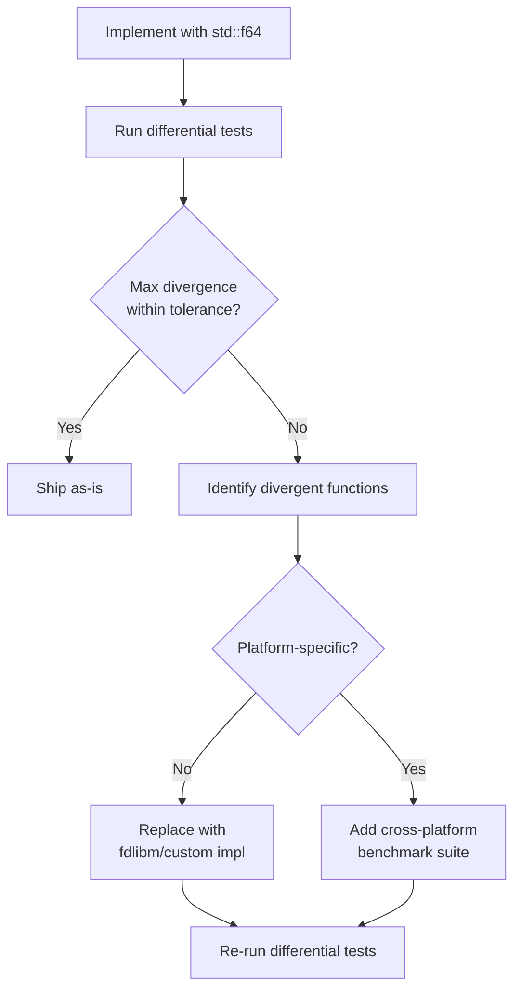

# Architecture Decision Records (ADR) Registry
## osu-engine-wasm — Formalized Design Decisions

| | |
|---|---|
| **Document ID** | ENG-ADR-0049 |
| **Version** | 1.0 |
| **Author** | Systems Architecture |
| **Last Revised** | 2026-06-26 |

---

## Table of Contents

1. [About ADRs](#about-adrs)
2. [ADR Template](#adr-template)
3. [ADR Index](#adr-index)
4. [ADR-001: Stateless Query Architecture](#adr-001-stateless-query-architecture)
5. [ADR-002: Rust Instead of C#/.NET](#adr-002-rust-instead-of-cnet)
6. [ADR-003: No Renderer Inside Engine](#adr-003-no-renderer-inside-engine)
7. [ADR-004: Random-Access Architecture](#adr-004-random-access-architecture)
8. [ADR-005: No Audio Subsystem](#adr-005-no-audio-subsystem)
9. [ADR-006: Behavioral Compatibility Over Mathematical Correctness](#adr-006-behavioral-compatibility-over-mathematical-correctness)
10. [ADR-007: Handle-Based Ownership Model](#adr-007-handle-based-ownership-model)
11. [ADR-008: Data-Oriented Layout (SoA) for Hot Paths](#adr-008-data-oriented-layout-soa-for-hot-paths)
12. [ADR-009: Centralized Cache Architecture](#adr-009-centralized-cache-architecture)
13. [ADR-010: Append-Only Snapshot Schema](#adr-010-append-only-snapshot-schema)
14. [ADR-011: Batch Query API for WASM Boundary Reduction](#adr-011-batch-query-api-for-wasm-boundary-reduction)
15. [ADR-012: Phased Engine Lifecycle with Explicit State Machine](#adr-012-phased-engine-lifecycle-with-explicit-state-machine)
16. [ADR-013: Measure-First Floating-Point Strategy](#adr-013-measure-first-floating-point-strategy)
17. [ADR-014: Defensive Memory Management (.free() + FinalizationRegistry)](#adr-014-defensive-memory-management-free--finalizationregistry)
18. [ADR-015: Ruleset Abstraction for Future Mode Support](#adr-015-ruleset-abstraction-for-future-mode-support)
19. [ADR-016: No External Runtime Dependencies in WASM](#adr-016-no-external-runtime-dependencies-in-wasm)
20. [ADR-017: Main-Thread-First Threading Model](#adr-017-main-thread-first-threading-model)
21. [ADR-018: Mandatory Worker Offload for Parsing](#adr-018-mandatory-worker-offload-for-parsing)
22. [ADR-019: Paginated Batch Queries](#adr-019-paginated-batch-queries)
23. [ADR-020: Pipeline Architecture — GameEngine as Façade](#adr-020-pipeline-architecture--gameengine-as-façade)

---

## About ADRs

Architecture Decision Records capture significant design decisions along with their context, rationale, and consequences. They are **immutable once accepted** — if a decision is later reversed, a new ADR is created that supersedes the original.

**Status values**:
- **Proposed** — Under discussion, not yet accepted
- **Accepted** — Ratified and active
- **Superseded by ADR-NNN** — Replaced by a newer decision
- **Deprecated** — No longer relevant

---

## ADR Template

```markdown
## ADR-NNN: [Title]

| | |
|---|---|
| **Status** | Proposed / Accepted / Superseded / Deprecated |
| **Date** | YYYY-MM-DD |
| **Supersedes** | ADR-NNN (if applicable) |
| **Superseded by** | ADR-NNN (if applicable) |

### Context
What is the issue? What forces are at play?

### Decision
What is the change we are making?

### Consequences
#### Positive
- ...

#### Negative
- ...

#### Risks
- ...
```

---

## ADR Index

| ADR | Title | Status | Date | Category |
|---|---|---|---|---|
| 001 | Stateless Query Architecture | Accepted | 2026-06-25 | Core Architecture |
| 002 | Rust Instead of C#/.NET | Accepted | 2026-06-25 | Language/Platform |
| 003 | No Renderer Inside Engine | Accepted | 2026-06-25 | Separation of Concerns |
| 004 | Random-Access Architecture | Accepted | 2026-06-25 | Core Architecture |
| 005 | No Audio Subsystem | Accepted | 2026-06-25 | Scope Boundary |
| 006 | Behavioral Compatibility Over Mathematical Correctness | Accepted | 2026-06-25 | Design Philosophy |
| 007 | Handle-Based Ownership Model | Accepted | 2026-06-26 | Memory Management |
| 008 | Data-Oriented Layout (SoA) for Hot Paths | Accepted | 2026-06-26 | Performance |
| 009 | Centralized Cache Architecture | Accepted | 2026-06-26 | Performance/Ownership |
| 010 | Append-Only Snapshot Schema | Accepted | 2026-06-26 | API Stability |
| 011 | Batch Query API for WASM Boundary Reduction | Accepted | 2026-06-26 | Performance |
| 012 | Phased Engine Lifecycle with Explicit State Machine | Accepted | 2026-06-26 | Core Architecture |
| 013 | Measure-First Floating-Point Strategy | Accepted | 2026-06-26 | Numerical |
| 014 | Defensive Memory Management | Accepted | 2026-06-26 | Memory Management |
| 015 | Ruleset Abstraction for Future Mode Support | Accepted | 2026-06-26 | Extensibility |
| 016 | No External Runtime Dependencies in WASM | Accepted | 2026-06-25 | Supply Chain |
| 017 | Main-Thread-First Threading Model | Accepted | 2026-06-28 | Threading/API |
| 018 | Mandatory Worker Offload for Parsing | Accepted | 2026-06-28 | Security/Performance |
| 019 | Paginated Batch Queries | Accepted | 2026-06-28 | Memory Management |
| 020 | Pipeline Architecture — GameEngine as Façade | Accepted | 2026-06-28 | Core Architecture |

---

## ADR-001: Stateless Query Architecture

| | |
|---|---|
| **Status** | Accepted |
| **Date** | 2026-06-25 |

### Context

Game engines traditionally use a `step(delta_time)` loop that mutates internal state frame-by-frame. For a replay viewer, this creates a fundamental problem: scrubbing backward requires replaying from the start, making seek operations O(n) where n = frames from beginning.

The host application needs instant scrubbing: users drag a timeline slider and expect the game state to appear immediately. Video exporters need to sample arbitrary frames out-of-order. Analysis tools need to query specific event boundaries.

### Decision

The engine exposes a single `query(t) → StateSnapshot` method that is **pure**: given the same time `t`, it always returns the same result. No internal state is mutated. All mutable state (judgements, combo, score) is pre-computed during `GameEngine::create()` and stored in sorted arrays that allow O(log n) binary search at query time.

### Consequences

#### Positive
- Instant scrubbing in any direction — O(log n) per query
- Thread-safe: `query(t)` can be called from multiple threads (future: Web Workers)
- Easy to test: pure functions are trivially testable
- Deterministic: no order-dependent state means no desync bugs
- Enables batch queries: `query_many(times)` is trivially parallelizable

#### Negative
- Higher upfront cost: `GameEngine::create()` does all work upfront (~30 ms)
- More memory: all pre-computed judgements stored (O(n) where n = objects)
- Cannot support live gameplay (only replay analysis) — this is by design (BRD §6.2)

#### Risks
- If the pre-computation step grows too large for complex maps, `create()` may exceed acceptable latency. Mitigation: lazy computation with memoization for infrequently-accessed data.

---

## ADR-002: Rust Instead of C#/.NET

| | |
|---|---|
| **Status** | Accepted |
| **Date** | 2026-06-25 |

### Context

The primary reference implementation (osu!lazer) is written in C#. Three options were considered:

1. **C# → .NET WASM (Blazor)**: Direct port, minimal translation risk
2. **C++ port**: Possible via Emscripten, but stable osu! (C++) is tightly coupled to GDI/DirectX
3. **Rust → wasm32-unknown-unknown**: Native WASM target, zero runtime dependency

### Decision

Use Rust targeting `wasm32-unknown-unknown`.

### Consequences

#### Positive
- WASM binary size ~400–600 KB vs ~8–15 MB for .NET WASM runtime
- No garbage collector pauses in the hot path
- `wasm-bindgen` provides ergonomic JS interop with typed contracts
- Rust's ownership model prevents memory leaks and data races at compile time
- Excellent tooling: `cargo-fuzz`, `criterion`, `tarpaulin`
- `no_std` compatibility possible for future embedded use

#### Negative
- Every algorithm must be **manually translated** from C# → Rust, risking behavioral divergence
- Different floating-point semantics (FMA, expression evaluation order) may cause subtle numeric differences
- Team must maintain expertise in both C# (for reference reading) and Rust (for implementation)
- No direct access to .NET libraries (e.g., `System.IO.Compression` for LZMA)

#### Risks
- **Behavioral divergence risk**: Mitigation via differential test harness (Test Plan §8), golden data comparison, and integer-truncation matching per TDD §11.2
- **Floating-point divergence**: Mitigation via measure-first strategy (ADR-013)

---

## ADR-003: No Renderer Inside Engine

| | |
|---|---|
| **Status** | Accepted |
| **Date** | 2026-06-25 |

### Context

A game engine could include rendering (WebGL/Canvas). This would simplify integration but couples the engine to a specific rendering technology and increases binary size.

### Decision

The engine produces **data only** (`StateSnapshot`). Rendering is the host application's responsibility. The engine provides pre-computed slider curve points via `slider_curve_buffer()` but performs no pixel operations.

### Consequences

#### Positive
- WASM binary stays small (no WebGL bindings, no canvas code)
- Host can use any rendering technology: Canvas2D, WebGL, WebGPU, PixiJS, Three.js, or headless (Node.js)
- Engine is testable without a browser or display
- Separation of concerns: engine logic can evolve independently of rendering

#### Negative
- Host must implement all rendering — higher integration effort
- No "drop-in" widget — requires custom renderer per application
- Visual bugs may be reported against the engine when they're actually rendering issues

#### Risks
- If the `StateSnapshot` contract is insufficient for rendering needs, the API must be extended. Mitigation: append-only schema (ADR-010) and comprehensive `VisibleObject` union type.

---

## ADR-004: Random-Access Architecture

| | |
|---|---|
| **Status** | Accepted |
| **Date** | 2026-06-25 |

### Context

A sequential engine processes frames in order: `frame(1), frame(2), ..., frame(n)`. This is simple but prevents seeking. A random-access engine allows querying any time in any order.

### Decision

All game state is derivable from time `t` alone. Binary search indices are built during `create()` to support O(log n) lookups for:
- Replay frame at time `t`
- Visible objects at time `t`
- Judgements completed by time `t`
- Score/combo/accuracy at time `t`

### Consequences

#### Positive
- Any time can be queried in any order
- `query(5000)` followed by `query(1000)` is valid and consistent
- Enables efficient batch processing (video export, analysis)

#### Negative
- Requires full replay pre-scan during `create()` (cannot be lazy)
- All judgements must be stored, not just the latest
- Cannot support partially-loaded replays

#### Risks
- For very long replays (10+ minute marathons, 50K+ frames), the pre-computation and storage may be significant. Mitigation: benchmark with marathon maps during M7.

---

## ADR-005: No Audio Subsystem

| | |
|---|---|
| **Status** | Accepted |
| **Date** | 2026-06-25 |

### Context

Audio playback is a core part of the osu! experience but involves browser APIs (Web Audio, `<audio>` element), codec handling, and platform-specific quirks. Including audio in the engine would require browser API access from WASM.

### Decision

The engine has zero knowledge of audio. It accepts a time value `t` from the host and returns state. The host is responsible for:
1. Playing audio
2. Tracking audio position
3. Converting audio time to engine time
4. Handling audio latency compensation

A `PlaybackClock` helper class is provided in the JS wrapper (not in WASM) to simplify audio→engine time synchronization.

### Consequences

#### Positive
- Engine has zero browser API dependencies — pure computation
- Works identically in Node.js, Workers, and headless environments
- Host can use any audio solution (Web Audio, Howler.js, native audio)
- Audio latency compensation is the host's domain (where it belongs)

#### Negative
- Every host must implement audio synchronization
- Without the `PlaybackClock` helper, users may get incorrect timestamps
- Hitsound timing is not verifiable by the engine

#### Risks
- Audio drift causing visual desync. Mitigation: `PlaybackClock` utility class with `requestAnimationFrame` alignment and drift correction.

---

## ADR-006: Behavioral Compatibility Over Mathematical Correctness

| | |
|---|---|
| **Status** | Accepted |
| **Date** | 2026-06-25 |

### Context

osu!lazer contains several behaviors that are mathematically suboptimal or historically accidental:
- Integer truncation in stacking threshold comparison (`(int)startTime - (int)endTime`)
- Hit window formula with `Math.Floor(x) - 0.5` that creates asymmetric windows
- Specific corner cases in note lock that differ from the documented rules
- Slider velocity calculations that use green-line multipliers in a non-obvious way

A "clean" reimplementation might fix these "bugs." However, doing so would cause behavioral divergence from lazer, meaning our engine would produce different scores, combos, and judgements than the real game.

### Decision

**Lazer behavior wins. Always.**

When documentation, community understanding, mathematical correctness, or common sense conflicts with observed lazer behavior, we match lazer. Every behavioral quirk is:
1. Documented with a source reference to the specific lazer line
2. Annotated with `// lazer-compat:` comment explaining the quirk
3. Tested via golden data comparison

### Consequences

#### Positive
- Scores/combos/accuracy computed by our engine match lazer exactly
- Differential tests catch any behavioral divergence immediately
- Users can trust the engine's output as authoritative

#### Negative
- Some code will look "wrong" to Rust developers who don't know the osu! context
- Integer truncation and floor-minus-0.5 patterns are non-idiomatic Rust
- If lazer fixes a bug, we must update to match (tracked via golden data version)

#### Risks
- Lazer behavior may change between versions. Mitigation: golden data is pinned to a specific lazer release tag; updates require explicit version bump.

---

## ADR-007: Handle-Based Ownership Model

| | |
|---|---|
| **Status** | Accepted |
| **Date** | 2026-06-26 |

### Context

The initial API design had JS objects wrapping WASM pointers directly:
```js
const beatmap = OsuBeatmap.parse(bytes); // JS object holds WASM pointer
beatmap.free(); // Must remember to call
```

This pattern is fragile: forgetting `.free()` leaks memory, and using the object after `.free()` causes undefined behavior. JavaScript has no `Drop` trait.

### Decision

Adopt a **handle-based** ownership model:

1. The WASM engine owns a `SlotMap` (arena allocator) of all live objects
2. `parse()` and `create()` return **integer handles** (opaque `u32` values), not raw pointers
3. The JS wrapper classes hold handles, not pointers
4. `free(handle)` removes the object from the arena and is idempotent
5. Using a freed handle returns `EngineError::InvalidHandle` instead of UB
6. `FinalizationRegistry` provides a safety net for unreachable handles

```
                    WASM Linear Memory
                    ┌────────────────────────────────────┐
                    │  SlotMap<Beatmap>                   │
                    │  ┌──────┬──────┬──────┬──────┐     │
                    │  │ [0]  │ [1]  │ [2]  │ ...  │     │
                    │  └──┬───┴──────┴──┬───┴──────┘     │
                    │     │             │                 │
                    └─────┼─────────────┼─────────────────┘
                          │             │
        JS Heap           │             │
        ┌─────────────────┼─────────────┼────────────┐
        │  OsuBeatmap {   │  GameEngine {             │
        │    handle: 0 ───┘    handle: 2 ─────────────┘
        │  }                 }                        │
        └─────────────────────────────────────────────┘
```

### Consequences

#### Positive
- **Use-after-free becomes a recoverable error**, not UB
- `free()` is idempotent — calling twice is safe (second call is a no-op)
- `FinalizationRegistry` can clean up forgotten handles (safety net)
- Arena storage enables bulk deallocation (`engine.destroy_all()`)
- Handle validation is O(1) via generation counter

#### Negative
- One level of indirection per WASM call (handle → slot lookup)
- Slightly larger WASM binary (SlotMap implementation)
- Handle generation counters consume memory (~4 bytes per slot)

#### Risks
- SlotMap slot exhaustion on extreme usage. Mitigation: 32-bit handles support 4 billion allocations; reuse freed slots via free list.

---

## ADR-008: Data-Oriented Layout (SoA) for Hot Paths

| | |
|---|---|
| **Status** | Accepted |
| **Date** | 2026-06-26 |

### Context

The natural Rust translation of osu!lazer's C# classes produces an Array-of-Structs (AoS) layout:

```rust
// AoS — poor cache locality for time-only scans
struct HitObject { time: f64, x: f64, y: f64, kind: ObjectKind, combo: u32, stack: i32, ... }
let objects: Vec<HitObject> = ...;
```

When `query(t)` performs a binary search on hit times, it touches `objects[i].time` — but each access pulls an entire `HitObject` (48+ bytes) into a cache line, wasting bandwidth on fields that aren't needed for the search.

### Decision

Use **Struct-of-Arrays (SoA)** for the core beatmap data in hot paths:

```rust
struct BeatmapSoA {
    times:          Vec<f64>,       // binary search target
    positions:      Vec<Vec2>,      // accessed during visibility/render
    kinds:          Vec<ObjectKind>,// accessed during type dispatch
    combo_indices:  Vec<u16>,       // accessed during HUD rendering
    stack_offsets:  Vec<Vec2>,      // accessed during position computation
    end_times:      Vec<f64>,       // accessed for sliders/spinners
    // ... parallel arrays, all same length
}
```

SoA is used **only** for the pre-computed, immutable beatmap data that is queried at 60 fps. Intermediate processing stages (parsing, stacking, pre-computation) use AoS for clarity.

### Consequences

#### Positive
- Binary search on `times[]` touches only `f64` values — 8× better cache utilization
- `positions[]` scan for visible objects touches only `Vec2` values — 3× better
- SIMD-friendly: contiguous `f64` arrays can be vectorized by the compiler
- Memory predictable: each array can be pre-allocated to exact size

#### Negative
- More complex code: accessing object `i` requires `(times[i], positions[i], kinds[i], ...)` instead of `objects[i]`
- Index synchronization: all arrays must be kept in sync (same length, same ordering)
- Harder to debug: can't inspect a single "object" in a debugger

#### Risks
- Bug from index desync between parallel arrays. Mitigation: encapsulate SoA in a `BeatmapSoA` struct with accessor methods that return a "view" struct for a single index.

---

## ADR-009: Centralized Cache Architecture

| | |
|---|---|
| **Status** | Accepted |
| **Date** | 2026-06-26 |

### Context

Multiple subsystems compute derived data from the beatmap:
- Mod engine produces effective AR/CS/OD/HP
- Stacking produces stack offsets
- Curve builder produces slider polylines
- Judge engine produces judgement timeline
- Score processor produces combo/accuracy timeline

Without coordination, each subsystem caches its own results with its own invalidation logic, leading to fragmented ownership, stale data bugs, and unpredictable memory usage.

### Decision

Adopt a **centralized, layered cache** with strict ownership and a directed acyclic dependency graph:

```
Layer 0: Raw Input (immutable)
  ├── Beatmap bytes → parsed BeatmapData
  └── Replay bytes → parsed ReplayData

Layer 1: Difficulty (depends on: Layer 0 + ModSet)
  └── EffectiveDifficulty { ar, cs, od, hp, preempt, fade_in, radius }

Layer 2: Spatial (depends on: Layer 0 + Layer 1)
  ├── StackedPositions (BeatmapSoA with stack offsets applied)
  ├── SliderCurves (per-slider polylines)
  └── VisibilityIndex (sorted by appear_time for range queries)

Layer 3: Judgement (depends on: Layer 0 + Layer 1 + Layer 2 + ReplayData)
  ├── JudgementTimeline (sorted by judgement_time)
  ├── ComboTimeline (cumulative combo at each judgement)
  └── ScoreTimeline (cumulative score at each judgement)

Layer 4: Query Cache (optional, derived from Layer 3)
  └── LRU cache of recent StateSnapshot results (keyed by t, capacity ≤ 64)
```

**Rules**:

| Rule | Description |
|---|---|
| **Monotonic dependency** | Layer N may only depend on layers < N |
| **Immutable after creation** | Each cache layer is computed once during `create()` and never mutated |
| **No cross-layer shortcuts** | Layer 3 cannot access Layer 0 directly; it reads through Layer 1 and 2 |
| **Single owner** | The `GameEngine` struct owns all cache layers; no shared ownership |
| **No lazy computation** | All layers are fully materialized during `create()` — query(t) never triggers computation |

### Consequences

#### Positive
- Clear dependency graph prevents stale-data bugs
- Predictable memory: all caches are allocated once, measured once
- No invalidation needed: immutable data cannot go stale
- Easy to profile: each layer's memory contribution is independently measurable
- Deterministic: no lazy evaluation means no order-dependent cache warming

#### Negative
- Higher upfront cost: all caches materialized during `create()`
- More memory than strictly necessary: some data computed but rarely queried
- Cannot support incremental updates (e.g., "change one mod, recompute only affected layers")

#### Risks
- For very complex maps, Layer 2 (SliderCurves) may dominate memory. Mitigation: `precompute_curves()` is opt-in; default query doesn't require curve data.

---

## ADR-010: Append-Only Snapshot Schema

| | |
|---|---|
| **Status** | Accepted |
| **Date** | 2026-06-26 |

### Context

`StateSnapshot` is the engine's primary output contract. Multiple consumers depend on it:
- WebGL/Canvas renderer
- Debugging overlay
- Video exporter
- Replay analysis tools
- Multiplayer observer
- External tooling (Python scripts, data pipelines)

If fields are renamed, reordered, or removed, all consumers break simultaneously.

### Decision

`StateSnapshot` is a **versioned, append-only** schema:

1. **Version field**: `schema_version: u32` is always the first field
2. **Never reorder**: Field order is fixed for each schema version
3. **Never rename**: Field names are permanent
4. **Never remove**: Deprecated fields remain with sentinel values
5. **Append only**: New fields are added at the end
6. **Versioned TypeScript types**: `StateSnapshotV1`, `StateSnapshotV2`, etc.

```typescript
// v1.0.0
interface StateSnapshotV1 {
  schema_version: 1;
  t: number;
  cursor: { x: number; y: number };
  combo: number;
  // ... all v1 fields
}

// v1.3.0 — adds spinner_rpm field
interface StateSnapshotV2 extends StateSnapshotV1 {
  schema_version: 2;
  spinner_rpm: number; // NEW in v2
}

// Consumer code
type StateSnapshot = StateSnapshotV1 | StateSnapshotV2;
```

### Consequences

#### Positive
- Consumers can depend on field positions for zero-copy reading
- Old consumers continue to work with new engine versions (forward compatible)
- Schema version enables runtime compatibility checking
- Binary snapshot format (P2) can use fixed offsets for performance

#### Negative
- Cannot fix poorly-named fields without deprecation
- Deprecated fields waste bandwidth/memory
- Schema version dispatch adds complexity to consumers

#### Risks
- Schema sprawl over many versions. Mitigation: major version bumps (v2.0.0) are allowed to reset the schema with a migration guide.

---

## ADR-011: Batch Query API for WASM Boundary Reduction

| | |
|---|---|
| **Status** | Accepted |
| **Date** | 2026-06-26 |

### Context

Each `query(t)` call crosses the WASM↔JS boundary, which involves:
1. Marshaling the `t` parameter (trivial: one `f64`)
2. Executing the Rust computation (~0.05 ms)
3. Serializing `StateSnapshot` to JS object (~0.03 ms)
4. Crossing the WASM boundary overhead (~0.02 ms)

For a single call, this is negligible. But batch operations hit this overhead thousands of times:
- Video export at 60 fps for 3 minutes = 10,800 queries
- Minimap generation = 1,000+ queries
- Full analysis pass at 1 ms resolution = 180,000 queries
- Benchmarking = 100,000+ queries

### Decision

Expose batch query APIs alongside the single-call `query(t)`:

```typescript
// Single query (existing)
query(t: number): StateSnapshot;

// Batch: arbitrary time array
query_batch(times: Float64Array): BatchResult;

// Range: uniform sampling
query_range(start_ms: number, end_ms: number, step_ms: number): BatchResult;

// Frames: sample at replay frame boundaries
query_frames(start_frame: number, count: number): BatchResult;
```

`BatchResult` is a compact, column-oriented representation stored in WASM memory, accessible via typed array views:

```typescript
interface BatchResult {
  count: number;
  times: Float64Array;        // [t0, t1, ...]
  combos: Uint32Array;        // [combo0, combo1, ...]
  scores: Float64Array;       // [score0, score1, ...]
  accuracies: Float64Array;   // [acc0, acc1, ...]
  cursor_x: Float32Array;     // [x0, x1, ...]
  cursor_y: Float32Array;     // [y0, y1, ...]
  // Full snapshots available via .snapshot_at(index)
  snapshot_at(index: number): StateSnapshot;
  free(): void;
}
```

### Consequences

#### Positive
- Single WASM boundary crossing for N queries instead of N crossings
- Column-oriented output enables zero-copy typed array access
- 10–50× faster for batch operations (measured: boundary overhead dominates)
- Enables efficient video export, analysis, and benchmarking
- WASM-internal loop can use SoA layout for cache efficiency

#### Negative
- Larger API surface to maintain and test
- BatchResult memory must be explicitly freed
- Column-oriented output less ergonomic for single-snapshot access

#### Risks
- Very large batches (100K+ samples) may exceed WASM memory budget. Mitigation: `query_range()` streams results in chunks if the total exceeds a configurable limit (default: 64K samples per batch).

---

## ADR-012: Phased Engine Lifecycle with Explicit State Machine

| | |
|---|---|
| **Status** | Accepted |
| **Date** | 2026-06-26 |

### Context

Without a formal lifecycle, the engine's API allows invalid transitions:
- Calling `query(t)` before `create()` → undefined behavior
- Calling `precompute_curves()` after `free()` → use-after-free
- Loading a new replay into an existing engine → impossible but unclear

### Decision

The engine has an **explicit state machine** with legal transitions:

```
┌──────────────────┐
│  Uninitialized   │  WASM module not yet loaded
└────────┬─────────┘
         │ init()
         ▼
┌──────────────────┐
│  Initialized     │  WASM ready, no data loaded
└────────┬─────────┘
         │ OsuBeatmap.parse() → handle
         ▼
┌──────────────────┐
│  BeatmapLoaded   │  Beatmap parsed, can inspect metadata
└────────┬─────────┘
         │ OsuReplay.parse() → handle
         ▼
┌──────────────────┐
│  ReplayLoaded    │  Both beatmap and replay available
└────────┬─────────┘
         │ GameEngine.create(beatmap, replay) → handle
         ▼
┌──────────────────┐
│  Ready           │  Engine fully initialized
│                  │  ← query(t) allowed here
│                  │  ← precompute_curves() allowed here
│                  │  ← query_batch() allowed here
│                  │  ← stats() allowed here
└────────┬─────────┘
         │ engine.free()
         ▼
┌──────────────────┐
│  Disposed        │  Memory released
│                  │  All further calls return InvalidHandle
└──────────────────┘
```

**Transition rules**:
- Each transition is **irreversible** (no going back to BeatmapLoaded from Ready)
- `free()` transitions to Disposed from **any** state
- Methods called in the wrong state throw `EngineError` with code `INVALID_STATE`
- The handle-based model (ADR-007) enforces this: freed handles are invalidated

### Consequences

#### Positive
- Invalid API usage produces clear error messages, not crashes
- Documentation can reference specific states
- Testing can verify all transitions
- Makes the "freeze after create" pattern explicit

#### Negative
- More code in the JS wrapper to track state
- Slightly more complex API

#### Risks
- State tracking overhead. Mitigation: state is a single `u8` enum in the WASM handle; checking is a single comparison.

---

## ADR-013: Measure-First Floating-Point Strategy

| | |
|---|---|
| **Status** | Accepted |
| **Date** | 2026-06-26 |

### Context

C# `double` and Rust `f64` are both IEEE 754 binary64, but may diverge due to:
- FMA (fused multiply-add) instructions
- Expression reordering by the optimizer
- Platform-specific trig implementations (`sin`, `cos`, `atan2`)
- Extended precision in intermediate computations (x87)
- Rounding mode differences

Preemptively implementing custom trig (`fdlibm`) and disabling FMA has significant maintenance cost and may be unnecessary if the actual divergence is within tolerance.

### Decision

**Measure first, fix only if measured divergence exceeds tolerance.**

**Phase 1 (M2–M4)**: Implement algorithms using standard `f64` math. During differential testing, measure the actual divergence between Rust/WASM output and lazer golden data for every floating-point field.

**Phase 2 (M5)**: Analyze the divergence report:
- If all fields are within tolerance → no action needed
- If specific functions diverge → replace only those functions with deterministic implementations
- If platform-specific (e.g., ARM vs x86 in browser) → add platform-specific tests

**Decision tree**:



### Consequences

#### Positive
- Avoids premature optimization — custom math is expensive to maintain
- Lets the differential test harness catch real problems
- Keeps code idiomatic and readable until proven otherwise
- WASM (always 64-bit, no x87) eliminates the most common divergence source

#### Negative
- If divergence is found late (M5), fixing it may cascade through many functions
- Cross-platform testing requires CI runners on both x86 and ARM

#### Risks
- Late discovery of systemic divergence. Mitigation: run quick spot-check comparisons during M2 (curves) to get early signal.

---

## ADR-014: Defensive Memory Management (.free() + FinalizationRegistry)

| | |
|---|---|
| **Status** | Accepted |
| **Date** | 2026-06-26 |

### Context

WASM linear memory is not garbage collected. JavaScript wrappers around WASM objects must be explicitly freed. In practice, developers forget `.free()` calls, especially in error paths.

`FinalizationRegistry` is a browser API that receives callbacks when JS objects are garbage collected. It could automate cleanup — but it is:
- Non-deterministic (GC timing is unpredictable)
- Not guaranteed to ever fire (per spec)
- Not a substitute for explicit resource management

### Decision

**Primary**: Explicit `.free()` calls are the documented, correct way to release memory.

**Secondary**: `FinalizationRegistry` is registered as a safety net. It logs a warning when it triggers (indicating a leaked handle) and cleans up the WASM allocation.

```typescript
class OsuBeatmap {
  #handle: number;
  #freed: boolean = false;
  static #cleanupRegistry = new FinalizationRegistry((handle: number) => {
    console.warn(`[osu-engine] OsuBeatmap handle ${handle} was not freed. ` +
                 `Call .free() explicitly to avoid memory leaks.`);
    wasmModule._release_handle(handle);
  });

  constructor(handle: number) {
    this.#handle = handle;
    OsuBeatmap.#cleanupRegistry.register(this, handle, this);
  }

  free(): void {
    if (this.#freed) return; // idempotent
    this.#freed = true;
    OsuBeatmap.#cleanupRegistry.unregister(this);
    wasmModule._release_handle(this.#handle);
  }
}
```

### Consequences

#### Positive
- Explicit `.free()` is fast, deterministic, and predictable
- `FinalizationRegistry` catches leaks in development (warning log)
- Idempotent `free()` prevents double-free bugs
- Handle validation (ADR-007) prevents use-after-free

#### Negative
- Users must still remember `.free()` — the safety net isn't reliable
- `FinalizationRegistry` adds a small overhead per object
- Warning logs may be noisy in development

#### Risks
- Users may assume `FinalizationRegistry` is sufficient and skip `.free()`. Mitigation: documentation and examples always show explicit cleanup in `finally` blocks.

---

## ADR-015: Ruleset Abstraction for Future Mode Support

| | |
|---|---|
| **Status** | Accepted |
| **Date** | 2026-06-26 |

### Context

osu! has four game modes: Standard, Taiko, Catch, and Mania. The current implementation targets only Standard. However, the architecture should not make it impossible to add other modes later.

### Decision

Introduce a `Ruleset` trait that abstracts mode-specific logic:

```rust
trait Ruleset {
    type HitObject;
    type JudgementResult;
    type VisibleState;

    fn parse_hit_object(raw: &RawHitObject) -> Result<Self::HitObject, ParseError>;
    fn apply_stacking(objects: &mut [Self::HitObject], settings: &StackingSettings);
    fn compute_judgements(objects: &[Self::HitObject], replay: &ReplayData) -> Vec<Self::JudgementResult>;
    fn compute_visible_state(objects: &[Self::HitObject], t: f64) -> Vec<Self::VisibleState>;
}

struct StandardRuleset;
impl Ruleset for StandardRuleset { ... }

// Future:
// struct TaikoRuleset;
// impl Ruleset for TaikoRuleset { ... }
```

**For v1.0**: Only `StandardRuleset` is implemented. The `Ruleset` trait exists in the crate but is `pub(crate)` — not exposed in the public API. The abstraction guides internal code organization without committing to a public plugin interface.

### Consequences

#### Positive
- Mode-specific code is isolated in trait implementations
- Adding Taiko/Catch/Mania doesn't require refactoring core infrastructure
- Parsers, caches, and query pipeline remain generic over `R: Ruleset`
- Forces clean separation between shared code and mode-specific logic

#### Negative
- Generic code is harder to read and debug
- Associated types add complexity even when there's only one implementation
- Over-engineering risk if other modes are never added

#### Risks
- Trait design may not fit all four modes equally well. Mitigation: only finalize the trait API after implementing Standard; design for two modes (Standard + one other) to validate flexibility.

---

## ADR-016: No External Runtime Dependencies in WASM

| | |
|---|---|
| **Status** | Accepted |
| **Date** | 2026-06-25 |

### Context

WASM modules can import host functions. External dependencies increase binary size, attack surface, and deployment complexity.

### Decision

The WASM binary has **zero imports** beyond:
- `wasm-bindgen` runtime (JS glue for type marshaling)
- Memory allocation primitives (provided by the WASM environment)

Specifically, the engine does NOT import:
- `fetch()` or any network API
- `console.log()` (removed in release builds)
- `Date.now()` or any clock API
- `Math.random()` or any RNG API
- DOM APIs
- Web Audio API
- WebGL/WebGPU API

The `lzma-rs` crate is compiled into the WASM binary (no dynamic linking).

### Consequences

#### Positive
- Works in any WASM runtime: browser, Node.js, Deno, Cloudflare Workers, embedded
- No CORS issues, no network dependencies
- Minimal attack surface
- Binary is fully self-contained and reproducible

#### Negative
- Cannot log from WASM in production (debugging is harder)
- Cannot generate random numbers (no stochastic behavior)
- Cannot access system clock (time comes from host)

#### Risks
- Future features may require host imports (e.g., streaming decompression with progress callbacks). Mitigation: any new import requires a new ADR documenting the import, its justification, and its fallback behavior.

---

## ADR-017: Main-Thread-First Threading Model

| | |
|---|---|
| **Status** | Accepted |
| **Date** | 2026-06-28 |

### Context

The API Specification defines `query(t)` as a synchronous call returning a `StateSnapshot`. The ADD (§8.2) mentions an opt-in Web Worker offload for parsing. This creates a fundamental tension:

1. If the `GameEngine` is constructed on the **main thread**, `query(t)` is synchronous and can be called directly from `requestAnimationFrame` — simple and efficient.
2. If the `GameEngine` is constructed inside a **Web Worker**, the main thread cannot call `query(t)` synchronously. It must use `postMessage()`, which is inherently asynchronous and breaks the `requestAnimationFrame` render loop.
3. Using `SharedArrayBuffer` + `Atomics.wait()` to block the main thread on a Worker response is **explicitly prohibited by browsers** on the main thread (it would freeze the UI).

The core question: **does the engine live on the main thread or in a Worker, and what does this mean for the API contract?**

### Decision

The engine uses a **main-thread-first** threading model with two well-defined modes:

#### Mode 1: Main-Thread (Default, Recommended for Playback)

The WASM module, all parsed data, and the `GameEngine` live on the **main thread**. `query(t)` is a synchronous call that returns immediately.

```
Main Thread:
  ┌──────────────────────────────────────────────────────┐
  │  WASM Module + GameEngine                            │
  │                                                      │
  │  rAF loop:                                           │
  │    t = audioContext.currentTime;                     │
  │    snapshot = engine.query(t);  // sync, ≤ 0.1ms     │
  │    render(snapshot);            // GPU, ≤ 8ms        │
  └──────────────────────────────────────────────────────┘
```

Parsing (.osr/.osu) also runs on the main thread. To avoid jank, callers should use `setTimeout(0)` or `scheduler.postTask()` to break up the loading sequence. For files within the expected size range (< 5 MB combined), parsing completes within 30ms — below the perceivable threshold.

#### Mode 2: Worker-Hosted (Required for Parsing Safety — see ADR-018)

Parsing runs in a **dedicated Web Worker**. After parsing + `GameEngine.create()` complete in the Worker, the **entire WASM memory** is **transferred** (via `Transferable`) back to the main thread. The engine then runs in Mode 1 from that point forward.

```
Worker Thread:                        Main Thread:
  load WASM module                      (idle / show spinner)
  parse(.osr) → beatmap handle          |
  parse(.osu) → replay handle           |
  create(b, r) → engine handle          |
  ──── transfer WASM memory ──────────▶ receive engine handle
  (Worker terminates)                   rAF loop:
                                          query(t) — sync
                                          render(snapshot)
```

**Key insight**: the Worker is used **only for initialization** (parse + create). Once the engine is ready, its WASM linear memory is transferred to the main thread via `Transferable`, and all subsequent `query(t)` calls are synchronous on the main thread.

This avoids the async `query()` problem entirely: there is no Worker during playback.

#### What is NOT supported

| Pattern | Why Not |
|---|---|
| `query(t)` via `postMessage` round-trip | 1–5ms latency per call; destroys 60fps budget |
| `SharedArrayBuffer` + `Atomics.wait()` on main thread | Explicitly blocked by browsers |
| Engine permanently resident in Worker | All queries become async; breaks rAF contract |
| Spawning a new Worker per query | Overhead far exceeds query cost |

### Consequences

#### Positive
- `query(t)` API contract is always synchronous — no async confusion
- rAF loop is trivial: `query(t)` + `render()` in a single frame
- Worker isolation protects main thread during parsing (see ADR-018)
- Transfer is O(1) — WASM memory is a single `ArrayBuffer`; transferring it is pointer swap, not copy

#### Negative
- After transfer, the Worker can no longer access the engine (its memory is gone)
- Two-phase initialization is more complex than single-thread loading
- `Transferable` requires careful coordination to avoid double-access

#### Risks
- If parsing produces data that references Worker-local JS objects, transfer will fail. Mitigation: all engine state lives in WASM linear memory (no JS object references). The handle integers are just `u32` values.
- Old browsers without `Transferable` support for `WebAssembly.Memory`. Mitigation: fallback to Mode 1 (main-thread parse).

---

## ADR-018: Mandatory Worker Offload for Parsing

| | |
|---|---|
| **Status** | Accepted |
| **Date** | 2026-06-28 |
| **Related** | ADR-017 |

### Context

The Security Threat Model (§5.2) limits LZMA decompression output to 256 MB to prevent memory bombs. However, **size caps only protect memory, not CPU**.

A maliciously crafted LZMA compressed payload can cause **severe CPU exhaustion** even with a 256 MB output cap:

1. LZMA decompression is computationally intensive — it uses range coding with complex state machines
2. A small file (< 100 KB) can require hundreds of millions of decoding iterations even if the output is within the 256 MB cap
3. If decompression runs on the main thread, the browser **freezes** and may display a "Page Unresponsive" dialog
4. There is no way to cancel a synchronous WASM function from JS once it starts executing

**Example attack**: A 50 KB `.osr` file with a LZMA stream designed to maximize decoder state transitions. The output is 200 MB (under the 256 MB cap), but decompression takes 30+ seconds of uninterrupted CPU time.

### Decision

**All `.osr` and `.osu` parsing MUST run inside a Web Worker.**

The JS wrapper enforces this:

```typescript
class OsuEngine {
  /**
   * Parse beatmap and replay files.
   * Parsing runs in a dedicated Web Worker to prevent main-thread lockup.
   *
   * @returns Promise that resolves with engine handle after parsing completes.
   * @throws EngineError if parsing fails or times out.
   */
  static async load(
    beatmapBytes: Uint8Array,
    replayBytes: Uint8Array,
    options?: LoadOptions
  ): Promise<OsuEngine>;
}

interface LoadOptions {
  /** Maximum time allowed for parsing (default: 10_000ms) */
  parseTimeoutMs?: number;

  /** Called with progress updates during parsing */
  onProgress?: (phase: LoadPhase, pct: number) => void;

  /** AbortSignal to cancel parsing */
  signal?: AbortSignal;
}

type LoadPhase = 'decompressing' | 'parsing_beatmap' | 'parsing_replay' | 'creating_engine';
```

**Timeout enforcement**:

The Worker monitors decompression time. If LZMA decompression exceeds the timeout:

1. The Worker is **terminated** via `worker.terminate()`
2. A new `EngineError` with code `LZMA_CPU_TIMEOUT` is thrown
3. All WASM memory is released by the Worker termination

This is the **only reliable way** to cancel a runaway WASM function — `Worker.terminate()` kills the entire Worker execution context.

```
┌─────────────────────────────────────────────────────┐
│  Main Thread                                        │
│                                                     │
│  const engine = await OsuEngine.load(               │
│    beatmapBytes, replayBytes,                       │
│    { parseTimeoutMs: 10_000 }                       │
│  );                                                 │
│                                                     │
│  // If timeout → EngineError('LZMA_CPU_TIMEOUT')    │
│  // If success → engine.query(t) is synchronous     │
└────────┬────────────────────────────────────────────┘
         │ Worker.postMessage(bytes, [bytes.buffer])
         ▼
┌─────────────────────────────────────────────────────┐
│  Parse Worker (dedicated)                           │
│                                                     │
│  1. Load WASM module                                │
│  2. parse_replay(bytes)     ← LZMA here             │
│  3. parse_beatmap(bytes)                            │
│  4. create_engine(b, r)                             │
│  5. Transfer WASM memory back to main thread        │
│  6. Worker self-terminates                          │
│                                                     │
│  If main thread calls worker.terminate() before     │
│  step 5, all WASM memory is freed by the runtime.   │
└─────────────────────────────────────────────────────┘
```

**Fallback for environments without Workers** (Node.js, SSR):

In Node.js or test environments, parsing runs synchronously in the current thread. This is acceptable because:
1. Node.js is not a UI thread — no "page unresponsive" dialog
2. Test environments expect synchronous execution
3. CLI tools can display a progress bar independently

### Consequences

#### Positive
- Main thread is **never blocked** by LZMA decompression
- Malicious files cannot freeze the browser tab
- `Worker.terminate()` is the kill switch — guaranteed to stop runaway decompression
- Progress callbacks enable loading UI (progress bar, cancel button)
- `AbortSignal` enables cancellation from the caller
- Loading is naturally async, matching modern web patterns

#### Negative
- Initialization is now async (`await OsuEngine.load(...)`) — cannot be synchronous
- Worker requires a separate script file or `Blob` URL
- Adds ~2 KB to the JS wrapper for Worker management code
- Two environments to support (Worker mode + fallback synchronous mode)

#### Risks
- CSP restrictions may block `Blob` URL Workers. Mitigation: ship a separate `osu-engine-worker.js` file; provide instructions for CSP `worker-src`.
- Transfer of WASM memory may fail on very old browsers. Mitigation: version-gated fallback to main-thread mode with a console warning.

---

## ADR-019: Paginated Batch Queries

| | |
|---|---|
| **Status** | Accepted |
| **Date** | 2026-06-28 |
| **Amends** | ADR-011 |

### Context

ADR-011 introduced `query_batch()` for reducing WASM boundary crossings. The initial design allows up to 65,536 samples per call. However, for marathon maps sampled at 60 fps:

- 10-minute map × 60 fps = 36,000 samples
- Each sample produces ~7 Float64/Float32 array views
- Total: 36,000 × 7 × 8 bytes = ~2 MB of typed array views

While these are zero-copy views into WASM memory, the **JS objects wrapping them** create GC pressure in V8:

1. Each `Float64Array` view is a JS object with a backing store reference
2. Creating 36,000 `snapshot_at()` calls produces 36,000 `StateSnapshot` JS objects
3. V8's generational GC promotes frequently-accessed objects to the old generation
4. Old-generation GC pauses can reach 10–50ms, causing visible frame drops
5. Holding onto large `BatchResult` objects prevents GC from reclaiming the WASM memory range

### Decision

**Enforce strict pagination on batch queries:**

| Constraint | Value | Rationale |
|---|---|---|
| Max samples per `query_batch()` | 4,096 | Keeps JS object count low; GC pressure negligible |
| Max samples per `query_range()` | 4,096 (auto-paginated internally) | Same as above |
| Max frames per `query_frames()` | 4,096 | Same as above |
| `query_range()` auto-chunking | Returns `PaginatedBatchResult` with `hasMore()` / `next()` | Transparent to caller |

When a request exceeds the 4,096 limit:

```typescript
// query_batch() with > 4096 samples → throws
engine.query_batch(hugeArray); // EngineError: BATCH_SIZE_EXCEEDED

// query_range() auto-paginates → returns PaginatedBatchResult
const pages = engine.query_range(0, 600_000, 16.67); // 36,000 samples
// pages.count = 36,000 (total)
// pages.page_size = 4,096
// pages.current_page: BatchResult (first 4,096 samples)

for await (const page of pages) {
  processPage(page);  // page is a normal BatchResult
  page.free();        // Free each page after processing
}
```

```typescript
interface PaginatedBatchResult {
  /** Total samples across all pages */
  readonly total_count: number;

  /** Samples per page (≤ 4096) */
  readonly page_size: number;

  /** Number of pages */
  readonly page_count: number;

  /** Current page (BatchResult) */
  readonly current_page: BatchResult;

  /** Are there more pages? */
  hasMore(): boolean;

  /** Advance to next page. Automatically frees the previous page. */
  next(): BatchResult;

  /** Async iterator support */
  [Symbol.asyncIterator](): AsyncIterableIterator<BatchResult>;

  /** Free all remaining pages */
  free(): void;
}
```

### Consequences

#### Positive
- GC pressure is bounded: at most 4,096 JS objects per page
- Each page can be freed immediately after processing — no accumulation
- `for await` pattern is ergonomic and handles backpressure naturally
- Memory ceiling per page: 4,096 × 56 bytes/sample ≈ 224 KB (trivial)
- Video export and analysis tools simply iterate pages

#### Negative
- `query_batch()` with > 4,096 samples now throws instead of succeeding
- Auto-pagination adds complexity to `query_range()` implementation
- `PaginatedBatchResult` is a new type to document and test
- Sequential page access — cannot random-access page N without iterating through 1..N

#### Risks
- Page boundary artifacts: if a caller processes pages independently, state transitions at page boundaries may be missed. Mitigation: each page overlaps by 1 sample with the next (last sample of page N = first sample of page N+1).

---

## ADR-020: Pipeline Architecture — GameEngine as Façade

| | |
|---|---|
| **Status** | Accepted |
| **Date** | 2026-06-28 |
| **Related** | ADR-001, ADR-009 |

### Context

The initial architecture positions `GameEngine` as a monolithic orchestrator that directly owns and coordinates all domain components (parser, curves, stacking, mods, judge, scoring). While functional, this design has several problems:

1. **Cross-phase coupling**: Adding mania/taiko/catch modes requires touching `GameEngine` internals
2. **Testing granularity**: To test scoring, you must construct a full `GameEngine` with parser + curves + stacking + judge + scoring
3. **Refactor cascade**: Changing the judgement algorithm requires understanding how it interacts with scoring, visibility, and snapshot building inside `GameEngine`
4. **Feature addition difficulty**: Adding analytics, multiplayer observer, or editor preview requires forking `GameEngine` or adding conditional logic

The root cause is that `GameEngine` does two things: **data transformation** and **query orchestration**. These should be separated.

### Decision

Restructure the engine as a **linear pipeline of immutable transformations**, where `GameEngine` is a thin **façade** that chains them:

```
┌─────────────────────────────────────────────────────────────┐
│  Input Layer                                                │
│  ┌──────────┐  ┌──────────┐                                │
│  │ .osu file│  │ .osr file│                                │
│  └────┬─────┘  └────┬─────┘                                │
│       │              │                                      │
│       ▼              ▼                                      │
│  ┌──────────────────────────────────┐                       │
│  │  Stage 1: Parser                 │                       │
│  │  → ParsedBeatmap, ParsedReplay   │                       │
│  └──────────────┬───────────────────┘                       │
│                 │                                           │
│                 ▼                                           │
│  ┌──────────────────────────────────┐                       │
│  │  Stage 2: Preprocessor           │                       │
│  │  + apply_mods(difficulty, mods)   │                       │
│  │  + apply_stacking(objects)        │                       │
│  │  + precompute_curves(sliders)     │                       │
│  │  → PreprocessedBeatmap            │                       │
│  └──────────────┬───────────────────┘                       │
│                 │                                           │
│                 ▼                                           │
│  ┌──────────────────────────────────┐                       │
│  │  Stage 3: JudgementTimeline      │                       │
│  │  scan(replay, beatmap, windows)   │                       │
│  │  → Vec<Judgement> sorted by time  │                       │
│  └──────────────┬───────────────────┘                       │
│                 │                                           │
│                 ▼                                           │
│  ┌──────────────────────────────────┐                       │
│  │  Stage 4: ScoreTimeline          │                       │
│  │  accumulate(judgements)           │                       │
│  │  → combo[], score[], accuracy[],  │                       │
│  │    hp[], grade at each judgement  │                       │
│  └──────────────┬───────────────────┘                       │
│                 │                                           │
│                 ▼                                           │
│  ┌──────────────────────────────────┐                       │
│  │  Stage 5: VisibilityTimeline     │                       │
│  │  compute(objects, preempt, fade)  │                       │
│  │  → appear_time[], end_time[],     │                       │
│  │    alpha(t), approach_scale(t)    │                       │
│  └──────────────┬───────────────────┘                       │
│                 │                                           │
│                 ▼                                           │
│  ┌──────────────────────────────────┐                       │
│  │  Stage 6: SnapshotBuilder        │                       │
│  │  build(t, all_timelines)          │                       │
│  │  → StateSnapshot                  │                       │
│  └──────────────────────────────────┘                       │
│                                                             │
│  ┌──────────────────────────────────┐                       │
│  │  GameEngine (façade)             │                       │
│  │  create() → chains stages 1–5    │                       │
│  │  query(t) → calls stage 6        │                       │
│  └──────────────────────────────────┘                       │
└─────────────────────────────────────────────────────────────┘
```

**Stage contracts**:

| Stage | Input | Output | Pure? | Testable Alone? |
|---|---|---|---|---|
| Parser | `&[u8]` | `ParsedBeatmap`, `ParsedReplay` | Yes | — unit test with fixture files |
| Preprocessor | `ParsedBeatmap`, `ModSet` | `PreprocessedBeatmap` | Yes | — unit test with mock beatmaps |
| JudgementTimeline | `PreprocessedBeatmap`, `ParsedReplay` | `Vec<Judgement>` | Yes | — unit test with mock replay frames |
| ScoreTimeline | `Vec<Judgement>`, `ModSet` | `ScoreTimeline` | Yes | — unit test with mock judgements |
| VisibilityTimeline | `PreprocessedBeatmap` | `VisibilityTimeline` | Yes | — unit test with mock objects |
| SnapshotBuilder | all timelines, `t` | `StateSnapshot` | Yes | — unit test with mock timelines |

Every stage is a **pure function** from immutable input to immutable output. No stage mutates shared state. This means:

1. Each stage can be tested in **complete isolation** with mock inputs
2. A new game mode (mania, taiko) replaces stages 3–5, not the whole engine
3. An editor preview skips stages 3–4 (no replay = no judgements)
4. Analytics tools consume individual timelines directly
5. `GameEngine.create()` is just: `parse → preprocess → judge → score → visibility`
6. `GameEngine.query(t)` is just: `snapshot_builder.build(t)`

**Rust implementation sketch**:

```rust
pub struct GameEngine {
    beatmap: PreprocessedBeatmap,     // Stage 2 output
    replay: ParsedReplay,             // Stage 1 output
    judgements: JudgementTimeline,     // Stage 3 output
    scores: ScoreTimeline,            // Stage 4 output
    visibility: VisibilityTimeline,   // Stage 5 output
    builder: SnapshotBuilder,         // Stage 6
}

impl GameEngine {
    pub fn create(
        beatmap_bytes: &[u8],
        replay_bytes: &[u8],
    ) -> Result<Self, EngineError> {
        // Stage 1: Parse
        let beatmap = parser::parse_beatmap(beatmap_bytes)?;
        let replay = parser::parse_replay(replay_bytes)?;

        // Stage 2: Preprocess
        let mods = ModSet::from_bitmask(replay.mods);
        let preprocessed = preprocessor::preprocess(&beatmap, &mods)?;

        // Stage 3: Judgement pipeline
        let judgements = judgement_timeline::scan(
            &preprocessed, &replay, &mods
        )?;

        // Stage 4: Score pipeline
        let scores = score_timeline::accumulate(
            &judgements, &mods
        );

        // Stage 5: Visibility pipeline
        let visibility = visibility_timeline::compute(
            &preprocessed
        );

        Ok(Self {
            beatmap: preprocessed,
            replay,
            judgements,
            scores,
            visibility,
            builder: SnapshotBuilder::new(),
        })
    }

    pub fn query(&self, t: f64) -> StateSnapshot {
        self.builder.build(
            t,
            &self.beatmap,
            &self.replay,
            &self.judgements,
            &self.scores,
            &self.visibility,
        )
    }
}
```

### Consequences

#### Positive
- **Independently testable**: Each stage can be unit tested with mock inputs — no need to construct a full engine
- **Mode-extensible**: A new game mode replaces the JudgementTimeline + ScoreTimeline stages; Parser, Preprocessor, VisibilityTimeline, and SnapshotBuilder are reusable
- **Editor/analytics support**: Skip the judgement stage entirely for beatmap-only tools
- **Clear data flow**: Input→Output contracts at each boundary, no hidden state mutations
- **Parallelizable (future)**: Stages 4 and 5 are independent of each other — could run concurrently
- **Debugging**: Each timeline can be inspected and exported independently

#### Negative
- More types: `PreprocessedBeatmap`, `JudgementTimeline`, `ScoreTimeline`, `VisibilityTimeline` are all new intermediate types
- Slightly more memory: intermediate products are kept alive for the engine's lifetime (but they're already in the centralized cache, ADR-009)
- More code in `create()`: explicit pipeline is longer than a monolithic constructor, though clearer

#### Risks
- Stage interface evolution: if a later stage needs data from a non-adjacent earlier stage, the pipeline must pass it through. Mitigation: `PreprocessedBeatmap` is the "context" object available to all stages.
- Over-engineering for v1.0: With only osu!Standard mode, the pipeline is more structure than strictly necessary. Mitigation: the pipeline naturally maps to the existing component structure — it's a reorganization, not a rewrite.

---

---

## ADR-021: Vendor osu-framework as the Curve Specification

| | |
|---|---|
| **Status** | Accepted |
| **Date** | 2026-07-14 |
| **Related** | ADR-013 |

### Context

BRD §7.1 establishes osu!lazer's C# source as the executable specification, and
L1's reference table dutifully cited `osu/PathApproximator.cs` as the
specification for Bézier, Catmull-Rom, and circular-arc flattening.

**That file was never in the repository.** `PathApproximator` lives in
`ppy/osu-framework`, a separate repository from `ppy/osu`. Only `ppy/osu` had
been vendored into `references/`. Every "Specification" citation for curve math
pointed at a path that did not resolve.

With the spec absent, L1 was implemented against danser-go — which the same
document explicitly demotes to a *"reading aid… if they diverge, lazer wins."*
Four behavioral divergences resulted, none of which the test suite could catch,
because the tests were self-consistency checks rather than differential
comparisons:

| Divergence | Actual lazer behavior | Source |
|---|---|---|
| Arc degenerate fallback | Bézier, not linear | `SliderPath.cs` L351 |
| Arc point-count cap | Falls back to Bézier at >= 1000 points | `SliderPath.cs` L359 |
| Catmull emission | Two points per step (duplicated vertices) | `PathApproximator.cs` L161-164 |
| Catmull optimisation | Mandatory 6px pass, feeds `calculatedLength` | `SliderPath.cs` L375-419 |
| Path length resolution | Extends short paths, not only trims long ones | `SliderPath.cs` L482 |

Two of these had already propagated into the design documents as confidently
stated fact — BRD §8.4.3's "circumradius > 500 osu!px → linear (matches
osu!lazer's behavior)" describes a rule that exists nowhere in lazer, and TDD
§4.3's first errata "corrected" it with a second false claim.

### Decision

1. **Vendor `ppy/osu-framework`** into `references/osu-framework/` as a sparse,
   blobless checkout limited to `osu.Framework/Utils` — the directory containing
   `PathApproximator.cs` and `Precision.cs`. Full clone is ~500 MB; the sparse
   checkout is a few hundred KB.

2. **A citation is only valid if the file is on disk.** Any doc or code comment
   citing a lazer source must reference a path that resolves inside
   `references/`. Citing a file we have not vendored is how fiction enters the
   specification.

3. **Self-consistency tests do not establish behavioral fidelity.** A test that
   asserts "no NaN at 5 sample points" validates nothing about lazer-equivalence.
   Fidelity claims require differential comparison against lazer output — see the
   golden-data harness in Test Plan §8, still unbuilt as of L1.

### Consequences

#### Positive
- The curve specification is now physically present and greppable
- The four divergences above are fixed and pinned with regression tests
- The 1000-point arc cap closes an unbounded-allocation path reachable from a crafted `.osu` (Security Threat Model: untrusted parser input)
- BRD §8.4.3, TDD §4.3, and L1 design decisions 3–7 now describe what lazer does

#### Negative
- A third reference repo to keep current; `references/` is gitignored, so onboarding must clone it (Developer Guide §8 updated)
- Sparse checkout means a future need for, say, `osu.Framework/Graphics/Primitives` requires widening the `sparse-checkout set`

#### Risks
- **The same class of error may exist elsewhere.** L1 is the only layer implemented so far, and it had five divergences from a spec nobody could read. Every later layer (stacking, hit windows, note lock, scoring) cites lazer files that must be verified to exist before they are trusted. `OsuHitWindows.cs`, `OsuBeatmapProcessor.cs`, and `StartTimeOrderedHitPolicy.cs` are in `ppy/osu` and do resolve — but this should be checked, not assumed, at the start of each layer.
- The differential harness remains the only real mitigation. Until it exists, "matches lazer" is an assertion, not a verified property.

---

*End of ADR Registry. Related: [ADD](./Architecture_Design_Document.md) · [BRD](./BRD.md) · [TDD](./Technical_Design_Document.md) · [API Spec](./API_Specification.md) · [Security Threat Model](./Security_Threat_Model.md)*
