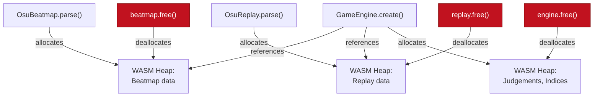

# API Specification
## @osurender/engine — Public TypeScript API Reference

| | |
|---|---|
| **Document ID** | ENG-API-0046 |
| **Version** | 1.0 — DRAFT |
| **Author** | Systems Engineering |
| **Parent Document** | [BRD — ENG-BRD-0042](./BRD.md) (§9) |
| **Last Revised** | 2026-06-26 |

---

## Table of Contents

1. [Overview](#1-overview)
2. [Installation & Initialization](#2-installation--initialization)
3. [Module: Versioning](#3-module-versioning)
4. [Class: OsuBeatmap](#4-class-osubeatmap)
5. [Class: OsuReplay](#5-class-osureplay)
6. [Class: GameEngine](#6-class-gameengine)
7. [Interface: StateSnapshot](#7-interface-statesnapshot)
8. [Interface: VisibleObject](#8-interface-visibleobject)
9. [Interface: JudgementEvent](#9-interface-judgementevent)
10. [Error Types](#10-error-types)
11. [Constants & Enums](#11-constants--enums)
12. [Memory Management](#12-memory-management)
13. [Usage Examples](#13-usage-examples)
14. [Performance Characteristics](#14-performance-characteristics)
15. [Compatibility & Versioning Policy](#15-compatibility--versioning-policy)
16. [Batch Query API](#16-batch-query-api)
17. [Expanded Error Taxonomy](#17-expanded-error-taxonomy)
18. [PlaybackClock Helper](#18-playbackclock-helper)
19. [Zero-Copy Buffer Lifetime Guarantees](#19-zero-copy-buffer-lifetime-guarantees)
20. [Observability: EngineStats](#20-observability-enginestats)
21. [Performance Budget by Subsystem](#21-performance-budget-by-subsystem)
22. [Compatibility Matrix](#22-compatibility-matrix)

---

## 1. Overview

`@osurender/engine` is a WebAssembly-based game logic engine for osu! Standard mode. It parses `.osr` replay files and `.osu` beatmap files in the browser, and exposes a pure, stateless `query(t)` API that returns the complete game state at any point in time.

### 1.1 Design Principles

| Principle | Description |
|---|---|
| **Pure queries** | `query(t)` is a pure function — no side effects, no internal state mutation |
| **Random-access** | Any time `t` can be queried in any order; no need to replay from the start |
| **Zero-copy curves** | `slider_curve_buffer()` returns a view into WASM linear memory |
| **Typed errors** | All failures throw typed errors with `.code` and `.message` properties |
| **Explicit cleanup** | WASM objects must be freed via `.free()` to prevent memory leaks |

### 1.2 Architecture

```
┌─────────────────────────────────────────────────────────────────┐
│  Host Application (TypeScript / JavaScript)                     │
│                                                                 │
│  const engine = await OsuEngine.load(osuBytes, osrBytes);       │
│                                                                 │
│  // 60fps render loop                                           │
│  function frame(t) {                                            │
│    const snap = engine.query(t);  // < 0.1ms                   │
│    renderer.draw(snap);                                         │
│    requestAnimationFrame(frame);                                │
│  }                                                              │
└─────────────────────────────────────────────────────────────────┘
          │              │               │
          ▼              ▼               ▼
┌─────────────────────────────────────────────────────────────────┐
│  @osurender/engine  (WASM + wasm-bindgen glue)                  │
│  Pipeline: Parse → Preprocess → Judge → Score → Visibility     │
│  Façade: GameEngine.create() + query(t) → StateSnapshot         │
└─────────────────────────────────────────────────────────────────┘
```

### 1.3 API Abstraction Layers (ADR-007, ADR-020)

The public API is structured as **4 abstraction layers**. Each layer wraps the one below it, adding ergonomics and safety. ADR-007 governs handle-based ownership at L0–L1; the TypeScript API at L2–L3 hides those handles behind classes.

```
┌─────────────────────────────────────────────────────────────────┐
L3 │  OsuEngine.load(osu, osr, options?)                           │
   │  → Async façade. Manages Worker, WASM init, pipeline.         │
   │  → Returns ready-to-query engine. This is the USER-FACING API.│
├─────────────────────────────────────────────────────────────────┤
L2 │  OsuBeatmap / OsuReplay / GameEngine                          │
   │  → TypeScript classes wrapping WASM handles.                  │
   │  → .free() releases memory. FinalizationRegistry as safety net.│
   │  → Synchronous query() for main-thread 60fps loops.           │
├─────────────────────────────────────────────────────────────────┤
L1 │  wasm_parse_beatmap(ptr, len) → handle: u32                   │
   │  wasm_create_engine(bm_handle, rp_handle) → handle: u32      │
   │  wasm_query(engine_handle, t) → serialized JSON               │
   │  → Raw #[wasm_bindgen] exports. Integer handles, not objects. │
├─────────────────────────────────────────────────────────────────┤
L0 │  HandleArena<T>                                               │
   │  → Internal Rust. Generational arena for safe handle reuse.   │
   │  → Never exposed to JavaScript.                               │
└─────────────────────────────────────────────────────────────────┘
```

| Layer | Who Uses It | Lifetime Managed By | Authoritative Doc |
|---|---|---|---|
| **L3** `OsuEngine.load()` | Application developers | Automatic (Worker lifecycle) | API Spec §17.1 |
| **L2** `OsuBeatmap` / `GameEngine` | Advanced users, internal | Manual `.free()` + FinalizationRegistry | API Spec §4, §5, §6 |
| **L1** `wasm_*` exports | Internal only | Handle integers (`u32`) | Not public API |
| **L0** `HandleArena<T>` | Internal only | Rust ownership | ADR-007 |

> [!IMPORTANT]
> **ADR-007 reconciliation**: ADR-007 specifies handle-based ownership at the WASM boundary (L1). The public TypeScript API (L2–L3) wraps those handles in classes that provide `.free()` and FinalizationRegistry safety nets. Both are correct at their respective layers — there is no conflict.

**Batch APIs are first-class**: `query()`, `query_batch()`, `query_range()`, and `query_frames()` are all co-equal members of the L2/L3 API surface. Batch queries are not secondary utilities — they are the recommended path for any use case that queries multiple timestamps (analytics, heatmaps, video export). See §16.

---

## 2. Installation & Initialization

### 2.1 NPM Installation

```bash
npm install @osurender/engine
```

### 2.2 CDN Usage

```html
<script type="module">
  import init, {
    OsuBeatmap,
    OsuReplay,
    GameEngine,
    version
  } from 'https://cdn.jsdelivr.net/npm/@osurender/engine@1/osu_engine_wasm.js';

  // Must call init() before using any API
  await init();

  console.log(version());
</script>
```

### 2.3 Bundler Usage (Vite / Webpack)

```typescript
import init, {
  OsuBeatmap,
  OsuReplay,
  GameEngine,
  version
} from '@osurender/engine';

// Initialize WASM module
await init();
```

### 2.4 Node.js Usage (Testing)

```typescript
const { OsuBeatmap, OsuReplay, GameEngine, version } = require('@osurender/engine');
// No init() needed — Node.js target auto-initializes
```

### 2.5 Initialization Options

```typescript
/**
 * Initialize the WASM module.
 * Must be called exactly once before using any other API.
 *
 * @param moduleOrPath - Optional: URL to .wasm file, or an ArrayBuffer
 *                       containing the WASM binary. If omitted, uses the
 *                       co-located .wasm file.
 * @returns Promise that resolves when the module is ready
 *
 * @example
 * // Custom WASM location
 * await init('/assets/osu_engine_wasm_bg.wasm');
 *
 * @example
 * // Pre-fetched WASM binary
 * const wasmBytes = await fetch('/engine.wasm').then(r => r.arrayBuffer());
 * await init(wasmBytes);
 */
export default function init(
  moduleOrPath?: string | URL | ArrayBuffer | WebAssembly.Module
): Promise<void>;
```

---

## 3. Module: Versioning

```typescript
/**
 * Engine version information.
 * Embedded at compile time from Cargo.toml and git.
 */
export interface EngineVersion {
  /** Major version (breaking changes) */
  major: number;
  /** Minor version (additive features) */
  minor: number;
  /** Patch version (bug fixes) */
  patch: number;
  /** Git commit hash (short, 7 chars) */
  git_hash: string;
}

/**
 * Returns the engine version.
 *
 * @returns EngineVersion object
 *
 * @example
 * const v = version();
 * console.log(`Engine v${v.major}.${v.minor}.${v.patch} (${v.git_hash})`);
 * // "Engine v1.0.0 (a1b2c3d)"
 */
export function version(): EngineVersion;
```

---

## 4. Class: OsuBeatmap

Represents a parsed `.osu` beatmap file. Immutable after construction.

### 4.1 Static Methods

```typescript
/**
 * Parse a .osu beatmap file from raw bytes.
 *
 * @param bytes - Raw file contents as Uint8Array
 * @returns Parsed OsuBeatmap instance
 * @throws {EngineError} With code:
 *   - 'UNSUPPORTED_GAME_MODE' if Mode !== 0 (Standard)
 *   - 'MISSING_SECTION' if required section is absent
 *   - 'MALFORMED_TIMING_POINT' if timing point line is unparseable
 *   - 'MALFORMED_HIT_OBJECT' if hit object line is unparseable
 *   - 'INVALID_UTF8' if file contains invalid UTF-8
 *
 * @example
 * const response = await fetch('/beatmaps/map.osu');
 * const bytes = new Uint8Array(await response.arrayBuffer());
 * const beatmap = OsuBeatmap.parse(bytes);
 * console.log(`${beatmap.artist} - ${beatmap.title} [${beatmap.version}]`);
 */
static parse(bytes: Uint8Array): OsuBeatmap;
```

### 4.2 Properties

| Property | Type | Description |
|---|---|---|
| `title` | `string` | Song title |
| `title_unicode` | `string` | Song title (Unicode) |
| `artist` | `string` | Song artist |
| `artist_unicode` | `string` | Song artist (Unicode) |
| `creator` | `string` | Mapper username |
| `version` | `string` | Difficulty name (e.g., "Insane") |
| `beatmap_hash` | `string` | MD5 hash of the source `.osu` file |
| `beatmap_id` | `number` | osu! beatmap ID (0 if unsubmitted) |
| `beatmap_set_id` | `number` | osu! beatmap set ID (0 if unsubmitted) |
| `base_ar` | `number` | Base Approach Rate (before mods) |
| `base_cs` | `number` | Base Circle Size (before mods) |
| `base_od` | `number` | Base Overall Difficulty (before mods) |
| `base_hp` | `number` | Base HP Drain Rate (before mods) |
| `slider_multiplier` | `number` | Base slider velocity multiplier |
| `slider_tick_rate` | `number` | Slider tick rate |
| `object_count` | `number` | Total hit objects |
| `circle_count` | `number` | Number of circles |
| `slider_count` | `number` | Number of sliders |
| `spinner_count` | `number` | Number of spinners |
| `max_combo` | `number` | Theoretical maximum combo |
| `drain_time_seconds` | `number` | Active play time (excluding breaks) |
| `total_length_seconds` | `number` | Total map length including breaks |
| `format_version` | `number` | `.osu` format version (e.g., 14) |
| `stack_leniency` | `number` | Stacking leniency (0.0–1.0) |

### 4.3 Instance Methods

```typescript
/**
 * Release WASM memory held by this beatmap.
 * Must be called when the beatmap is no longer needed.
 * Using the object after free() is undefined behavior.
 */
free(): void;
```

---

## 5. Class: OsuReplay

Represents a parsed `.osr` replay file. Immutable after construction.

### 5.1 Static Methods

```typescript
/**
 * Parse a .osr replay file from raw bytes.
 *
 * @param bytes - Raw file contents as Uint8Array
 * @returns Parsed OsuReplay instance
 * @throws {EngineError} With code:
 *   - 'UNSUPPORTED_GAME_MODE' if mode !== 0
 *   - 'TRUNCATED_INPUT' if file is too short
 *   - 'LZMA_DECOMPRESSION_FAILED' if LZMA payload is corrupt
 *   - 'LZMA_SIZE_LIMIT_EXCEEDED' if decompressed size > 256 MB
 *   - 'INVALID_UTF8' if strings contain invalid UTF-8
 *   - 'INVALID_STRING_MARKER' if osu-string has bad prefix
 *
 * @example
 * const response = await fetch('/replays/play.osr');
 * const bytes = new Uint8Array(await response.arrayBuffer());
 * const replay = OsuReplay.parse(bytes);
 * console.log(`${replay.player_name}: ${replay.score} (${replay.max_combo}x)`);
 */
static parse(bytes: Uint8Array): OsuReplay;
```

### 5.2 Properties

| Property | Type | Description |
|---|---|---|
| `game_mode` | `number` | Game mode (always 0 for Standard) |
| `game_version` | `number` | osu! client version (e.g., 20230326) |
| `player_name` | `string` | Player username |
| `beatmap_hash` | `string` | MD5 hash of the beatmap played |
| `replay_hash` | `string` | MD5 hash of the replay |
| `mods` | `number` | Mod bitmask (raw integer) |
| `mod_names` | `string[]` | Human-readable mod names (e.g., `["HardRock", "DoubleTime"]`) |
| `score` | `number` | Total score achieved |
| `max_combo` | `number` | Maximum combo achieved |
| `count_300` | `number` | Number of 300 judgements |
| `count_100` | `number` | Number of 100 judgements |
| `count_50` | `number` | Number of 50 judgements |
| `count_miss` | `number` | Number of misses |
| `count_geki` | `number` | Number of Geki (perfect 300 in a combo set) |
| `count_katu` | `number` | Number of Katu (100 or better ending a combo set) |
| `perfect` | `boolean` | Whether the play achieved max combo |
| `frame_count` | `number` | Number of replay cursor frames |
| `duration_ms` | `number` | Total replay duration in milliseconds |
| `timestamp` | `bigint` | Windows file time ticks (100ns since 1601-01-01) |
| `online_score_id` | `bigint` | Online score ID (0 if unsubmitted) |

### 5.3 Instance Methods

```typescript
/**
 * Release WASM memory held by this replay.
 * Must be called when the replay is no longer needed.
 */
free(): void;
```

---

## 6. Class: GameEngine

The primary interface for querying game state. Created from a beatmap + replay pair.

### 6.1 Static Methods

```typescript
/**
 * Create a game engine from a parsed beatmap and replay.
 *
 * This performs all one-time computation:
 * - Applies mod transformations (AR/CS/OD/HP, time scaling)
 * - Applies HardRock Y-flip / Mirror X-flip
 * - Runs stacking algorithm (v1 or v2 based on format version)
 * - Pre-computes all judgements by scanning the full replay
 * - Builds binary search indices for O(log n) queries
 *
 * @param beatmap - Parsed OsuBeatmap (not consumed; can be reused)
 * @param replay - Parsed OsuReplay (not consumed; can be reused)
 * @returns GameEngine ready for query(t) calls
 * @throws {EngineError} With code:
 *   - 'BEATMAP_HASH_MISMATCH' if replay.beatmap_hash !== beatmap.beatmap_hash
 *   - 'NO_TIMING_POINTS' if beatmap has no timing points
 *   - 'INVALID_MOD_COMBINATION' if conflicting mods (e.g., EZ + HR)
 *
 * @remarks
 * - This method takes ~30ms for a typical 3-minute map (BRD §11)
 * - The beatmap and replay must remain alive until the engine is freed
 * - The engine holds immutable references; query() is thread-safe
 *
 * @example
 * const engine = GameEngine.create(beatmap, replay);
 * const snap = engine.query(15000); // state at t=15 seconds
 */
static create(beatmap: OsuBeatmap, replay: OsuReplay): GameEngine;
```

### 6.2 Properties

| Property | Type | Description |
|---|---|---|
| `duration_ms` | `number` | Total replay duration in milliseconds |
| `object_count` | `number` | Total hit objects in the (mod-adjusted) beatmap |
| `effective_ar` | `number` | AR after mod application |
| `effective_cs` | `number` | CS after mod application |
| `effective_od` | `number` | OD after mod application |
| `effective_hp` | `number` | HP after mod application |
| `preempt_ms` | `number` | Object visibility preempt time (ms) |
| `fade_in_ms` | `number` | Fade-in duration (ms) |
| `circle_radius` | `number` | Circle radius in osu! pixels |
| `time_rate` | `number` | Time rate multiplier (1.0 = normal, 1.5 = DT, 0.75 = HT) |

### 6.3 Instance Methods

#### query()

```typescript
/**
 * Query the complete game state at time t.
 *
 * This is a pure function: calling query(t) with the same t always
 * returns the same result, regardless of previous queries. You can
 * seek forward, backward, or to any arbitrary time.
 *
 * @param t - Time in milliseconds (0 = start of beatmap audio)
 * @returns StateSnapshot containing all game state at time t
 *
 * @remarks
 * - Performance: < 0.1ms per call (native), < 0.2ms (WASM)
 * - Complexity: O(log n) where n = max(frames, objects)
 * - No heap allocation in the Rust hot path; one JS object allocation
 *   for the return value
 * - Negative t values are valid (pre-start state, combo=0, no objects)
 * - t > duration_ms returns the final state
 *
 * @example
 * // Seek to 30 seconds
 * const snap = engine.query(30000);
 * console.log(`Combo: ${snap.combo}, Accuracy: ${(snap.accuracy * 100).toFixed(2)}%`);
 *
 * @example
 * // 60fps render loop
 * function animate(audioTime: number) {
 *   const snap = engine.query(audioTime);
 *   renderer.draw(snap);
 *   requestAnimationFrame(() => animate(audioContext.currentTime * 1000));
 * }
 */
query(t: number): StateSnapshot;
```

#### precompute_curves()

```typescript
/**
 * Pre-compute slider curve render points for all sliders.
 *
 * Call once after create(). Results are cached in WASM memory
 * and accessed via slider_curve_buffer().
 *
 * @param points_per_segment - Number of sample points per curve segment.
 *   Recommended: 32 for rendering, 8 for analysis.
 *   Range: [4, 128]. Values outside range are clamped.
 *
 * @remarks
 * - Takes ~10ms for 500 sliders with 32 points
 * - Memory: ~32 × 8 bytes × slider_count
 * - Calling again replaces previous computation
 *
 * @example
 * engine.precompute_curves(32);
 * const curvePoints = engine.slider_curve_buffer(0);
 * // curvePoints = Float32Array [x0, y0, x1, y1, ...]
 */
precompute_curves(points_per_segment: number): void;
```

#### slider_curve_buffer()

```typescript
/**
 * Get the pre-computed curve render points for a specific slider.
 *
 * Returns a zero-copy Float32Array view into WASM linear memory.
 * The array contains interleaved [x, y] coordinates in osu! pixels.
 *
 * @param object_index - Index of the slider hit object (0-based)
 * @returns Float32Array of [x0, y0, x1, y1, ...] points
 * @throws {EngineError} With code:
 *   - 'INDEX_OUT_OF_RANGE' if object_index >= object_count
 *   - 'NOT_A_SLIDER' if the object at this index is not a slider
 *   - 'CURVES_NOT_PRECOMPUTED' if precompute_curves() hasn't been called
 *
 * @remarks
 * - The returned Float32Array is a VIEW into WASM memory — it does not
 *   own the data. Do NOT hold references across query() or free() calls.
 * - For safe persistence, copy the data: `new Float32Array(buffer)`
 * - Coordinates include stack offset and mod transforms (HR Y-flip)
 *
 * @example
 * const pts = engine.slider_curve_buffer(sliderIndex);
 * ctx.beginPath();
 * ctx.moveTo(pts[0], pts[1]);
 * for (let i = 2; i < pts.length; i += 2) {
 *   ctx.lineTo(pts[i], pts[i + 1]);
 * }
 * ctx.stroke();
 */
slider_curve_buffer(object_index: number): Float32Array;
```

#### free()

```typescript
/**
 * Release all WASM memory held by this engine.
 *
 * After calling free(), any subsequent method call on this
 * instance is undefined behavior and may crash.
 *
 * This also releases internal references to the beatmap and replay
 * data. The OsuBeatmap and OsuReplay objects themselves are NOT freed
 * by this call — they must be freed separately if desired.
 */
free(): void;
```

---

## 7. Interface: StateSnapshot

The complete game state at a single point in time. Returned by `engine.query(t)`.

```typescript
export interface StateSnapshot {
  /** The time this snapshot represents (same as query input) */
  t: number;

  // ── Cursor State ─────────────────────────────────────────────

  /** Cursor position in osu! playfield coordinates */
  cursor: {
    /** X position (0–512 osu!px) */
    x: number;
    /** Y position (0–384 osu!px) */
    y: number;
  };

  /** Key state at this frame */
  keys: {
    /** Mouse button 1 */
    m1: boolean;
    /** Mouse button 2 */
    m2: boolean;
    /** Keyboard key 1 (Z by default) */
    k1: boolean;
    /** Keyboard key 2 (X by default) */
    k2: boolean;
    /** Smoke key */
    smoke: boolean;
  };

  // ── Visible Objects ──────────────────────────────────────────

  /**
   * Objects currently visible on screen, sorted by draw order
   * (furthest-from-hit-time first, closest-to-hit-time last).
   * Typically 5–20 objects.
   */
  visible_objects: VisibleObject[];

  // ── Score / HUD ──────────────────────────────────────────────

  /** Current combo count */
  combo: number;

  /** Maximum combo achieved so far */
  max_combo: number;

  /** Total score */
  score: number;

  /**
   * Current accuracy (0.0 – 1.0).
   * Formula: (300×c300 + 100×c100 + 50×c50) / (300 × total_objects_judged)
   */
  accuracy: number;

  /**
   * Current HP (0.0 – 1.0).
   * 0.0 = dead (if NoFail is not active).
   * P1 feature — may be 1.0 in v1.0 if HP drain is not yet implemented.
   */
  hp: number;

  // ── Judgement History ────────────────────────────────────────

  /**
   * Recent judgement events (last 5).
   * Useful for displaying hit error indicators.
   */
  recent_judgements: JudgementEvent[];

  // ── Frame Metadata ───────────────────────────────────────────

  /** Index of the current replay frame (0-based) */
  frame_index: number;

  /** Effective AR after mod application */
  effective_ar: number;

  /** Effective CS after mod application */
  effective_cs: number;

  /** Effective OD after mod application */
  effective_od: number;

  /** Object preempt time in milliseconds */
  preempt_ms: number;

  /** Fade-in duration in milliseconds */
  fade_in_ms: number;

  /** Circle radius in osu! pixels */
  circle_radius: number;

  // ── Cumulative Judgement Counts ───────────────────────────────

  /** Total 300 judgements so far */
  count_300: number;

  /** Total 100 judgements so far */
  count_100: number;

  /** Total 50 judgements so far */
  count_50: number;

  /** Total misses so far */
  count_miss: number;

  /** Total slider breaks so far */
  count_slider_break: number;

  /** Total objects judged so far */
  objects_judged: number;
}
```

---

## 8. Interface: VisibleObject

A discriminated union representing a hit object currently visible on screen.

```typescript
/**
 * A hit object currently visible at the queried time t.
 * Discriminated on the `kind` field.
 */
export type VisibleObject =
  | VisibleCircle
  | VisibleSlider
  | VisibleSpinner;

export interface VisibleCircle {
  /** Discriminator */
  kind: "circle";

  /** Index in the beatmap's hit object list (0-based) */
  object_index: number;

  /** Stack-adjusted X position in osu!px */
  x: number;

  /** Stack-adjusted Y position in osu!px */
  y: number;

  /** Target hit time in milliseconds */
  hit_time: number;

  /** Current opacity (0.0 = invisible, 1.0 = fully visible) */
  alpha: number;

  /**
   * Approach circle scale factor.
   * 1.0 = at hit time (touching circle edge).
   * > 1.0 = approaching (larger than circle).
   * Typically starts at 4.0 and shrinks to 1.0.
   */
  approach_scale: number;

  /** Combo color index (0-based, cycles through skin colors) */
  combo_color_index: number;

  /** Combo number displayed on the circle (1, 2, 3, ...) */
  combo_number: number;

  /** Whether this circle has already been judged at time t */
  is_judged: boolean;

  /** Judgement result if judged, null otherwise */
  judgement: "300" | "100" | "50" | "miss" | null;
}

export interface VisibleSlider {
  /** Discriminator */
  kind: "slider";

  /** Index in the beatmap's hit object list */
  object_index: number;

  /** Stack-adjusted start X position in osu!px */
  x: number;

  /** Stack-adjusted start Y position in osu!px */
  y: number;

  /** Target hit time (slider head) in milliseconds */
  hit_time: number;

  /** Time when the slider ends (including all repeats) */
  end_time: number;

  /** Number of repeats (1 = no repeat, 2 = one bounce-back, etc.) */
  repeat_count: number;

  /** Current opacity */
  alpha: number;

  /** Approach circle scale factor (for slider head) */
  approach_scale: number;

  /**
   * Current slider ball position.
   * null before the slider's hit_time.
   * Contains the x,y of the ball traveling along the curve.
   */
  ball_position: { x: number; y: number } | null;

  /**
   * Ball progress within the current repeat (0.0 – 1.0).
   * 0.0 = at slider head, 1.0 = at slider tail.
   * On reverse repeats, this goes 0→1→0→1...
   */
  ball_progress: number;

  /**
   * Current repeat index (0-based).
   * 0 = first traversal, 1 = first reverse, etc.
   */
  current_repeat: number;

  /** Combo color index */
  combo_color_index: number;

  /** Combo number displayed on the slider head */
  combo_number: number;

  /** Whether the slider is currently being tracked (key held + cursor on ball) */
  is_tracking: boolean;
}

export interface VisibleSpinner {
  /** Discriminator */
  kind: "spinner";

  /** Index in the beatmap's hit object list */
  object_index: number;

  /** Spinner start time in milliseconds */
  hit_time: number;

  /** Spinner end time in milliseconds */
  end_time: number;

  /** Current opacity */
  alpha: number;

  /**
   * Spinner completion (0.0 – 1.0).
   * Based on accumulated RPM. 1.0 = fully completed for a 300.
   */
  completion: number;

  /**
   * Current rotations per minute.
   * Computed from cursor angular velocity. P1 feature.
   */
  rpm: number;
}
```

---

## 9. Interface: JudgementEvent

Represents a single judging event (when a hit object is resolved to 300/100/50/miss).

```typescript
export interface JudgementEvent {
  /** Index of the judged hit object */
  object_index: number;

  /** Time the judgement occurred (ms) */
  t: number;

  /** Judgement result */
  result: "300" | "100" | "50" | "miss" | "slider_break";

  /** Cursor X at the moment of judgement (osu!px) */
  x: number;

  /** Cursor Y at the moment of judgement (osu!px) */
  y: number;

  /**
   * Hit timing error in milliseconds.
   * Negative = early, Positive = late.
   * For misses, this equals the miss window.
   */
  delta_ms: number;
}
```

---

## 10. Error Types

All errors thrown by the engine are instances of `EngineError`.

```typescript
/**
 * Error thrown by engine operations.
 * Extends Error with a machine-readable `code` property.
 */
export class EngineError extends Error {
  /** Machine-readable error code */
  readonly code: EngineErrorCode;

  /** Human-readable error message */
  readonly message: string;
}

export type EngineErrorCode =
  // Parser errors
  | 'TRUNCATED_INPUT'
  | 'INVALID_MAGIC'
  | 'INVALID_UTF8'
  | 'INVALID_STRING_MARKER'
  | 'ULEB_OVERFLOW'
  | 'LZMA_DECOMPRESSION_FAILED'
  | 'LZMA_SIZE_LIMIT_EXCEEDED'
  | 'UNSUPPORTED_GAME_MODE'
  | 'UNSUPPORTED_VERSION'
  | 'MISSING_SECTION'
  | 'MALFORMED_TIMING_POINT'
  | 'MALFORMED_HIT_OBJECT'
  | 'UNKNOWN_CURVE_TYPE'
  | 'INVALID_COORDINATE'

  // Engine errors
  | 'BEATMAP_HASH_MISMATCH'
  | 'NO_TIMING_POINTS'
  | 'INVALID_MOD_COMBINATION'

  // Query errors
  | 'INDEX_OUT_OF_RANGE'
  | 'NOT_A_SLIDER'
  | 'CURVES_NOT_PRECOMPUTED';
```

### 10.1 Error Handling Pattern

```typescript
try {
  const beatmap = OsuBeatmap.parse(bytes);
} catch (e) {
  if (e instanceof EngineError) {
    switch (e.code) {
      case 'UNSUPPORTED_GAME_MODE':
        console.warn("This beatmap is not osu! Standard mode");
        break;
      case 'MALFORMED_HIT_OBJECT':
        console.error("Corrupt beatmap file:", e.message);
        break;
      default:
        console.error(`Engine error [${e.code}]: ${e.message}`);
    }
  }
}
```

---

## 11. Constants & Enums

### 11.1 Mod Bitmask Constants

```typescript
export const Mods = {
  None:        0,
  NoFail:      1 << 0,   // 1
  Easy:        1 << 1,   // 2
  TouchDevice: 1 << 2,   // 4
  Hidden:      1 << 3,   // 8
  HardRock:    1 << 4,   // 16
  SuddenDeath: 1 << 5,   // 32
  DoubleTime:  1 << 6,   // 64
  Relax:       1 << 7,   // 128
  HalfTime:    1 << 8,   // 256
  Nightcore:   1 << 9,   // 512 (implies DoubleTime)
  Flashlight:  1 << 10,  // 1024
  Autoplay:    1 << 11,  // 2048
  SpunOut:     1 << 12,  // 4096
  Autopilot:   1 << 13,  // 8192
  Perfect:     1 << 14,  // 16384
  ScoreV2:     1 << 22,  // 4194304
  Mirror:      1 << 29,  // 536870912
} as const;
```

### 11.2 Playfield Constants

```typescript
export const Playfield = {
  /** Playfield width in osu! pixels */
  WIDTH: 512,
  /** Playfield height in osu! pixels */
  HEIGHT: 384,
  /** Playfield center X */
  CENTER_X: 256,
  /** Playfield center Y */
  CENTER_Y: 192,
} as const;
```

### 11.3 Key Flags

```typescript
export const KeyFlag = {
  M1:    1 << 0,  // Mouse button 1
  M2:    1 << 1,  // Mouse button 2
  K1:    1 << 2,  // Keyboard key 1
  K2:    1 << 3,  // Keyboard key 2
  Smoke: 1 << 4,  // Smoke key
} as const;
```

---

## 12. Memory Management

### 12.1 Ownership Model



### 12.2 Lifecycle Rules

> [!IMPORTANT]
> **Every `parse()` or `create()` call MUST be paired with a `free()` call.** Failing to call `free()` will leak WASM linear memory, which cannot be garbage collected.

```typescript
// Correct: always free in finally block
let engine: GameEngine | null = null;
try {
  const beatmap = OsuBeatmap.parse(osuBytes);
  const replay = OsuReplay.parse(osrBytes);
  engine = GameEngine.create(beatmap, replay);

  // ... use engine ...

} finally {
  engine?.free();
  replay?.free();
  beatmap?.free();
}
```

### 12.3 Zero-Copy Buffer Safety

```typescript
// The Float32Array from slider_curve_buffer() is a VIEW
// into WASM memory. It becomes invalid after free().

const curveView = engine.slider_curve_buffer(0);
// Safe: use immediately
drawCurve(curveView);

// Safe: copy for later use
const curveCopy = new Float32Array(curveView);

// Dangerous: using view after free
engine.free();
drawCurve(curveView);  // UNDEFINED BEHAVIOR — memory may be reused
```

---

## 13. Usage Examples

### 13.1 Basic: Load and Query

```typescript
import init, { OsuBeatmap, OsuReplay, GameEngine } from '@osurender/engine';

async function analyzeReplay(osuUrl: string, osrUrl: string) {
  await init();

  // Fetch files
  const [osuRes, osrRes] = await Promise.all([fetch(osuUrl), fetch(osrUrl)]);
  const osuBytes = new Uint8Array(await osuRes.arrayBuffer());
  const osrBytes = new Uint8Array(await osrRes.arrayBuffer());

  // Parse
  const beatmap = OsuBeatmap.parse(osuBytes);
  const replay = OsuReplay.parse(osrBytes);

  console.log(`Map: ${beatmap.artist} - ${beatmap.title} [${beatmap.version}]`);
  console.log(`Play: ${replay.player_name} — ${replay.max_combo}x, ${replay.count_miss} miss`);

  // Create engine
  const engine = GameEngine.create(beatmap, replay);
  console.log(`Duration: ${(engine.duration_ms / 1000).toFixed(1)}s`);
  console.log(`Effective AR: ${engine.effective_ar.toFixed(1)}`);

  // Query final state
  const finalSnap = engine.query(engine.duration_ms);
  console.log(`Final: ${finalSnap.combo}x combo, ${(finalSnap.accuracy * 100).toFixed(2)}% accuracy`);

  // Cleanup
  engine.free();
  replay.free();
  beatmap.free();
}
```

### 13.2 Render Loop Integration

```typescript
function startPlayback(engine: GameEngine, renderer: Renderer, audio: AudioContext) {
  const startTime = audio.currentTime;

  function frame() {
    const audioMs = (audio.currentTime - startTime) * 1000;
    const snap = engine.query(audioMs);

    // Draw all visible objects
    for (const obj of snap.visible_objects) {
      switch (obj.kind) {
        case 'circle':
          renderer.drawCircle(obj.x, obj.y, obj.approach_scale, obj.alpha, obj.combo_number);
          break;
        case 'slider':
          if (obj.ball_position) {
            renderer.drawSliderBall(obj.ball_position.x, obj.ball_position.y);
          }
          renderer.drawSliderBody(engine.slider_curve_buffer(obj.object_index), obj.alpha);
          break;
        case 'spinner':
          renderer.drawSpinner(obj.completion, obj.alpha);
          break;
      }
    }

    // Draw cursor
    renderer.drawCursor(snap.cursor.x, snap.cursor.y);

    // Draw HUD
    renderer.drawHUD(snap.combo, snap.accuracy, snap.score, snap.hp);

    // Draw hit error
    for (const j of snap.recent_judgements) {
      renderer.drawHitError(j.delta_ms, j.result);
    }

    requestAnimationFrame(frame);
  }

  requestAnimationFrame(frame);
}
```

### 13.3 Batch Analysis

```typescript
async function extractHitTimings(engine: GameEngine): Promise<number[]> {
  const timings: number[] = [];
  const step = 1; // 1ms resolution

  for (let t = 0; t <= engine.duration_ms; t += step) {
    const snap = engine.query(t);

    // Detect new judgements
    for (const j of snap.recent_judgements) {
      if (j.t >= t - step && j.t < t) {
        timings.push(j.delta_ms);
      }
    }
  }

  return timings;
}
```

### 13.4 Mod Detection

```typescript
import { Mods } from '@osurender/engine';

function describePlay(replay: OsuReplay): string {
  const parts: string[] = [];

  if (replay.mods & Mods.Hidden)     parts.push('HD');
  if (replay.mods & Mods.HardRock)   parts.push('HR');
  if (replay.mods & Mods.DoubleTime) parts.push('DT');
  if (replay.mods & Mods.Flashlight) parts.push('FL');

  const modStr = parts.length > 0 ? `+${parts.join('')}` : 'NM';
  return `${replay.player_name} ${modStr} ${replay.max_combo}x ${(replay.count_miss === 0 ? 'FC' : `${replay.count_miss}m`)}`;
}
```

---

## 14. Performance Characteristics

### 14.1 Time Complexity

| Operation | Complexity | Typical Time |
|---|---|---|
| `OsuBeatmap.parse()` | O(n) | ~15 ms for 100 KB |
| `OsuReplay.parse()` | O(n) | ~20 ms for 300 KB |
| `GameEngine.create()` | O(f × h) | ~30 ms for typical map |
| `precompute_curves()` | O(s × p) | ~10 ms for 500 sliders |
| `query(t)` | O(log n + k) | ~0.1 ms |
| `slider_curve_buffer()` | O(1) | ~0.01 ms (pointer return) |
| `free()` | O(1) | ~0.01 ms |

Where: n = input size, f = frames, h = objects, s = sliders, p = points, k = visible objects

### 14.2 Space Complexity

| Data | Memory | Typical |
|---|---|---|
| Beatmap | O(h + t) | ~300 KB for 1500 objects |
| Replay | O(f) | ~480 KB for 30K frames |
| Judgements | O(h) | ~60 KB |
| Curve buffers | O(s × p × 2) | ~128 KB |
| Indices | O(h + f) | ~36 KB |
| **Total peak** | | **~4–12 MB** |

### 14.3 WASM Binary Size

| Component | Contribution |
|---|---|
| Core engine logic | ~200 KB |
| `lzma-rs` | ~80 KB |
| `wasm-bindgen` glue | ~20 KB |
| `serde` | ~40 KB |
| Allocator (`wee_alloc`) | ~1 KB |
| **Total (gzipped)** | **~400–600 KB** |

---

### 15.2 Multi-Dimensional Versioning Strategy

The engine maintains **five independent version dimensions** to enable fine-grained compatibility tracking:

| Version Dimension | Tracks | Bump Trigger |
|---|---|---|
| **Engine API Version** | Public TypeScript API surface | Any method/type change |
| **Snapshot Schema Version** | `StateSnapshot` field layout | Any field addition/deprecation |
| **Golden Dataset Version** | Differential test baselines | lazer release update or tolerance change |
| **Beatmap Parser Version** | `.osu` format parsing behavior | Parser bug fix or new format support |
| **Replay Parser Version** | `.osr` format parsing behavior | Parser bug fix or new format support |

```typescript
interface EngineVersion {
  /** SemVer of the engine API (e.g., "1.3.0") */
  api: string;

  /** Snapshot schema version (monotonically increasing integer) */
  snapshot_schema: number;

  /** Golden dataset version tag (e.g., "lazer-2024.1115.0-r3") */
  golden_dataset: string;

  /** Beatmap parser version (monotonically increasing integer) */
  beatmap_parser: number;

  /** Replay parser version (monotonically increasing integer) */
  replay_parser: number;

  /** Short git commit hash */
  git_hash: string;
}

// Usage
const version = engine.version();
console.log(`API: ${version.api}, Schema: v${version.snapshot_schema}`);
```

**Compatibility rules**:

| Dimension | Compatibility Guarantee |
|---|---|
| API version | SemVer: major breaks = breaking, minor = additive, patch = fix |
| Snapshot schema | Append-only; never reorder, rename, or remove fields (ADR-010) |
| Golden dataset | Pinned to specific lazer release; update = explicit version bump |
| Beatmap parser | Same `.osu` file must produce identical output across patch versions |
| Replay parser | Same `.osr` file must produce identical output across patch versions |

### 15.3 Deprecation Policy

- Breaking changes require a **major version bump**
- Deprecated APIs are marked `@deprecated` for at least **6 months** before removal
- Migration guides are published with each major release
- Deprecated `StateSnapshot` fields remain in the schema with documented sentinel values

### 15.4 Supported Platforms

| Platform | Minimum Version | Notes |
|---|---|---|
| Chrome | 89 | WebAssembly + BigInt support |
| Firefox | 89 | WebAssembly + BigInt support |
| Safari | 15 | WebAssembly support |
| Edge | 89 | Chromium-based |
| Node.js | 18 LTS | WASM support |

---

## 16. Batch Query API

Per ADR-011, batch operations reduce WASM boundary overhead for bulk queries.

### 16.1 query_batch()

```typescript
/**
 * Execute multiple queries in a single WASM boundary crossing.
 *
 * This is 10-50× faster than calling query() in a loop for large
 * batches, because WASM↔JS marshaling overhead is amortized.
 *
 * @param times - Float64Array of timestamps to query (milliseconds).
 *   Need not be sorted. Maximum **4,096** samples per call (ADR-019).
 *   For larger ranges, use query_range() which auto-paginates.
 * @returns BatchResult containing column-oriented results.
 *
 * @remarks
 * - The returned BatchResult holds memory in WASM — you MUST call
 *   .free() when done, or use a try/finally block.
 * - Results are returned in the same order as the input times.
 * - NaN/Infinity values in the times array are clamped to [0, duration_ms].
 *
 * @example
 * const times = new Float64Array([0, 5000, 10000, 15000, 20000]);
 * const result = engine.query_batch(times);
 * try {
 *   for (let i = 0; i < result.count; i++) {
 *     console.log(`t=${result.times[i]}: combo=${result.combos[i]}`);
 *   }
 * } finally {
 *   result.free();
 * }
 */
query_batch(times: Float64Array): BatchResult;
```

### 16.2 query_range()

```typescript
/**
 * Query at uniform intervals within a time range.
 *
 * Equivalent to query_batch() with evenly-spaced timestamps,
 * but avoids allocating the input array.
 *
 * @param start_ms - Start time (inclusive)
 * @param end_ms - End time (inclusive)
 * @param step_ms - Interval between samples. Must be > 0.
 * @returns BatchResult
 *
 * @example
 * // Sample every 16.67ms (60 fps) for the entire map
 * const result = engine.query_range(0, engine.duration_ms, 1000 / 60);
 */
query_range(start_ms: number, end_ms: number, step_ms: number): PaginatedBatchResult;
```

> [!IMPORTANT]
> Per ADR-019, if the total sample count exceeds 4,096, `query_range()` automatically paginates the result into chunks of ≤ 4,096 samples. Each page is a standard `BatchResult` that must be freed after use. This prevents V8 GC pressure from large typed array view counts.

### 16.3.1 PaginatedBatchResult Interface

```typescript
/**
 * Auto-paginated result for large range queries.
 * Each page contains ≤ 4,096 samples.
 *
 * Pages overlap by 1 sample at boundaries
 * (last sample of page N = first sample of page N+1)
 * to prevent state transition artifacts.
 */
export interface PaginatedBatchResult {
  /** Total samples across all pages */
  readonly total_count: number;

  /** Samples per page (≤ 4096) */
  readonly page_size: number;

  /** Number of pages */
  readonly page_count: number;

  /** Current page (BatchResult) */
  readonly current_page: BatchResult;

  /** Are there more pages? */
  hasMore(): boolean;

  /** Advance to next page. Automatically frees the previous page. */
  next(): BatchResult;

  /** Async iterator support */
  [Symbol.asyncIterator](): AsyncIterableIterator<BatchResult>;

  /** Free all remaining pages */
  free(): void;
}
```

**Usage:**

```typescript
// Auto-paginated range query for video export
const pages = engine.query_range(0, 600_000, 16.67); // 36,000 samples
for await (const page of pages) {
  for (let i = 0; i < page.count; i++) {
    encoder.addFrame(page.combos[i], page.cursor_x[i], page.cursor_y[i]);
  }
  page.free(); // Free each page immediately
}
```

### 16.3 query_frames()

```typescript
/**
 * Query at exact replay frame timestamps.
 *
 * This gives the most accurate representation since the game state
 * only changes at replay frame boundaries.
 *
 * @param start_frame - Starting frame index (0-based)
 * @param count - Number of frames to query
 * @returns BatchResult
 *
 * @example
 * // Query the first 1000 replay frames
 * const result = engine.query_frames(0, 1000);
 */
query_frames(start_frame: number, count: number): BatchResult;
```

### 16.4 BatchResult Interface

```typescript
/**
 * Column-oriented batch query results.
 *
 * Each array has the same length (count). Index i across all arrays
 * corresponds to the same query timestamp.
 *
 * The typed arrays are VIEWS into WASM memory — they become invalid
 * after free() or any other engine method that triggers allocation.
 */
export interface BatchResult {
  /** Number of samples in this batch */
  readonly count: number;

  // ── Column Arrays (zero-copy views) ────────────────────────

  /** Timestamps of each sample (ms) */
  readonly times: Float64Array;

  /** Combo at each sample */
  readonly combos: Uint32Array;

  /** Score at each sample */
  readonly scores: Float64Array;

  /** Accuracy at each sample (0.0–1.0) */
  readonly accuracies: Float64Array;

  /** HP at each sample (0.0–1.0) */
  readonly hps: Float64Array;

  /** Cursor X at each sample */
  readonly cursor_x: Float32Array;

  /** Cursor Y at each sample */
  readonly cursor_y: Float32Array;

  /** Visible object count at each sample */
  readonly visible_counts: Uint16Array;

  // ── Per-sample full snapshot ────────────────────────────────

  /**
   * Get the full StateSnapshot for a specific sample.
   * This involves deserialization — use sparingly.
   *
   * @param index - Sample index (0-based, < count)
   */
  snapshot_at(index: number): StateSnapshot;

  /**
   * Release WASM memory. MUST be called when done.
   * Idempotent — safe to call multiple times.
   */
  free(): void;
}
```

---

## 17. Expanded Error Taxonomy

Per feedback item #17, errors are categorized into six families for clear consumer handling:

```typescript
export type EngineErrorCode =
  // ── ParseError: Invalid input data ──────────────────────
  | 'TRUNCATED_INPUT'              // Input too short
  | 'INVALID_MAGIC'                // Bad file magic bytes
  | 'INVALID_UTF8'                 // String is not valid UTF-8
  | 'INVALID_STRING_MARKER'        // Bad .osr string length prefix
  | 'ULEB_OVERFLOW'                // ULEB128 value too large
  | 'LZMA_DECOMPRESSION_FAILED'    // LZMA decompress error
  | 'LZMA_SIZE_LIMIT_EXCEEDED'     // Decompressed size > 256 MB
  | 'MALFORMED_TIMING_POINT'       // Bad timing point format
  | 'MALFORMED_HIT_OBJECT'         // Bad hit object format
  | 'UNKNOWN_CURVE_TYPE'           // Unrecognized slider curve type
  | 'INVALID_COORDINATE'           // Non-finite or extreme coordinate
  | 'OBJECT_LIMIT_EXCEEDED'        // > 100,000 objects
  | 'FRAME_LIMIT_EXCEEDED'         // > 1,000,000 frames
  | 'LZMA_CPU_TIMEOUT'             // LZMA decompression exceeded parse timeout (ADR-018)

  // ── ValidationError: Data parsed but semantically invalid ──
  | 'UNSUPPORTED_GAME_MODE'        // Not osu! Standard (mode 0)
  | 'UNSUPPORTED_VERSION'          // Format version not supported
  | 'MISSING_SECTION'              // Required section missing
  | 'NO_TIMING_POINTS'             // Beatmap has zero timing points
  | 'BEATMAP_HASH_MISMATCH'        // Replay refers to different map
  | 'INVALID_MOD_COMBINATION'      // Mutually exclusive mods enabled

  // ── RuntimeError: Logic/computation error ──────────────────
  | 'CURVES_NOT_PRECOMPUTED'       // precompute_curves() not called
  | 'NOT_A_SLIDER'                 // Object is not a slider

  // ── MemoryError: Resource exhaustion ───────────────────────
  | 'ALLOCATION_FAILED'            // WASM linear memory exhausted
  | 'BATCH_TOO_LARGE'              // Batch query > 4,096 samples (ADR-019)
  | 'BATCH_SIZE_EXCEEDED'          // query_batch() called with > 4,096 timestamps
  | 'HANDLE_ARENA_FULL'            // > 65536 simultaneous handles

  // ── UnsupportedFeature: Recognized but not implemented ─────
  | 'UNSUPPORTED_MOD'              // Mod recognized but not simulated
  | 'UNSUPPORTED_SLIDER_TYPE'      // Rare slider type not implemented
  | 'FEATURE_NOT_AVAILABLE'        // Feature gated behind build flag

  // ── InternalBug: Should never happen ───────────────────────
  | 'INVALID_HANDLE'               // Handle freed or never allocated
  | 'INVALID_STATE'                // Method called in wrong lifecycle state
  | 'INDEX_OUT_OF_RANGE'           // Internal index corruption
  | 'INTERNAL_ERROR';              // Catch-all for unexpected bugs

export class EngineError extends Error {
  readonly code: EngineErrorCode;
  readonly category: 'parse' | 'validation' | 'runtime' | 'memory' | 'unsupported' | 'internal';
  readonly message: string;

  /** Whether this error indicates a bug in the engine (vs. bad input) */
  get isInternalBug(): boolean {
    return this.category === 'internal';
  }

  /** Whether the engine can continue operating after this error */
  get isRecoverable(): boolean {
    return this.category !== 'memory' && this.category !== 'internal';
  }
}
```

### 17.1 Error Handling Patterns

```typescript
// Pattern 1: Categorical handling
try {
  const beatmap = OsuBeatmap.parse(bytes);
} catch (e) {
  if (e instanceof EngineError) {
    switch (e.category) {
      case 'parse':       showError("Corrupt file"); break;
      case 'validation':  showError("Unsupported file"); break;
      case 'memory':      showError("Out of memory"); break;
      case 'internal':    reportBug(e); break;
    }
  }
}

// Pattern 2: Specific error handling
try {
  const engine = GameEngine.create(beatmap, replay);
} catch (e) {
  if (e instanceof EngineError && e.code === 'BEATMAP_HASH_MISMATCH') {
    showWarning("This replay is for a different beatmap version");
  }
}
```

---

## 17.1 Initialization API (ADR-017, ADR-018)

Per ADR-017 and ADR-018, the primary initialization method is an **async factory** that handles Worker management internally:

```typescript
/**
 * Primary factory method for creating an OsuEngine instance.
 *
 * Parsing and engine creation run in a dedicated Web Worker to prevent
 * main-thread CPU exhaustion (ADR-018). Once complete, the WASM memory
 * is transferred to the main thread, and all subsequent query() calls
 * are synchronous.
 *
 * @param beatmapBytes - Raw .osu file contents
 * @param replayBytes - Raw .osr file contents
 * @param options - Configuration for timeout, progress, cancellation
 * @returns Promise resolving to a ready-to-query engine instance
 *
 * @throws EngineError('LZMA_CPU_TIMEOUT') if parsing exceeds timeout
 * @throws EngineError('TRUNCATED_INPUT') if files are malformed
 * @throws DOMException('AbortError') if signal is aborted
 *
 * @example
 * const engine = await OsuEngine.load(beatmapBytes, replayBytes, {
 *   parseTimeoutMs: 10_000,
 *   onProgress: (phase, pct) => updateLoadingBar(phase, pct),
 *   signal: abortController.signal,
 * });
 *
 * // engine.query(t) is now synchronous
 * const snapshot = engine.query(5000);
 */
export class OsuEngine {
  static async load(
    beatmapBytes: Uint8Array,
    replayBytes: Uint8Array,
    options?: LoadOptions
  ): Promise<OsuEngine>;

  /** Synchronous query — only available after load() resolves */
  query(t: number): StateSnapshot;

  /** Synchronous batch query (max 4,096 samples per ADR-019) */
  query_batch(times: Float64Array): BatchResult;

  /** Auto-paginated range query */
  query_range(start_ms: number, end_ms: number, step_ms: number): PaginatedBatchResult;

  /** Precompute slider curve polylines */
  precompute_curves(samples_per_segment?: number): void;

  /** Get engine statistics */
  stats(): EngineStats;

  /** Release all WASM memory. Idempotent. */
  free(): void;
}

interface LoadOptions {
  /** Maximum parse time before Worker is terminated (default: 10_000ms) */
  parseTimeoutMs?: number;

  /** Progress callback during initialization phases */
  onProgress?: (phase: LoadPhase, pct: number) => void;

  /** AbortSignal for cancellation support */
  signal?: AbortSignal;
}

type LoadPhase =
  | 'loading_wasm'       // WASM module instantiation
  | 'decompressing'      // LZMA decompression of .osr data
  | 'parsing_replay'     // Replay frame extraction
  | 'parsing_beatmap'    // .osu file parsing
  | 'creating_engine'    // Judgement pre-computation, index building
  | 'transferring';      // WASM memory transfer to main thread
```

> [!WARNING]
> The individual `OsuBeatmap.parse()`, `OsuReplay.parse()`, and `GameEngine.create()` methods still exist in the WASM API for Node.js and test environments. **In browser environments, always use `OsuEngine.load()`** to ensure parsing runs in a Worker with timeout protection.

---

## 18. PlaybackClock Helper

Per feedback item #12, a JavaScript-only helper synchronizes audio time with engine queries:

```typescript
/**
 * Synchronizes audio playback time with engine queries.
 *
 * The engine doesn't know about audio — it only accepts time in ms.
 * This helper converts Web Audio API or HTMLAudioElement time into
 * engine-compatible timestamps with drift correction.
 *
 * NOT part of the WASM binary — this is pure JavaScript.
 */
export class PlaybackClock {
  /**
   * @param audio - The audio source (AudioContext or HTMLAudioElement)
   * @param options - Configuration
   */
  constructor(
    audio: AudioContext | HTMLAudioElement,
    options?: {
      /** Audio start offset matching the beatmap's AudioLeadIn (ms). Default: 0 */
      offset_ms?: number;

      /** Rate multiplier (e.g., 1.5 for DT). Default: 1.0 */
      rate?: number;

      /** Maximum allowed drift before correction (ms). Default: 5 */
      max_drift_ms?: number;
    }
  );

  /** Current engine time in milliseconds */
  readonly time_ms: number;

  /** Whether audio is currently playing */
  readonly is_playing: boolean;

  /** Current drift between estimated and actual audio time (ms) */
  readonly drift_ms: number;

  /** Start playback */
  play(): void;

  /** Pause playback */
  pause(): void;

  /** Seek to a specific engine time */
  seek(time_ms: number): void;

  /**
   * Call this in your requestAnimationFrame loop.
   * Returns the best-estimate engine time for this frame.
   *
   * Uses high-resolution timing + drift correction to provide
   * smooth, accurate timestamps even when audio callbacks are jittery.
   *
   * @example
   * function animate() {
   *   const t = clock.tick();
   *   const snap = engine.query(t);
   *   renderer.draw(snap);
   *   requestAnimationFrame(animate);
   * }
   */
  tick(): number;
}
```

---

## 19. Zero-Copy Buffer Lifetime Guarantees

> [!CAUTION]
> **Returned typed array views are valid ONLY until the next engine call that may allocate memory.** This includes `query()`, `query_batch()`, `free()`, and `precompute_curves()`.

### 19.1 Lifetime Rules

| Method | Returns View? | View Invalidated By |
|---|---|---|
| `slider_curve_buffer()` | `Float32Array` view | Any `free()`, `precompute_curves()`, `query_batch()` |
| `query_batch()` | Multiple typed array views | `BatchResult.free()`, engine `free()` |
| `query()` | Returns owned JS object | N/A |
| `version()` | Returns owned JS object | N/A |
| `stats()` | Returns owned JS object | N/A |

### 19.2 Safe Usage Pattern

```typescript
// SAFE: Use view immediately, then discard
const pts = engine.slider_curve_buffer(0);
drawCurve(pts);  // pts is valid here

// SAFE: Copy for later use
const ptsCopy = new Float32Array(pts);

// UNSAFE: View may be invalidated by query_batch
const pts2 = engine.slider_curve_buffer(0);
const batch = engine.query_batch(times);  // May trigger WASM allocation
drawCurve(pts2);  // pts2 might be INVALID — use ptsCopy instead

// SAFE: Re-obtain view after allocation
const pts3 = engine.slider_curve_buffer(0);
drawCurve(pts3);  // pts3 is valid
```

---

## 20. Observability: EngineStats

```typescript
/**
 * Runtime performance counters and diagnostics.
 * Returned by engine.stats(). All values are owned copies (not views).
 */
export interface EngineStats {
  // ── Timing ────────────────────────────────────────────────
  /** Time spent parsing .osu (ms) */
  parse_beatmap_ms: number;
  /** Time spent parsing .osr (ms) */
  parse_replay_ms: number;
  /** Time spent in GameEngine.create() (ms) */
  create_engine_ms: number;
  /** Time spent in precompute_curves() (ms) */
  precompute_curves_ms: number;

  // ── Memory ────────────────────────────────────────────────
  /** Current WASM linear memory size (bytes) */
  wasm_heap_bytes: number;
  /** Layer 0: raw beatmap + replay data (bytes) */
  input_data_bytes: number;
  /** Layer 1: difficulty cache (bytes) */
  difficulty_cache_bytes: number;
  /** Layer 2: spatial cache — stacking + curves + index (bytes) */
  spatial_cache_bytes: number;
  /** Layer 3: judgement + scoring cache (bytes) */
  judgement_cache_bytes: number;

  // ── Object Counts ─────────────────────────────────────────
  object_count: number;
  slider_count: number;
  spinner_count: number;
  frame_count: number;
  judgement_count: number;

  // ── Query Performance ─────────────────────────────────────
  /** Total queries executed since create() */
  query_count: number;
  /** Last query duration (microseconds) */
  last_query_us: number;
  /** Average query duration (microseconds) */
  avg_query_us: number;
  /** Worst-case query duration (microseconds) */
  max_query_us: number;

  // ── Cache Performance ─────────────────────────────────────
  /** LRU query cache hits */
  cache_hits: number;
  /** LRU query cache misses */
  cache_misses: number;
}
```

---

## 21. Performance Budget by Subsystem

| Subsystem | Budget | Measured By |
|---|---|---|
| `.osu` parsing (100 KB file) | ≤ 15 ms | Criterion benchmark: `parse_beatmap` |
| `.osr` parsing (300 KB file, with LZMA) | ≤ 20 ms | Criterion benchmark: `parse_replay` |
| `GameEngine.create()` | ≤ 30 ms | Criterion benchmark: `create_engine` |
| `precompute_curves()` (500 sliders, 32 pts) | ≤ 10 ms | Criterion benchmark: `precompute_curves` |
| Single `query(t)` | ≤ 100 μs | Criterion benchmark: `query_single` |
| Batch `query_batch()` (1000 samples) | ≤ 5 ms | Criterion benchmark: `query_batch_1k` |
| WASM↔JS boundary per call | ≤ 20 μs | Manual measurement |
| `StateSnapshot` serialization | ≤ 30 μs | Criterion benchmark: `serialize_snapshot` |
| Memory per typical map | ≤ 12 MB | `stats().wasm_heap_bytes` |
| Memory per marathon map | ≤ 30 MB | `stats().wasm_heap_bytes` |
| WASM binary (gzipped) | ≤ 800 KB | CI gate: `gzip -9 | wc -c` |
| `init()` WASM instantiation | ≤ 300 ms | Manual measurement |

---

## Appendix A: Rust ↔ TypeScript Type Mapping

| Rust Type | TypeScript Type | Notes |
|---|---|---|
| `f64` | `number` | IEEE 754 double |
| `f32` | `number` | Precision loss acceptable for positions |
| `u8`, `u16`, `u32` | `number` | Safe within JS `Number.MAX_SAFE_INTEGER` |
| `u64`, `i64` | `bigint` | Required for score IDs, timestamps |
| `bool` | `boolean` | |
| `String` | `string` | UTF-8 validated |
| `Option<T>` | `T \| null` | |
| `Vec<T>` | `T[]` | Copied across boundary |
| `Result<T, E>` | `T` / `throw EngineError` | Errors become exceptions |
| `&[f32]` (slice) | `Float32Array` | Zero-copy view into WASM memory |
| Enum variants | String literal union | `"circle" \| "slider" \| "spinner"` |
| `HandleId` (u32) | `number` (opaque) | JS wrapper hides this |

---

## Appendix B: Handle-Based Ownership Details

All JS wrapper classes follow this pattern (per ADR-007 and ADR-014):

```typescript
class OsuBeatmap {
  #handle: number;
  #freed: boolean = false;

  // FinalizationRegistry — safety net, NOT primary cleanup
  static #registry = new FinalizationRegistry((handle: number) => {
    console.warn(
      `[osu-engine] OsuBeatmap handle ${handle} was garbage collected ` +
      `without .free() being called. This is a memory leak. ` +
      `Always call .free() in a finally block.`
    );
    wasmModule._release_handle(handle);
  });

  /** @internal */
  constructor(handle: number) {
    this.#handle = handle;
    OsuBeatmap.#registry.register(this, handle, this);
  }

  /**
   * Release WASM memory. MUST be called when done.
   * Safe to call multiple times (idempotent).
   */
  free(): void {
    if (this.#freed) return;
    this.#freed = true;
    OsuBeatmap.#registry.unregister(this);
    wasmModule._release_handle(this.#handle);
  }

  /** @internal — validates handle before any WASM call */
  #ensureValid(): void {
    if (this.#freed) {
      throw new EngineError(
        'INVALID_HANDLE',
        'internal',
        'This OsuBeatmap has been freed. Create a new one.'
      );
    }
  }
}
```

---

## 22. Compatibility Matrix

This section specifies the exact format versions, browser versions, mod combinations, and WASM features that the engine supports. This is the authoritative reference for "what works".

### 22.1 Beatmap Format Support

| `.osu` Format Version | Status | Notes |
|---|---|---|
| v3–v13 | **Partial** | Legacy formats parsed best-effort; fields missing in old versions use defaults |
| v14 | **Full support** | Current lazer format; primary target |
| v15+ (future) | **Not supported** | Will require parser version bump |

### 22.2 Replay Format Support

| `.osr` Format Version | Status | Notes |
|---|---|---|
| Legacy (pre-2014) | **Best-effort** | May lack life bar graph or mod-specific fields |
| Current (2014–present) | **Full support** | All header fields, LZMA-compressed frame data |
| ScoreV2 replays | **Not supported (v1.0)** | Different scoring algorithm; planned for v2.0 |

### 22.3 Game Mode Support

| Mode | Status |
|---|---|
| osu!Standard (mode 0) | **Full support** |
| osu!Taiko (mode 1) | **Not supported (v1.0)** |
| osu!Catch (mode 2) | **Not supported (v1.0)** |
| osu!Mania (mode 3) | **Not supported (v1.0)** |

### 22.4 Mod Support Matrix

| Mod | Bitmask | v1.0 Support | Effect on Engine |
|---|---|---|---|
| NoMod | `0` | Yes | Baseline |
| NoFail (NF) | `1` | Yes | HP drain disabled |
| Easy (EZ) | `2` | Yes | AR/CS/OD/HP halved |
| Hidden (HD) | `8` | Yes | Affects visibility timeline (alpha/fade) |
| HardRock (HR) | `16` | Yes | AR/CS/OD/HP increased + Y-flip |
| DoubleTime (DT) | `64` | Yes | 1.5× speed; affects all time-based values |
| Nightcore (NC) | `576` | Yes | Same as DT (engine ignores audio pitch) |
| HalfTime (HT) | `256` | Yes | 0.75× speed |
| Flashlight (FL) | `1024` | Partial | Visibility area computation only; rendering is host responsibility |
| SpunOut (SO) | `4096` | Yes | Auto-completes spinners |
| Autoplay | `2048` | No | Not applicable (no replay data) |
| ScoreV2 | `536870912` | No | Planned for v2.0 |
| Mirror | `1073741824` | Yes | X-flip hit objects |

### 22.5 Browser / Runtime Support

| Platform | Minimum Version | Required Features | Notes |
|---|---|---|---|
| Chrome | 89+ | WebAssembly, BigInt, FinalizationRegistry | Reference browser |
| Firefox | 89+ | WebAssembly, BigInt, FinalizationRegistry | |
| Safari | 15+ | WebAssembly, BigInt | FinalizationRegistry from 15.0 |
| Edge | 89+ | Chromium-based | Same as Chrome |
| Node.js | 18 LTS+ | WASM support | Server-side/CLI usage |
| Deno | 1.30+ | WASM support | Experimental |

### 22.6 WASM Feature Requirements

| Feature | Required? | Fallback | Detection |
|---|---|---|---|
| WebAssembly MVP | **Required** | None — engine cannot run | `typeof WebAssembly !== 'undefined'` |
| BigInt | **Required** | None — replay timestamps use 64-bit | `typeof BigInt !== 'undefined'` |
| FinalizationRegistry | Recommended | Manual `.free()` still works | `typeof FinalizationRegistry !== 'undefined'` |
| SharedArrayBuffer | Optional | Worker uses `postMessage` transfer | `typeof SharedArrayBuffer !== 'undefined'` |
| WASM Threads | **Not required** | Single-threaded execution | Future optimization |
| WASM SIMD | **Not required** | Scalar fallback | Future optimization |
| Memory64 | **Not required** | 32-bit addressing (4 GB limit) | Far future |
| OffscreenCanvas | **Not required** | Main thread rendering | Host application concern |
| WebGPU | **Not required** | WebGL2 rendering | Host application concern |

> [!NOTE]
> The engine's WASM binary contains **no optional WASM features** in v1.0. It runs on any browser with WebAssembly MVP support. SIMD and Threads are planned optimizations for v2.0+ that would use feature detection at runtime.

---

*End of API Specification. Related: [BRD](./BRD.md) · [ADD](./Architecture_Design_Document.md) · [TDD](./Technical_Design_Document.md) · [Test Plan](./Test_Plan.md) · [ADR Registry](./ADR_Registry.md) · [Security Threat Model](./Security_Threat_Model.md)*
