# Architecture Design Document
## osu-engine-wasm — Browser-Native Replay & Beatmap Engine

| | |
|---|---|
| **Document ID** | ENG-ADD-0043 |
| **Version** | 1.0 — DRAFT |
| **Author** | Systems Engineering |
| **Status** | Pre-approval |
| **Parent Document** | [BRD — ENG-BRD-0042](./BRD.md) |
| **Last Revised** | 2026-06-25 |

---

## Table of Contents

1. [Introduction](#1-introduction)
2. [Architectural Goals & Constraints](#2-architectural-goals--constraints)
3. [System Context Diagram](#3-system-context-diagram)
4. [High-Level Architecture](#4-high-level-architecture)
5. [Component Architecture](#5-component-architecture)
6. [Data Architecture](#6-data-architecture)
7. [Interface Design](#7-interface-design)
8. [Concurrency & Threading Model](#8-concurrency--threading-model)
9. [Memory Architecture](#9-memory-architecture)
10. [Error Handling Strategy](#10-error-handling-strategy)
11. [Deployment Architecture](#11-deployment-architecture)
12. [Cross-Cutting Concerns](#12-cross-cutting-concerns)
13. [Technology Stack](#13-technology-stack)
14. [Architecture Decision Records](#14-architecture-decision-records)
15. [Traceability Matrix](#15-traceability-matrix)

---

## 1. Introduction

### 1.1 Purpose

This Architecture Design Document (ADD) defines the software architecture for `osu-engine-wasm`, a Rust-to-WebAssembly game logic engine for osu! Standard mode. It translates the business requirements in the [BRD (§6, §8)](./BRD.md) into a concrete technical design with component decomposition, interface contracts, and deployment topology.

### 1.2 Scope

The ADD covers:
- The `osu-engine` pure Rust core library (no WASM dependencies)
- The `osu-engine-wasm` WASM binding layer
- The `@osurender/engine` NPM package wrapper
- Interfaces with the host application and the `@osurender/renderer` package

It does **not** cover:
- The WebGL2 renderer (`@osurender/renderer`)
- The host application (`view_player.html`)
- Server-side infrastructure (Danser-Go, Modal cloud)

### 1.3 Reference Documents

| Document | ID | Relevance |
|---|---|---|
| Business Requirements Document | ENG-BRD-0042 | Requirements, goals, component specs |
| Technical Design Document | ENG-TDD-0044 | Algorithm-level design |
| Test Plan | ENG-TP-0045 | Validation strategy |
| API Specification | ENG-API-0046 | Public interface contract |

### 1.4 Reference Repositories

Per BRD §17, three external codebases inform this architecture:

| Repository | Role | Key Architectural Insight |
|---|---|---|
| [ppy/osu](https://github.com/ppy/osu) (C#) | Primary specification | Architecture uses `Ruleset` → `BeatmapProcessor` → `DrawableRuleset` pipeline; we flatten this into a stateless `query(t)` model |
| [Wieku/danser-go](https://github.com/Wieku/danser-go) (Go) | Cross-validation | Demonstrates that the game rules *can* be cleanly separated from rendering in a different language; their `rulesets/osu/ruleset.go` is logic-only |
| [andrewli336/osu-reverse-mapper](https://github.com/andrewli336/osu-reverse-mapper) (JS) | Format reference | Proves `.osr`/`.osu` parsing is achievable in a browser context; informs our binary encoding strategy |

---

## 2. Architectural Goals & Constraints

### 2.1 Architectural Goals

| ID | Goal | Traced From |
|---|---|---|
| AG-1 | **Behavioral fidelity** — produce identical game state to osu!lazer for any input at any time `t` | BRD §7 |
| AG-2 | **Sub-millisecond query** — `query(t)` completes in < 0.1 ms enabling 60 fps rendering | BRD §11 |
| AG-3 | **Zero-allocation queries** — `query(t)` performs no heap allocation in the common case | BRD §10.2 |
| AG-4 | **Pure logic separation** — engine has zero rendering, DOM, or browser API dependencies | BRD §6.1 |
| AG-5 | **Compact binary** — WASM output ≤ 800 KB gzipped | BRD §4.1 G12 |
| AG-6 | **Random-access time** — any `t` can be queried in any order without replaying from the start | BRD §10.2 |
| AG-7 | **Robust parsing** — no panics on malformed input; all errors are typed `Result` returns | BRD §14.1 |

### 2.2 Architectural Constraints

| ID | Constraint | Rationale |
|---|---|---|
| AC-1 | Compile target: `wasm32-unknown-unknown` | Browser deployment requirement |
| AC-2 | No `std::fs`, `std::net`, `std::thread` in `osu-engine` | WASM target has no filesystem/network/threads |
| AC-3 | Maximum 4 external crate dependencies | Binary size and supply chain (BRD §14.3) |
| AC-4 | `#[no_std]` compatible core math | Future embedded/native targets |
| AC-5 | IEEE 754 `f64` for all game math | Match C# `double` behavior (BRD §7.2) |
| AC-6 | Stable sort for all object ordering | Match C# `OrderBy` stability (BRD §7.2) |

### 2.3 Quality Attributes (ISO 25010)

```mermaid
graph TD
    A[Quality Attributes] --> B[Performance Efficiency]
    A --> C[Reliability]
    A --> D[Compatibility]
    A --> E[Maintainability]
    A --> F[Security]
    A --> G[Portability]

    B --> B1["Time: query < 0.1ms"]
    B --> B2["Resources: heap < 30MB"]
    B --> B3["Capacity: 50K replay frames"]

    C --> C1["Maturity: 50-map golden corpus"]
    C --> C2["Fault Tolerance: no panics"]
    C --> C3["Recoverability: ParseError enum"]

    D --> D1["Interoperability: TS typed API"]
    D --> D2["Co-existence: CDN deployable"]

    E --> E1["Modularity: 7 crate modules"]
    E --> E2["Testability: pure query(t)"]
    E --> E3["Analysability: zero side effects"]

    F --> F1["Integrity: bounded allocs"]
    F --> F2["Confidentiality: WASM sandbox"]

    G --> G1["Adaptability: 3 wasm-pack targets"]
    G --> G2["Installability: NPM package"]
```

---

## 3. System Context Diagram

### 3.1 Level 0 — System Context (C4 Model)

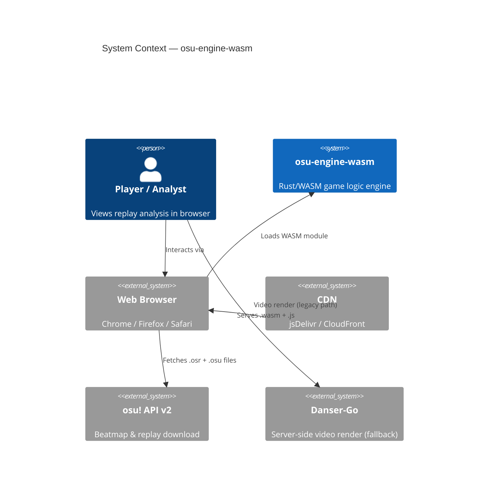

### 3.2 Level 1 — Container Diagram

```
┌────────────────────────────────────────────────────────────────────────────────┐
│                              BROWSER RUNTIME                                   │
│                                                                                │
│  ┌─────────────────────────────────────────────────────────────────────────┐   │
│  │                    view_player.html (Host App)                          │   │
│  │                                                                         │   │
│  │   ┌──────────┐  ┌───────────────┐  ┌──────────────┐  ┌──────────────┐  │   │
│  │   │ Scrubber │  │ Audio Player  │  │ Analyze Tab  │  │ Settings     │  │   │
│  │   │ (Seek)   │  │ (Web Audio)   │  │ (Data View)  │  │ (Mods, Skin) │  │   │
│  │   └────┬─────┘  └───────┬───────┘  └──────┬───────┘  └──────────────┘  │   │
│  │        │                │                  │                             │   │
│  │        │ time (ms)      │ sync             │ stats                      │   │
│  │        ▼                ▼                  ▼                             │   │
│  │   ┌────────────────────────────────────────────────────────────────┐    │   │
│  │   │              @osurender/engine  (WASM + TS bindings)          │    │   │
│  │   │                                                                │    │   │
│  │   │   OsuBeatmap.parse() ──► GameEngine.create() ──► .query(t)    │    │   │
│  │   │                                                  │             │    │   │
│  │   │                                          StateSnapshot         │    │   │
│  │   └──────────────────────────────┬─────────────────────────────────┘    │   │
│  │                                  │                                      │   │
│  │                                  ▼                                      │   │
│  │   ┌────────────────────────────────────────────────────────────────┐    │   │
│  │   │              @osurender/renderer  (TypeScript + WebGL2)        │    │   │
│  │   │                                                                │    │   │
│  │   │   CircleRenderer  SliderRenderer  CursorRenderer  HUDOverlay  │    │   │
│  │   └────────────────────────────────────────────────────────────────┘    │   │
│  └─────────────────────────────────────────────────────────────────────────┘   │
│                                                                                │
│  ┌────────────────────┐                                                        │
│  │   WebAssembly VM   │  ← Linear memory, sandboxed                            │
│  │   (V8 / SpiderMky) │                                                        │
│  └────────────────────┘                                                        │
└────────────────────────────────────────────────────────────────────────────────┘
```

---

## 4. High-Level Architecture

### 4.1 Architectural Style: Immutable Pipeline

The engine uses a **stateless query pipeline** pattern. Unlike osu!lazer's mutable object graph (BRD §7.2), our architecture separates construction from query:

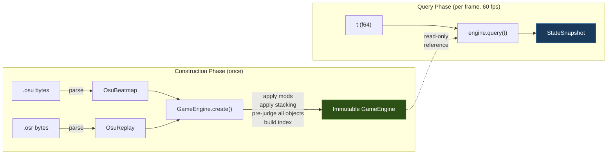

**Key architectural decision**: Unlike lazer's `Update()` loop which mutates state frame-by-frame, `query(t)` is a **pure function** over immutable data. This enables:
- Random-access seek (AG-6)
- Zero side effects (testability)
- Differential testing at arbitrary time points (BRD §13.5)

### 4.2 Layered Architecture

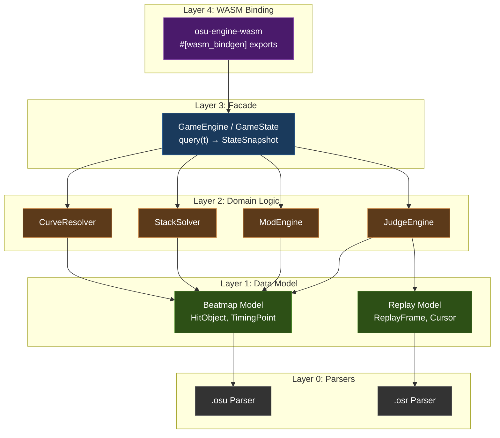

**Layer dependency rule**: Each layer may only depend on layers directly below it. No circular dependencies. No upward calls.

---

## 5. Component Architecture

### 5.1 Crate Layout (ADR-020 Pipeline Architecture)

```
crates/
├── osu-engine/                    ← Pure Rust library, no WASM deps
│   ├── Cargo.toml
│   └── src/
│       ├── lib.rs                 ← Public re-exports
│       │
│       │   ── L1: Core Math ──────────────────────────────────
│       ├── math/
│       │   ├── mod.rs
│       │   ├── point.rs           ← Vec2<f32/f64>, Point
│       │   ├── bezier.rs          ← Composite Bézier evaluation
│       │   ├── catmull.rs         ← Catmull-Rom spline
│       │   ├── arc.rs             ← Perfect circular arc
│       │   ├── linear.rs          ← Linear interpolation
│       │   ├── path.rs            ← SliderPath (arc-length parameterized)
│       │   └── truncation.rs      ← trunc_i32(), floor_i32() (TDD §11.2)
│       │
│       │   ── L2: Serialization ──────────────────────────────
│       ├── parser/
│       │   ├── mod.rs
│       │   ├── osr.rs             ← .osr binary parser → ParsedReplay
│       │   ├── osu.rs             ← .osu text parser → ParsedBeatmap
│       │   ├── lzma.rs            ← LZMA decompression wrapper (256 MB cap)
│       │   └── error.rs           ← ParseError enum
│       │
│       │   ── L3: Immutable Data Model ───────────────────────
│       ├── model/
│       │   ├── mod.rs
│       │   ├── beatmap.rs         ← ParsedBeatmap, HitObject, TimingPoint
│       │   ├── replay.rs          ← ParsedReplay, ReplayFrame
│       │   ├── difficulty.rs      ← DifficultySettings (AR/CS/OD/HP)
│       │   ├── metadata.rs        ← Title, artist, version, hash
│       │   ├── mods.rs            ← ModSet, ModBitmask
│       │   └── types.rs           ← Shared enums (HitResult, Grade, CurveType)
│       │
│       │   ── L4: Preprocessor ───────────────────────────────
│       ├── preprocess/
│       │   ├── mod.rs             ← preprocess(&ParsedBeatmap, &ModSet) → PreprocessedBeatmap
│       │   ├── mod_applicator.rs  ← AR/CS/OD/HP transforms per mod
│       │   ├── stacking_v1.rs     ← Legacy stacking (format < 6)
│       │   ├── stacking_v2.rs     ← Modern stacking (format ≥ 6)
│       │   └── curve_cache.rs     ← Precomputed slider curve polylines
│       │
│       │   ── L5: Timeline Pipelines ─────────────────────────
│       ├── pipeline/
│       │   ├── mod.rs
│       │   ├── judgement.rs       ← scan(beatmap, replay, windows) → JudgementTimeline
│       │   ├── score.rs           ← accumulate(judgements, mods) → ScoreTimeline
│       │   ├── visibility.rs      ← compute(beatmap, preempt, fade) → VisibilityTimeline
│       │   ├── hit_policy.rs      ← Note lock (StartTimeOrderedHitPolicy)
│       │   └── windows.rs         ← OD → hit window computation
│       │
│       │   ── L6: Query Engine (Façade) ──────────────────────
│       ├── engine/
│       │   ├── mod.rs
│       │   ├── facade.rs          ← GameEngine: create() chains L1–L5, query(t) calls builder
│       │   ├── snapshot.rs        ← StateSnapshot struct (ADR-010: append-only)
│       │   ├── builder.rs         ← SnapshotBuilder: build(t, timelines) → StateSnapshot
│       │   └── index.rs           ← Binary search indices for O(log n) lookup
│       │
│       │   ── Cross-Cutting ──────────────────────────────────
│       ├── error.rs               ← EngineError (unified error type)
│       ├── version.rs             ← EngineVersion (5-dimension versioning)
│       └── handle.rs              ← HandleArena<T> (ADR-007)
│
├── osu-engine-wasm/               ← L7: Thin WASM binding layer
│   ├── Cargo.toml
│   └── src/
│       └── lib.rs                 ← #[wasm_bindgen] exports only
│
└── osu-engine-bench/              ← Criterion benchmarks (per-stage)
    ├── Cargo.toml
    └── benches/
        ├── parse.rs               ← L2: parser throughput
        ├── preprocess.rs          ← L4: stacking + curves
        ├── judgement.rs            ← L5: judgement timeline scan
        ├── score.rs               ← L5: score accumulation
        ├── query.rs               ← L6: snapshot builder
        └── batch.rs               ← L6: batch query throughput
```

> [!NOTE]
> The module structure mirrors the pipeline stages from ADR-020. Each `L*` comment maps to the dependency layer from the Implementation Plan. Dependencies flow strictly downward: L6 depends on L5, which depends on L3+L4, etc.

### 5.2 Pipeline Dependency Graph (ADR-020)

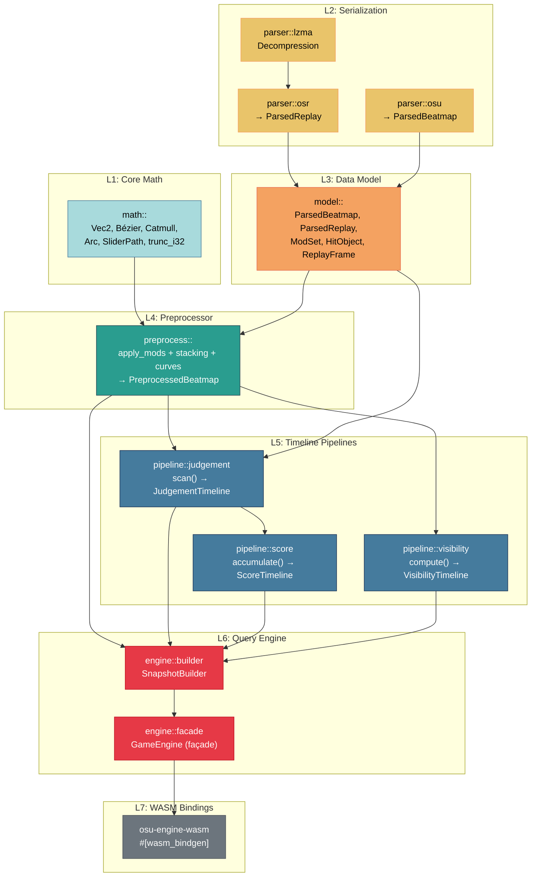

**Key architectural properties:**
- Dependencies flow strictly **top-to-bottom** (L1→L2→L3→L4→L5→L6→L7)
- Stages 4 (ScoreTimeline) and 5 (VisibilityTimeline) are **independent** — could run concurrently
- `GameEngine` (façade) has **no domain logic** — it delegates to `SnapshotBuilder`
- Each pipeline stage takes **immutable inputs** and produces **immutable outputs**

### 5.3 Pipeline Stage Specifications

#### Stage 1: Parser (L2 — Serialization)

| Component | Input | Output | Reference Implementation |
|---|---|---|---|
| `parser::osr` | `&[u8]` raw `.osr` bytes | `Result<ParsedReplay, ParseError>` | `references/osu-reverse-mapper/script.js` L862–948 |
| `parser::osu` | `&str` raw `.osu` text | `Result<ParsedBeatmap, ParseError>` | `references/osu/osu.Game/Beatmaps/Formats/LegacyBeatmapDecoder.cs` |
| `parser::lzma` | `&[u8]` compressed bytes | `Result<Vec<u8>, ParseError>` | Via `lzma-rs` crate, capped at 256 MB output |

#### Stage 2: Preprocessor (L4)

| Component | Input | Output | Reference |
|---|---|---|---|
| `preprocess::mod_applicator` | `ParsedBeatmap`, `ModSet` | Modified `DifficultySettings` | `references/danser-go/app/beatmap/difficulty/difficulty.go` |
| `preprocess::stacking_v2` | `Vec<HitObject>`, `stack_leniency` | Stack-offset-applied objects | `references/osu/osu.Game.Rulesets.Osu/Beatmaps/OsuBeatmapProcessor.cs` (283 lines) |
| `preprocess::curve_cache` | `Vec<SliderData>` | Precomputed curve polylines | `references/osu/osu.Game/Rulesets/Objects/SliderPath.cs` (524 lines) |
| **Combined** | `ParsedBeatmap`, `ModSet` | `PreprocessedBeatmap` | — |

#### Stage 3: JudgementTimeline (L5)

| Component | Input | Output | Reference |
|---|---|---|---|
| `pipeline::judgement` | `PreprocessedBeatmap`, `ParsedReplay`, `ModSet` | `JudgementTimeline` (sorted `Vec<Judgement>`) | `references/danser-go/app/rulesets/osu/ruleset.go` L610–712 |
| `pipeline::hit_policy` | Object pair, cursor state | `HitPolicyDecision` | `references/osu/osu.Game.Rulesets.Osu/UI/StartTimeOrderedHitPolicy.cs` (100 lines) |
| `pipeline::windows` | `OD`, `ModSet` | `HitWindows` (300/100/50/miss thresholds) | `references/osu/osu.Game/Rulesets/Objects/HitWindows.cs` |

#### Stage 4: ScoreTimeline (L5)

| Component | Input | Output |
|---|---|---|
| `pipeline::score` | `JudgementTimeline`, `ModSet` | `ScoreTimeline` containing: `combo[]`, `score[]`, `accuracy[]`, `hp[]`, `grade` at each judgement time |

#### Stage 5: VisibilityTimeline (L5)

| Component | Input | Output |
|---|---|---|
| `pipeline::visibility` | `PreprocessedBeatmap` | `VisibilityTimeline` containing: `appear_time[]`, `end_time[]`, `alpha(t)`, `approach_scale(t)` |

#### Stage 6: SnapshotBuilder (L6 — Query Engine)

| Component | Input | Output |
|---|---|---|
| `engine::builder` | `t`, `PreprocessedBeatmap`, `ParsedReplay`, `JudgementTimeline`, `ScoreTimeline`, `VisibilityTimeline` | `StateSnapshot` |
| `engine::index` | Sorted arrays | Binary search indices for `find_frame(t)`, `visible_objects(t)`, `judgements_up_to(t)` |

#### Façade (L6)

| Component | Responsibility | Key Methods |
|---|---|---|
| `engine::facade` | Chain stages 1–5 in `create()`; delegate to `SnapshotBuilder` in `query(t)` | `create(beatmap_bytes, replay_bytes) → GameEngine`, `query(t) → StateSnapshot` |

---

## 6. Data Architecture

### 6.1 Core Data Model

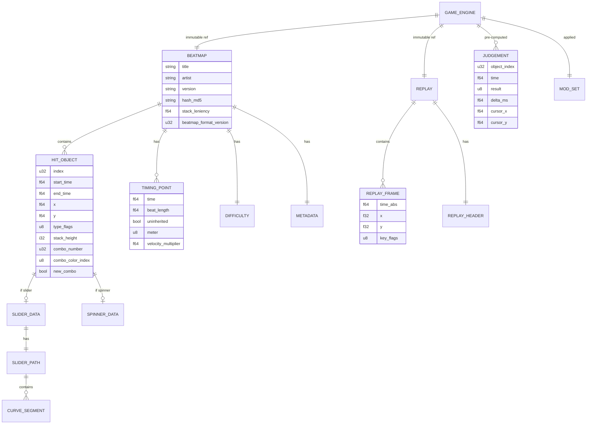

### 6.2 Immutability Contract

After `GameEngine::create()` completes, the following data is immutable:

| Data | Created During | Mutated After? |
|---|---|---|
| `OsuBeatmap` | `parse()` | Never |
| `OsuReplay` | `parse()` | Never |
| `Vec<Judgement>` | `create()` | Never |
| Stack offsets | `create()` | Never |
| Slider curve buffers | `precompute_curves()` | Never |
| Mod-adjusted difficulty | `create()` | Never |

This immutability is enforced by Rust's ownership model — `GameEngine` holds `Arc<Beatmap>` and `Arc<Replay>` as read-only shared references.

### 6.3 Index Structures

For `query(t)` to achieve O(log n) performance, three sorted indices are maintained:

```rust
struct EngineIndex {
    /// Replay frames sorted by absolute time
    /// Binary search: find cursor position at any t
    frame_times: Vec<f64>,        // parallel to replay.frames

    /// Hit objects sorted by (appear_time, start_time)
    /// Binary search: find visible objects at any t
    object_appear_times: Vec<f64>, // parallel to beatmap.objects
    object_end_times: Vec<f64>,

    /// Pre-computed judgements sorted by time
    /// Binary search: find all judgements ≤ t
    judgement_times: Vec<f64>,     // parallel to judgements
}
```

---

## 7. Interface Design

### 7.1 WASM Boundary Interface

The WASM boundary is the most performance-critical interface. Data crosses it via `wasm-bindgen` serialization.

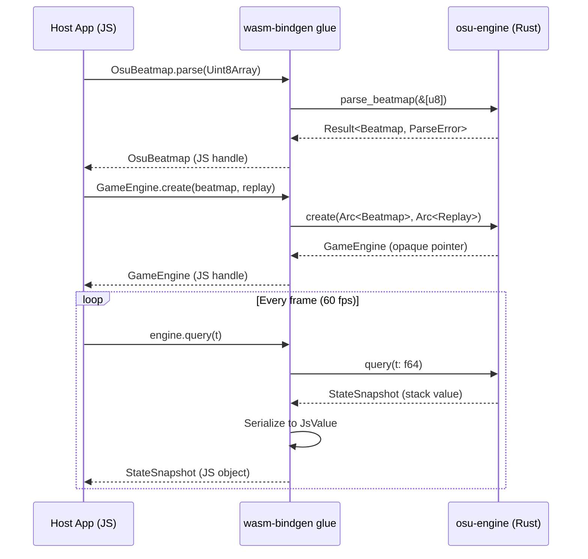

**Boundary rules** (from BRD §9):
- No `JsValue` in the engine core — only typed structs with `#[wasm_bindgen]`
- `slider_curve_buffer()` returns a zero-copy `Float32Array` view into WASM linear memory
- All strings crossing the boundary are UTF-8 validated and length-limited to 512 bytes

### 7.2 Engine ↔ Renderer Interface

The renderer reads `StateSnapshot` as a plain JS object. No back-channel from renderer to engine.

```typescript
// Contract: Renderer reads, never writes
interface RendererInput {
    snapshot: StateSnapshot;      // from engine.query(t)
    curveBuffers: Map<number, Float32Array>;  // from engine.slider_curve_buffer(i)
    skinAtlas: WebGLTexture;     // loaded by host
}
```

### 7.3 Engine ↔ Host Interface

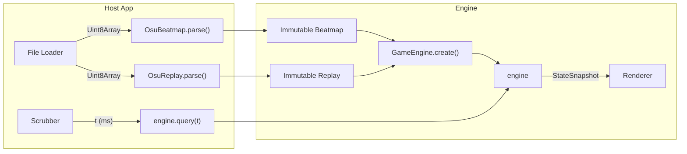

---

## 8. Concurrency & Threading Model

### 8.1 Default: Single-Threaded

The default WASM build is single-threaded. All operations (parse, create, query) execute on the main thread.

```
Main Thread: ──parse──create──query──query──query──query──▶
                                      │
                                      ▼
                              requestAnimationFrame
```

**Implication**: Parse + create must complete within 50 ms to avoid visible jank during load.

### 8.2 Threading Model (ADR-017, ADR-018)

The engine uses a **main-thread-first** threading model. `query(t)` is **always synchronous** — there is no async query path.

#### Phase 1: Initialization (in Web Worker)

Per ADR-018, all parsing (LZMA decompression, `.osu`/`.osr` processing) runs in a **dedicated Web Worker** to prevent main-thread CPU exhaustion from malicious files. The Worker has a configurable timeout (default: 10s); if exceeded, `Worker.terminate()` kills the runaway decompression.

```
Worker Thread:                        Main Thread:
  load WASM module                      (idle / show spinner)
  parse(.osr) → beatmap handle          |
  parse(.osu) → replay handle           |
  create(b, r) → engine handle          |
  ──── transfer WASM memory ──────────▶ receive WASM memory + handles
  (Worker terminates)                   ↓
                                        Phase 2 begins
```

After `GameEngine.create()` completes, the Worker **transfers** its WASM linear memory (a single `ArrayBuffer`) to the main thread via `Transferable`. This is an O(1) pointer swap, not a copy.

#### Phase 2: Playback (on Main Thread, synchronous)

Once the WASM memory is transferred, the engine lives entirely on the main thread. `query(t)` is a direct synchronous call:

```
Main Thread:
  ┌──────────────────────────────────────────────────────┐
  │  WASM Module + GameEngine (transferred from Worker)  │
  │                                                      │
  │  rAF loop:                                           │
  │    t = audioContext.currentTime;                     │
  │    snapshot = engine.query(t);  // sync, ≤ 0.1ms     │
  │    render(snapshot);            // GPU, ≤ 8ms        │
  └──────────────────────────────────────────────────────┘
```

#### Explicitly Unsupported Patterns

| Pattern | Why Not |
|---|---|
| `query(t)` via `postMessage` round-trip | 1–5ms latency per call; destroys 60fps budget |
| `SharedArrayBuffer` + `Atomics.wait()` on main thread | Explicitly blocked by browsers on main thread |
| Engine permanently resident in Worker | All queries become async; breaks rAF contract |
| Spawning a new Worker per query | Overhead far exceeds query cost |

#### Fallback for Non-Browser Environments

In Node.js or test environments, parsing runs synchronously in the current thread (no Worker). This is acceptable because Node.js has no UI thread constraint.

### 8.3 Thread Safety Model

| Component | Thread Safety | Rationale |
|---|---|---|
| `OsuBeatmap` | `Send + Sync` | Immutable after parse |
| `OsuReplay` | `Send + Sync` | Immutable after parse |
| `GameEngine` | `Send + Sync` | Immutable after create; `query()` takes `&self` |
| `StateSnapshot` | `Send` | Owned value, returned by copy |
| Curve buffers | `Sync` (via `Arc<[f32]>`) | Read-only after precompute |

**Note**: Thread safety matters primarily for the Worker→main-thread transfer step. During Phase 2 (playback), the engine is single-threaded on the main thread. The `Send + Sync` bounds are required because `Transferable` moves the memory across thread boundaries once.


---

## 9. Memory Architecture

### 9.1 WASM Linear Memory Layout

```
┌────────────────────────────────────────────────────────────────┐
│                    WASM Linear Memory (max 256 MB)              │
│                                                                 │
│  ┌──────────┐ ┌──────────────┐ ┌────────────┐ ┌─────────────┐ │
│  │  Stack    │ │  Parsed Data │ │  Curve     │ │  Scratch    │ │
│  │  (64 KB)  │ │  (1–8 MB)    │ │  Buffers   │ │  Buffers    │ │
│  │           │ │              │ │  (0.5–2 MB)│ │  (64 KB)    │ │
│  │  • locals │ │  • beatmap   │ │            │ │             │ │
│  │  • frames │ │  • replay    │ │  • f32[]   │ │  • query    │ │
│  │           │ │  • judgements│ │  • per      │ │    scratch  │ │
│  │           │ │  • indices   │ │    slider   │ │             │ │
│  └──────────┘ └──────────────┘ └────────────┘ └─────────────┘ │
│                                                                 │
│  Peak: 4–12 MB for typical 3-minute map                        │
│  Maximum: 30 MB for marathon maps (BRD §11)                    │
└────────────────────────────────────────────────────────────────┘
```

### 9.2 Memory Budget

| Component | Size Per Item | Typical Count | Total |
|---|---|---|---|
| `HitObject` | 200 bytes | 1,500 | 300 KB |
| `TimingPoint` | 48 bytes | 200 | 10 KB |
| `ReplayFrame` | 16 bytes | 30,000 | 480 KB |
| `Judgement` | 40 bytes | 1,500 | 60 KB |
| Curve buffer (per slider) | 32 pts × 8 bytes | 500 sliders | 128 KB |
| Index arrays | 8 bytes × N | 3 × 1,500 | 36 KB |
| **Total parsed data** | | | **~1 MB** |

### 9.3 Allocation Strategy

| Phase | Allocation Pattern | Rationale |
|---|---|---|
| `parse()` | Heap allocation (Vec growth) | One-time cost; amortized O(1) push |
| `create()` | Heap allocation (sort, index build) | One-time cost |
| `precompute_curves()` | Heap allocation (curve sample buffers) | One-time cost |
| `query(t)` | **Zero allocation** | Per-frame hot path; uses pre-allocated scratch buffer |

---

## 10. Error Handling Strategy

### 10.1 Error Classification

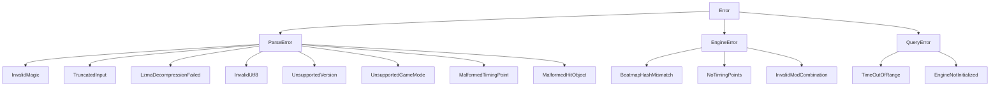

### 10.2 Error Propagation

| Layer | Error Type | Propagation |
|---|---|---|
| Parser | `ParseError` | Returns `Result<T, ParseError>` |
| Domain Logic | `EngineError` | Returns `Result<T, EngineError>` |
| WASM Binding | JS exception | `wasm-bindgen` converts `Err` to `throw` |

**Critical rule**: No `unwrap()`, `expect()`, or `panic!()` in any code path reachable from user input (BRD §14.1).

---

## 11. Deployment Architecture

### 11.1 Package Structure

```
@osurender/engine (NPM)
├── dist/
│   ├── osu_engine_wasm_bg.wasm     ← WASM binary (≤ 800 KB gz)
│   ├── osu_engine_wasm.js          ← JS glue (ESM)
│   ├── osu_engine_wasm.d.ts        ← TypeScript declarations
│   └── osu_engine_wasm_bg.wasm.d.ts
├── package.json
├── README.md
└── LICENSE
```

### 11.2 Build Targets

| Target | Command | Output | Use Case |
|---|---|---|---|
| `web` | `wasm-pack build --target web` | ESM module with `init()` | Browser `<script type="module">` |
| `bundler` | `wasm-pack build --target bundler` | Webpack/Vite compatible | Bundled apps |
| `nodejs` | `wasm-pack build --target nodejs` | CommonJS with `require()` | Server-side, testing |

### 11.3 CDN Deployment

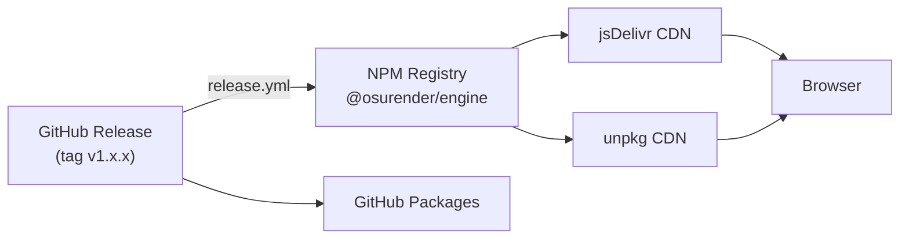

---

## 12. Cross-Cutting Concerns

### 12.1 Logging

No runtime logging in the WASM binary. All diagnostic information is conveyed through:
- Return values (`Result<T, E>`)
- Debug builds: `console_error_panic_hook` for Rust panics → JS console
- CI: structured test output via `cargo test -- --format json`

### 12.2 Versioning

Semantic versioning with embedded git hash:

```rust
pub fn version() -> EngineVersion {
    EngineVersion {
        major: env!("CARGO_PKG_VERSION_MAJOR").parse().unwrap(),
        minor: env!("CARGO_PKG_VERSION_MINOR").parse().unwrap(),
        patch: env!("CARGO_PKG_VERSION_PATCH").parse().unwrap(),
        git_hash: env!("GIT_HASH").to_string(),
    }
}
```

### 12.3 Configuration

The engine has **zero runtime configuration**. All behavior is determined by:
1. The beatmap content
2. The replay content
3. The mod set (extracted from replay)

No environment variables, no config files, no feature flags at runtime.

### 12.4 Observability

| Metric | How Measured | Where Reported |
|---|---|---|
| Parse time | `performance.now()` in host | Browser console / analytics |
| Query time | Criterion benchmark (native) | CI benchmark artifact |
| WASM size | `wc -c` post-build | CI gate (fail > 820 KB gz) |
| Memory peak | Chrome DevTools | Manual QA |
| Coverage | `cargo-tarpaulin` | Codecov badge |

---

## 13. Technology Stack

### 13.1 Build Toolchain

| Tool | Version (Pinned) | Purpose |
|---|---|---|
| Rust | 1.79.0 | Language |
| `wasm-pack` | 0.12.1 | WASM build tooling |
| `wasm-bindgen` | 0.2.92 | JS ↔ Rust type bridge |
| `cargo-tarpaulin` | 0.27.x | Code coverage |
| `cargo-fuzz` | 0.12.x | Fuzz testing |
| `criterion` | 0.5.x | Benchmarking |

### 13.2 Runtime Dependencies (Production)

| Crate | Version | Purpose | Size Impact |
|---|---|---|---|
| `lzma-rs` | 0.3.x | LZMA decompression for `.osr` | ~80 KB |
| `wasm-bindgen` | 0.2.92 | WASM boundary types | ~20 KB |
| `serde` | 1.x | Serialization framework | ~40 KB |
| `serde-wasm-bindgen` | 0.6.x | Serde ↔ JsValue bridge | ~10 KB |
| **Total** | | | **~150 KB** |

### 13.3 Excluded Technologies

| Technology | Reason for Exclusion |
|---|---|
| `web-sys` / `js-sys` | Engine must have zero browser API dependencies (AG-4) |
| `rayon` | No multi-threading in default build (AC-2) |
| `rosu-pp` | Star rating out of scope for v1.0 |
| Any ORM / database | No persistent state |
| Any HTTP client | No network access from WASM |

---

## 14. Architecture Decision Records

> **ADRs have been formalized into a dedicated registry.** See [ADR_Registry.md](./ADR_Registry.md) for the complete set of 16 architecture decision records.

Key ADRs relevant to this document:

| ADR | Title | Impact Area |
|---|---|---|
| [ADR-001](./ADR_Registry.md#adr-001-stateless-query-architecture) | Stateless Query Architecture | §4.1 |
| [ADR-004](./ADR_Registry.md#adr-004-random-access-architecture) | Random-Access Architecture | §6.3 |
| [ADR-007](./ADR_Registry.md#adr-007-handle-based-ownership-model) | Handle-Based Ownership Model | §7.1, §15 |
| [ADR-008](./ADR_Registry.md#adr-008-data-oriented-layout-soa-for-hot-paths) | Data-Oriented Layout (SoA) | §15 |
| [ADR-009](./ADR_Registry.md#adr-009-centralized-cache-architecture) | Centralized Cache Architecture | §15 |
| [ADR-010](./ADR_Registry.md#adr-010-append-only-snapshot-schema) | Append-Only Snapshot Schema | §7.2 |
| [ADR-012](./ADR_Registry.md#adr-012-phased-engine-lifecycle-with-explicit-state-machine) | Phased Engine Lifecycle | §16 |
| [ADR-015](./ADR_Registry.md#adr-015-ruleset-abstraction-for-future-mode-support) | Ruleset Abstraction | §21 |

---

## 15. Cache Architecture & Data-Oriented Layout

### 15.1 Layered Cache Ownership

All derived data follows a strict **directed acyclic dependency graph**. The `GameEngine` struct is the **single owner** of all cache layers. No cross-layer shortcuts, no shared mutability, no lazy evaluation.

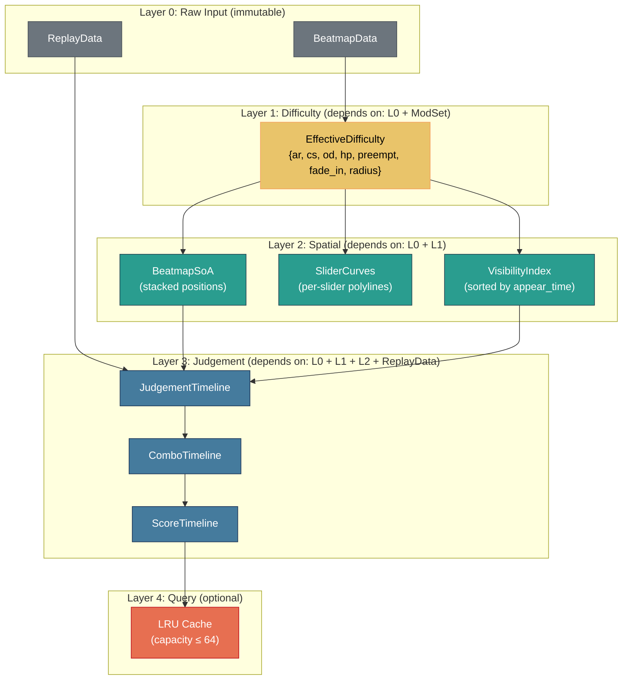

**Cache Rules**:

| Rule | Description |
|---|---|
| **Monotonic dependency** | Layer N may only depend on layers < N |
| **Immutable after creation** | Each layer computed once during `create()`, never mutated |
| **No cross-layer shortcuts** | Layer 3 accesses Layer 0 only through Layer 1/2 interfaces |
| **Single owner** | `GameEngine` struct owns all layers; no `Arc` sharing between layers |
| **No lazy computation** | All layers fully materialized during `create()`; `query(t)` never triggers computation |

### 15.2 Cache Invalidation Policy

Since all caches are immutable after `create()`, there is **no invalidation**. If the user wants different mods or a different replay, they must create a new `GameEngine` instance. This is by design (ADR-001).

### 15.3 Data-Oriented Layout (SoA)

Per ADR-008, the core beatmap data uses Struct-of-Arrays for cache-efficient access in the `query(t)` hot path:

```rust
/// Struct-of-Arrays layout for O(log n) + O(k) query performance.
/// All arrays have the same length (object_count).
/// Index i in any array corresponds to the same hit object.
struct BeatmapSoA {
    // ── Binary search targets (most frequently accessed) ──
    times:              Vec<f64>,        // 8 bytes × N — binary search
    end_times:          Vec<f64>,        // 8 bytes × N — visibility check
    appear_times:       Vec<f64>,        // 8 bytes × N — visibility check

    // ── Position data (accessed for visible objects only) ──
    positions_x:        Vec<f32>,        // 4 bytes × N — render
    positions_y:        Vec<f32>,        // 4 bytes × N — render
    stack_offsets_x:    Vec<f32>,        // 4 bytes × N — render
    stack_offsets_y:    Vec<f32>,        // 4 bytes × N — render

    // ── Object metadata (accessed for visible objects only) ──
    kinds:              Vec<ObjectKind>, // 1 byte × N — type dispatch
    combo_indices:      Vec<u16>,        // 2 bytes × N — HUD rendering
    combo_numbers:      Vec<u16>,        // 2 bytes × N — HUD rendering
    color_indices:      Vec<u8>,         // 1 byte × N — render

    // ── Slider-specific (accessed only for slider objects) ──
    slider_indices:     Vec<Option<u32>>,// 4 bytes × N — index into SliderData
}

/// Slider-specific data, stored contiguously for sliders only.
struct SliderSoA {
    repeat_counts:      Vec<u32>,
    pixel_lengths:      Vec<f64>,
    curve_ids:          Vec<u32>,        // index into curve cache
}
```

**Cache locality benefit**:

| Operation | AoS Cache Lines Touched | SoA Cache Lines Touched | Improvement |
|---|---|---|---|
| Binary search on times (N=1500) | ~11 × 8 = 88 (48-byte objects) | ~11 × 1 = 11 (8-byte f64s) | **8×** |
| Scan visible objects (k=10) | 10 × 1 = 10 (48-byte objects) | 10 × 1 = 10 (positions only) | **1× (same)** |
| Full object access (rare) | 1 per object | ~6 per object (multiple arrays) | **0.2× (worse)** |

SoA wins significantly for the common case (binary search) and is neutral for the medium case (visible scan). It's worse for the rare case (full object access), which is acceptable since that only happens during `create()`.

### 15.4 SoA Safety Wrapper

```rust
impl BeatmapSoA {
    /// Returns a "view" for a single object, grouping all SoA fields.
    /// This is a zero-cost abstraction: the compiler inlines the field access.
    fn object(&self, i: usize) -> ObjectView<'_> {
        debug_assert!(i < self.times.len());
        ObjectView {
            time: self.times[i],
            end_time: self.end_times[i],
            x: self.positions_x[i] + self.stack_offsets_x[i],
            y: self.positions_y[i] + self.stack_offsets_y[i],
            kind: self.kinds[i],
            combo_number: self.combo_numbers[i],
            color_index: self.color_indices[i],
        }
    }

    fn len(&self) -> usize { self.times.len() }
}
```

---

## 16. Engine Lifecycle & State Machine

Per ADR-012, the engine has an explicit state machine preventing invalid API usage.

### 16.1 State Diagram

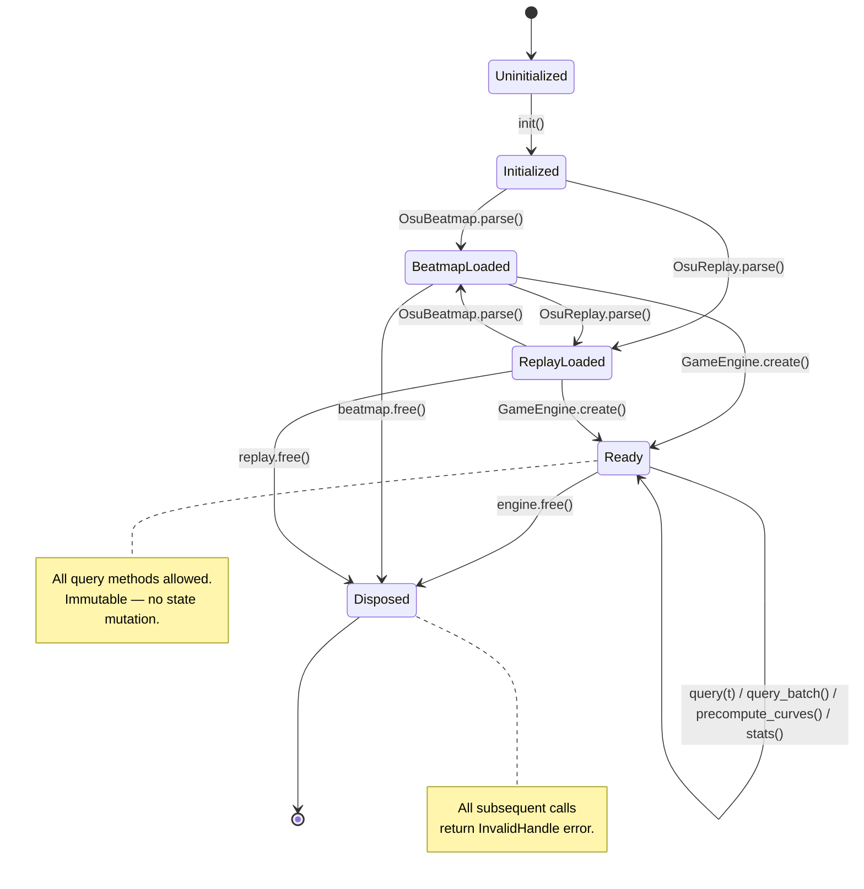

### 16.2 Phase Characteristics

| Phase | Allowed Operations | Mutability | Duration |
|---|---|---|---|
| **Uninitialized** | `init()` only | — | < 300 ms |
| **Initialized** | `parse()`, `version()` | — | Instant |
| **BeatmapLoaded** | Inspect metadata, `parse()` more files | Beatmap: immutable | User-driven |
| **ReplayLoaded** | Inspect replay metadata | Replay: immutable | User-driven |
| **Ready** | `query(t)`, `query_batch()`, `precompute_curves()`, `stats()` | All data: immutable | App lifetime |
| **Disposed** | None — all methods return `InvalidHandle` | Memory freed | Terminal |

### 16.3 Handle-Based Ownership Model

Per ADR-007, JS holds integer handles, not raw WASM pointers:

```
┌─────────────────────────────────────────────────────────────┐
│  WASM Linear Memory                                         │
│                                                             │
│  ┌────────────────────────────────────────────────────┐     │
│  │  HandleArena<Beatmap>                               │     │
│  │  ┌──────────┬──────────┬──────────┬──────────┐    │     │
│  │  │ slot[0]  │ slot[1]  │ slot[2]  │ ...      │    │     │
│  │  │ gen=1    │ gen=3    │ gen=1    │          │    │     │
│  │  │ data: Y  │ data: Y  │ data: N  │          │    │     │
│  │  └──────────┴──────────┴──────────┴──────────┘    │     │
│  └────────────────────────────────────────────────────┘     │
│                                                             │
│  ┌────────────────────────────────────────────────────┐     │
│  │  HandleArena<GameEngine>                            │     │
│  │  ┌──────────┬──────────┐                           │     │
│  │  │ slot[0]  │ ...      │                           │     │
│  │  │ gen=1    │          │                           │     │
│  │  │ data: Y  │          │                           │     │
│  │  └──────────┴──────────┘                           │     │
│  └────────────────────────────────────────────────────┘     │
└─────────────────────────────────────────────────────────────┘
                    ▲                     ▲
                    │ handle=0x00010000   │ handle=0x00010001
        ┌───────────┴───────┐    ┌───────┴───────────────┐
        │ JS: OsuBeatmap {  │    │ JS: GameEngine {      │
        │   #handle: u32    │    │   #handle: u32        │
        │   #freed: false   │    │   #freed: false       │
        │ }                 │    │ }                     │
        └───────────────────┘    └───────────────────────┘
```

**Handle format**: upper 16 bits = generation counter, lower 16 bits = slot index. This allows O(1) use-after-free detection.

---

## 17. Observability & Diagnostics

### 17.1 Runtime Statistics API

Per user feedback item #18, the engine exposes internal performance counters:

```typescript
interface EngineStats {
  // ── Timing ───────────────────────────────────
  parse_beatmap_ms: number;     // Time spent parsing .osu
  parse_replay_ms: number;      // Time spent parsing .osr
  create_engine_ms: number;     // Time spent in GameEngine.create()
  precompute_curves_ms: number; // Time spent pre-computing curves

  // ── Memory ───────────────────────────────────
  wasm_heap_bytes: number;      // Current WASM linear memory usage
  beatmap_data_bytes: number;   // Layer 0 beatmap data
  replay_data_bytes: number;    // Layer 0 replay data
  cache_layer1_bytes: number;   // Difficulty cache
  cache_layer2_bytes: number;   // Spatial cache (stacking + curves)
  cache_layer3_bytes: number;   // Judgement + scoring cache

  // ── Object Counts ────────────────────────────
  object_count: number;
  slider_count: number;
  frame_count: number;
  judgement_count: number;

  // ── Query Performance ────────────────────────
  query_count: number;          // Total queries since create()
  last_query_us: number;        // Last query() duration in microseconds
  avg_query_us: number;         // Average query() duration
  max_query_us: number;         // Worst-case query() duration

  // ── Cache ────────────────────────────────────
  query_cache_hits: number;     // LRU cache hits (Layer 4)
  query_cache_misses: number;   // LRU cache misses
}
```

```typescript
// Usage
const stats = engine.stats();
console.log(`Query avg: ${stats.avg_query_us.toFixed(1)}μs`);
console.log(`WASM heap: ${(stats.wasm_heap_bytes / 1024 / 1024).toFixed(1)} MB`);
```

### 17.2 Debug Overlay Data

For development builds, `query(t)` returns additional diagnostic fields:

```typescript
interface DebugSnapshot extends StateSnapshot {
  debug?: {
    frame_binary_search_steps: number;
    visible_scan_count: number;
    judgement_binary_search_steps: number;
    query_duration_us: number;
  };
}
```

---

## 18. Browser Capability Matrix

### 18.1 Required Capabilities

| Capability | Chrome | Firefox | Safari | Node.js | Fallback |
|---|---|---|---|---|---|
| WebAssembly (MVP) | 57+ | 52+ | 11+ | 12+ | **None** — hard requirement |
| `BigInt` | 67+ | 68+ | 14+ | 10.3+ | **None** — required for score IDs |
| `TextDecoder` | 38+ | 19+ | 10.1+ | 12+ | Polyfill available |
| `Uint8Array` | 7+ | 4+ | 5.1+ | 0.10+ | Universal |

### 18.2 Optional Capabilities

| Capability | Chrome | Firefox | Safari | Benefit | Fallback |
|---|---|---|---|---|---|
| `SharedArrayBuffer` | 68+ (w/ headers) | 79+ (w/ headers) | 15.2+ | Web Worker offload | Main-thread only |
| WASM Threads | 74+ | 79+ | 14.1+ | Parallel query_batch | Sequential batch |
| WASM SIMD | 91+ | 89+ | 16.4+ | Faster curve math | Scalar fallback |
| `FinalizationRegistry` | 84+ | 79+ | 14.1+ | Leak detection | Manual .free() only |
| `performance.now()` | 24+ | 15+ | 8+ | Stats timing | Fallback to `Date.now()` |
| WASM Bulk Memory | 75+ | 79+ | 15+ | Faster memory copy | Byte-by-byte copy |
| WASM Memory64 | Proposal | Planned | | >4 GB maps (never needed) | 32-bit addressing |
| `OffscreenCanvas` | 69+ | 105+ | 16.4+ | Worker rendering | Main-thread render |
| WebGPU | 113+ | Planned | | GPU rendering | WebGL2 fallback |

### 18.3 Required HTTP Headers (for threaded build)

```
Cross-Origin-Opener-Policy: same-origin
Cross-Origin-Embedder-Policy: require-corp
```

Without these headers, `SharedArrayBuffer` is unavailable and the engine runs single-threaded.

---

## 19. Deterministic Build Policy

### 19.1 Pinned Toolchain

| Component | Version | Pin Location |
|---|---|---|
| Rust compiler | 1.79.0 | `rust-toolchain.toml` |
| wasm-pack | 0.12.1 | CI workflow `install` step |
| wasm-bindgen-cli | 0.2.92 | `Cargo.lock` (transitive) |
| binaryen (`wasm-opt`) | 116 | CI workflow `install` step |
| Node.js | 20 LTS | `.nvmrc` |

### 19.2 Dependency Pinning

```toml
# Cargo.toml — exact versions
[dependencies]
lzma-rs = "=0.3.0"
serde = { version = "=1.0.203", features = ["derive"] }
wasm-bindgen = "=0.2.92"
serde-wasm-bindgen = "=0.6.5"
```

`Cargo.lock` is committed and considered a build artifact. Any `Cargo.lock` change triggers a dedicated review.

### 19.3 Reproducibility Verification

```bash
# Build twice, compare SHA-256
wasm-pack build --release --target web crates/osu-engine-wasm
sha256sum pkg/osu_engine_wasm_bg.wasm > build1.sha

# Clean and rebuild
cargo clean
wasm-pack build --release --target web crates/osu-engine-wasm
sha256sum pkg/osu_engine_wasm_bg.wasm > build2.sha

diff build1.sha build2.sha  # Must be identical
```

### 19.4 Release Binary Verification

Every release publishes:
- SHA-256 hash of `.wasm` binary in GitHub Release notes
- SHA-256 hash of `.js` glue file
- `Cargo.lock` at the release commit

---

## 20. Compatibility Matrix

### 20.1 Beatmap Format Support

| Format Version | Status | Notes |
|---|---|---|
| v3–v4 | Best-effort | Very old maps; limited testing |
| v5 | Supported | Stacking algorithm v1 |
| v6–v13 | Supported | Stacking algorithm v2 |
| v14 | Supported (primary target) | Current format |

### 20.2 Replay Format Support

| Feature | Status | Notes |
|---|---|---|
| Game mode 0 (Standard) | Supported | Primary target |
| Game mode 1–3 (Taiko/Catch/Mania) | Error returned | Per BRD §6.2 |
| Pre-2015 replays (no score ID) | Supported | Score ID field optional |
| Post-2024 replays (extended header) | Supported | Additional mod data parsed |
| LZMA1 compression | Supported | Standard replay compression |
| LZMA2 compression | Not supported | Not used by osu! client |

### 20.3 Mod Support

| Mod | Acronym | Status | Affects |
|---|---|---|---|
| NoFail | NF | Yes | HP only |
| Easy | EZ | Yes | CS/AR/OD/HP × 0.5 |
| HardRock | HR | Yes | CS/AR/OD/HP × 1.3/1.4, Y-flip |
| Hidden | HD | Yes | Fade-in/out timing |
| DoubleTime | DT | Yes | Time × 2/3 |
| Nightcore | NC | Yes | Same as DT (implies DT) |
| HalfTime | HT | Yes | Time × 4/3 |
| Flashlight | FL | Parsed, not simulated | No visual restriction in replay analysis |
| SuddenDeath | SD | Yes | HP behavior |
| Perfect | PF | Yes | HP behavior |
| SpunOut | SO | Yes | Spinner auto-complete |
| Relax | RX | Parsed | Non-standard judgement model |
| Autopilot | AP | Parsed | Non-standard cursor model |
| Mirror | MR | Yes | X-flip |
| ScoreV2 | V2 | P2 | Different scoring model |
| TouchDevice | TD | Yes | No gameplay effect |

### 20.4 Platform Support

| Platform | Status | Min Version | Notes |
|---|---|---|---|
| Chrome (Windows/Mac/Linux) | Full support | 89+ | Primary development target |
| Firefox | Full support | 89+ | Tested in CI |
| Safari | Supported | 15+ | Limited CI testing |
| Edge | Full support | 89+ | Chromium-based |
| Node.js | Full support | 18 LTS | Testing + server-side |
| Deno | Community | 1.0+ | WASM compatible, not CI-tested |
| Cloudflare Workers | Community | — | WASM compatible, not CI-tested |

---

## 21. Plugin & Extensibility Architecture

### 21.1 Ruleset Abstraction (P2)

Per ADR-015, mode-specific logic will be abstracted behind a `Ruleset` trait:

```
crates/osu-engine/src/
├── rulesets/
│   ├── mod.rs            ← Ruleset trait definition
│   ├── standard/         ← osu! Standard mode (v1.0)
│   │   ├── mod.rs
│   │   ├── objects.rs    ← Circle, Slider, Spinner
│   │   ├── stacking.rs   ← v1/v2 algorithms
│   │   ├── judge.rs      ← Hit windows, note lock
│   │   └── scoring.rs    ← ScoreV1
│   ├── taiko/            ← (future)
│   ├── catch/            ← (future)
│   └── mania/            ← (future)
```

### 21.2 Extension Points (P2)

| Extension Point | Current | Future |
|---|---|---|
| Difficulty calculator | Not included | Plugin crate `osu-engine-difficulty` |
| Replay analyzer | Built-in basic | Plugin crate for advanced analysis (aim/tap/flow) |
| Custom judge | Not supported | Trait-based custom evaluator |
| Custom scoring | ScoreV1 only | ScoreV2 + custom models |
| Skin data | Not included | Optional skin config parser |

### 21.3 Stable Binary Snapshot Format (P2)

For serialization, caching, and inter-process communication, a stable binary format for `StateSnapshot`:

```
┌──────────────────────────────────────────────────────┐
│  Byte 0-3:   Magic: "OSS\x01"  (Osu State Snapshot)  │
│  Byte 4-5:   Schema version (u16)                     │
│  Byte 6-7:   Flags (u16)                              │
│  Byte 8-15:  Timestamp (f64, ms)                      │
│  Byte 16-23: Cursor X (f64)                           │
│  Byte 24-31: Cursor Y (f64)                           │
│  Byte 32-35: Combo (u32)                              │
│  Byte 36-39: Max Combo (u32)                          │
│  Byte 40-47: Score (f64)                              │
│  Byte 48-55: Accuracy (f64)                           │
│  Byte 56-63: HP (f64)                                 │
│  ...remaining fields at fixed offsets...               │
│  Variable: visible_objects (length-prefixed array)     │
└──────────────────────────────────────────────────────┘
```

This enables:
- Remote rendering (serialize on server, render on client)
- Multiplayer spectator mode
- Debug file capture
- Regression test golden data in compact form

---

## 22. Traceability Matrix

### BRD Goals → Architecture Components

| BRD Goal | Component(s) | Layer | ADR |
|---|---|---|---|
| G1: Parse `.osr` | `parser::osr`, `parser::lzma` | Layer 0 | — |
| G2: Parse `.osu` | `parser::osu` | Layer 0 | — |
| G3: Mod transforms | `mods::applicator` | Layer 2 | — |
| G4: Curve resolution | `curve::bezier`, `curve::catmull`, `curve::arc`, `curve::path` | Layer 2 | ADR-004 |
| G5: Stacking | `stacking::v1`, `stacking::v2` | Layer 2 | — |
| G6: Object visibility | `engine::index`, `engine::game_engine` | Layer 3 | ADR-001 |
| G7: Hit windows | `judge::windows` | Layer 2 | ADR-006 |
| G8: Replay accuracy | `judge::evaluator`, `judge::hit_policy` | Layer 2 | ADR-006 |
| G9: Cursor interpolation | `replay::cursor` | Layer 1 | — |
| G10: WASM bindings | `osu-engine-wasm` + HandleArena | Layer 4 | ADR-007 |
| G11: NPM package | `npm/@osurender/engine` | Distribution | ADR-014 |
| G12: Binary size ≤ 800 KB | CI gate | Build pipeline | ADR-016 |

### BRD Risks → Architectural Mitigations

| BRD Risk | Architectural Mitigation | ADR |
|---|---|---|
| Behavioral divergence | Pure `query(t)` enables point-by-point differential testing | ADR-001 |
| Floating-point drift | Measure-first strategy; `f64` throughout | ADR-013 |
| Binary size creep | 4-crate dependency limit; CI size gate; `cargo bloat` | ADR-016 |
| Performance miss | SoA layout; zero-allocation query; binary search indices | ADR-008 |
| Memory leaks | Handle-based ownership + FinalizationRegistry safety net | ADR-007, ADR-014 |
| Cache fragmentation | Centralized layered cache with single ownership | ADR-009 |
| API instability | Append-only snapshot schema with versioning | ADR-010 |
| Invalid API usage | Explicit lifecycle state machine | ADR-012 |

---

*End of Architecture Design Document. Related: [BRD](./BRD.md) · [TDD](./Technical_Design_Document.md) · [Test Plan](./Test_Plan.md) · [API Spec](./API_Specification.md) · [ADR Registry](./ADR_Registry.md) · [Security Threat Model](./Security_Threat_Model.md)*
