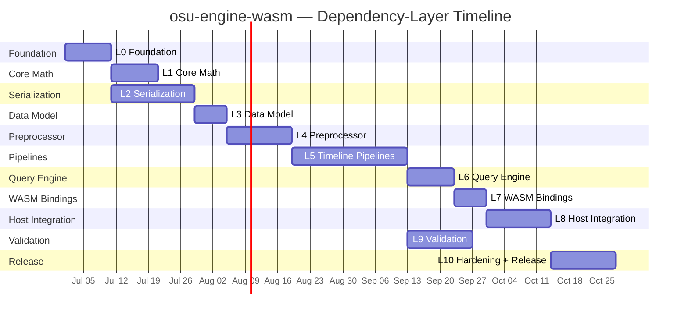
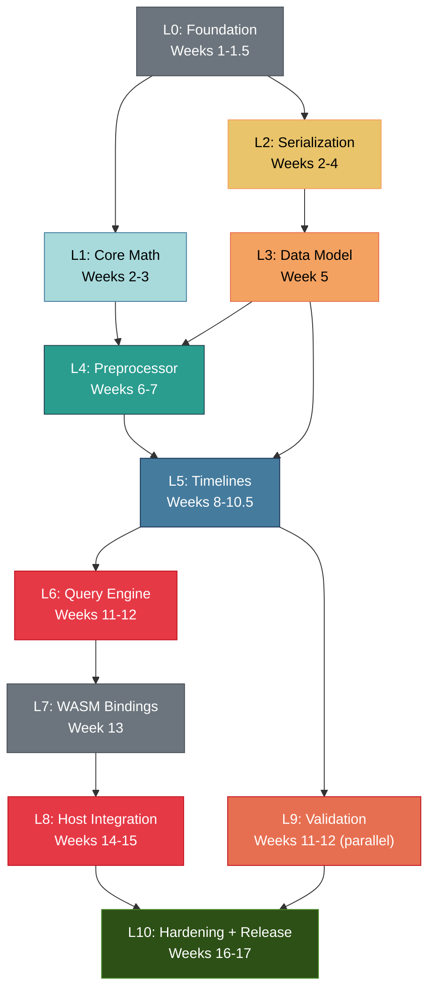

# Implementation Plan
## osu-engine-wasm — Phased Execution Roadmap

| | |
|---|---|
| **Document ID** | ENG-IMP-0047 |
| **Version** | 1.0 — DRAFT |
| **Author** | Engineering Lead |
| **Parent Document** | [BRD — ENG-BRD-0042](./BRD.md) (§15) |
| **Last Revised** | 2026-06-26 |

---

## Table of Contents

1. [Introduction](#1-introduction)
2. [Team & Roles](#2-team--roles)
3. [Development Methodology](#3-development-methodology)
4. [Implementation Layers](#4-implementation-layers)
5. [L0: Foundation](#5-l0-foundation)
6. [L1: Core Math](#6-l1-core-math)
7. [L2: Serialization](#7-l2-serialization)
8. [L3: Immutable Data Model](#8-l3-immutable-data-model)
9. [L4: Preprocessor](#9-l4-preprocessor)
10. [L5: Timeline Pipelines](#10-l5-timeline-pipelines)
11. [L6: Query Engine](#11-l6-query-engine)
12. [L7: WASM Bindings](#12-l7-wasm-bindings)
13. [L8: Host Integration](#13-l8-host-integration)
14. [L9: Validation](#14-l9-validation)
15. [L10: Hardening & Release](#15-l10-hardening--release)
16. [Dependency Graph](#16-dependency-graph)
17. [Risk-Adjusted Schedule](#17-risk-adjusted-schedule)
18. [Definition of Done](#18-definition-of-done)
19. [Source Code Reference Guide](#19-source-code-reference-guide)
20. [Change Log](#20-change-log)

---

## 1. Introduction

### 1.1 Purpose

This Implementation Plan translates the BRD milestones (§15) and architectural decisions ([ADD](./Architecture_Design_Document.md), [ADR Registry](./ADR_Registry.md)) into a concrete, **dependency-layer** execution roadmap. Each layer builds strictly on the previous layer, minimizing cross-phase refactors. Security constraints come from the [Security Threat Model](./Security_Threat_Model.md).

### 1.2 Guiding Principle

> Every implementation task is a **translation task**: read the C# source from osu!lazer, understand the behavior, write the Rust equivalent, and verify via differential testing. When in doubt, the lazer source wins.

### 1.3 Why Dependency Layers, Not Features

The traditional approach organizes work by feature (parsers → curves → stacking → judge). This is intuitive but causes problems:

| Problem | Feature-Oriented | Layer-Oriented |
|---|---|---|
| Cross-phase refactors | Curve types discovered during stacking require parser changes | Data model is complete before any consumer |
| Test isolation | Testing judge requires full parser + curves + stacking | Each layer has mock inputs for its predecessor |
| Code review scope | Large PRs that touch multiple subsystems | Small, focused PRs within a single layer |
| Parallel work | Limited — linear critical path | L1 and L2 are independent; L4 ScoreTimeline and VisibilityTimeline are independent |

### 1.4 Schedule Overview



**Total: 21 weeks** (reduced from 23 — less cross-phase rework).

**Parallel opportunities**:
- L1 (Core Math) and L2 (Serialization) start simultaneously after L0
- L9 (Validation/Golden Data) starts after L5, runs in parallel with L6–L8
- ScoreTimeline and VisibilityTimeline (within L5) are independent

---

## 2. Team & Roles

| Role | Responsibility | Allocation |
|---|---|---|
| **Rust Engineer (Lead)** | Core engine implementation, curve math, pipeline stages, WASM bindings | 70% dedicated |
| **TypeScript Engineer** | NPM package, integration tests, renderer bridge, CI/CD | 70% dedicated |
| **QA / Test** | Golden data pipeline, fuzz testing, differential harness | 30% (shared) |

---

## 3. Development Methodology

### 3.1 Workflow

1. **Read** the relevant lazer C# source (and danser-go for cross-reference)
2. **Write** the Rust implementation
3. **Test** against known reference values from lazer
4. **Verify** via differential test harness once available (L9)
5. **Review** via PR — every PR requires at least one approval

### 3.2 Branching Strategy

| Branch | Purpose |
|---|---|
| `main` | Stable, all CI passes. Tagged for releases. |
| `dev/{feature}` | Short-lived feature branches, merged via PR. |
| `golden-data-update/{tag}` | Golden data regeneration tied to a lazer release tag. |

### 3.3 Commit Convention

```
<type>(<scope>): <description>

feat(parser): implement .osr LZMA decompression
fix(math): correct arc-length parameterization off-by-one
test(pipeline): add note lock regression test for overlapping circles
perf(engine): reduce allocation in visible_objects computation
docs(brd): update reference repositories section
```

---

## 4. Implementation Layers

### 4.1 Layer Summary

| Layer | Duration | Key Deliverable | Exit Criteria | Depends On |
|---|---|---|---|---|
| L0 | 1.5 weeks | Repo skeleton, CI, fuzz stubs | CI green, `cargo test` passes | — |
| L1 | 1.5 weeks | Vec2, curves, trunc helpers | All curve positions within 0.5 px of lazer | L0 |
| L2 | 2.5 weeks | `.osr` + `.osu` parsers, LZMA | All parser unit tests pass; fuzz clean 10 min | L0 |
| L3 | 1 week | `ParsedBeatmap`, `ParsedReplay`, `ModSet` types | Types compile, serialization round-trip tests | L2 |
| L4 | 2 weeks | `PreprocessedBeatmap` (mods, stacking, curves) | Stack offsets match lazer; all mod combos tested | L1, L3 |
| L5 | 3.5 weeks | JudgementTimeline, ScoreTimeline, VisibilityTimeline | 20 replays match engine judgement counts | L3, L4 |
| L6 | 1.5 weeks | SnapshotBuilder, `query(t)`, batch queries | All 50 golden datasets pass within tolerance | L5 |
| L7 | 1 week | `#[wasm_bindgen]` exports, HandleArena | WASM binary builds, JS callable | L6 |
| L8 | 2 weeks | NPM package, `OsuEngine.load()`, Worker glue | `view_player.html` renders at 60 fps | L7 |
| L9 | 2 weeks | Golden data pipeline, differential tests | 50 datasets pass, all benchmarks within targets | L5 (parallel with L6–L8) |
| L10 | 2 weeks | Fuzz hardening, coverage push, release | Coverage ≥ 90%; NPM published | All |

### 4.2 Layer ↔ Pipeline Stage Mapping

| Layer | Pipeline Stage (ADR-020) | Rust Module |
|---|---|---|
| L1 | (foundation math) | `math/` |
| L2 | Stage 1: Parser | `parser/` |
| L3 | (data model between stages) | `model/` |
| L4 | Stage 2: Preprocessor | `preprocess/` |
| L5 | Stages 3–5: JudgementTimeline, ScoreTimeline, VisibilityTimeline | `pipeline/` |
| L6 | Stage 6: SnapshotBuilder + Façade | `engine/` |
| L7 | (binding layer) | `osu-engine-wasm/` |

---

## 5. L0: Foundation

**Duration**: Weeks 1–1.5
**Goal**: Repository structure, CI pipeline, and tooling ready.

### 5.1 Task Breakdown

| ID | Task | Owner | Est. | Depends On |
|---|---|---|---|---|
| L0-01 | Initialize Cargo workspace with `osu-engine` + `osu-engine-wasm` + `osu-engine-bench` crates | Rust Eng | 2h | — |
| L0-02 | Create `rust-toolchain.toml` pinning Rust 1.79.0 | Rust Eng | 0.5h | — |
| L0-03 | Add `lzma-rs`, `wasm-bindgen`, `serde` with **exact version pins** (`=x.y.z`) | Rust Eng | 1h | L0-01 |
| L0-04 | Create pipeline module stubs (`math/`, `parser/`, `model/`, `preprocess/`, `pipeline/`, `engine/`) | Rust Eng | 2h | L0-01 |
| L0-05 | Set up `cargo-fuzz` with `fuzz_osr_parse` and `fuzz_osu_parse` targets | Rust Eng | 2h | L0-01 |
| L0-06 | Create CI workflow `ci.yml` (fmt, clippy, test, wasm-pack build, size check) | TS Eng | 4h | L0-01 |
| L0-07 | Create benchmark workflow `bench.yml` (Criterion, regression detection) | TS Eng | 2h | L0-06 |
| L0-08 | Create release workflow `release.yml` (multi-target build, npm publish) | TS Eng | 3h | L0-06 |
| L0-09 | Initialize `npm/@osurender/engine` with `package.json`, TypeScript declarations stub | TS Eng | 2h | — |
| L0-10 | Create `tests/fixtures/` directory, add 5 initial test beatmaps and replays | QA | 2h | — |
| L0-11 | Set up `cargo-tarpaulin` coverage reporting → Codecov | TS Eng | 1h | L0-06 |
| L0-12 | Set up `cargo deny` with `deny.toml` (license allow-list + advisory checks) | Rust Eng | 1h | L0-01 |
| L0-13 | Implement `EngineVersion` struct (5-dimension versioning, API Spec §15.2) | Rust Eng | 2h | L0-01 |
| L0-14 | Implement `EngineError` enum (6-category taxonomy, API Spec §17) | Rust Eng | 3h | L0-01 |

### 5.2 Acceptance Criteria

- [ ] `cargo build --workspace` succeeds
- [ ] `cargo test --workspace` passes (empty tests)
- [ ] `wasm-pack build crates/osu-engine-wasm --target web` produces `.wasm`
- [ ] CI workflow runs on push and PR
- [ ] `cargo fuzz list` shows both fuzz targets
- [ ] `cargo deny check` passes

---

## 6. L1: Core Math

**Duration**: Weeks 2–3 (parallel with L2)
**Goal**: All geometric primitives and curve types produce correct results.

### 6.1 Task Breakdown

| ID | Task | Owner | Est. | Reference Source |
|---|---|---|---|---|
| L1-01 | Implement `Vec2<T>` (Point), distance, lerp helpers | Rust Eng | 2h | — |
| L1-02 | Implement `trunc_i32()` and `floor_i32()` helper functions (TDD §11.2.4) | Rust Eng | 1h | TDD §11.2 |
| L1-03 | Implement composite Bézier segment splitter | Rust Eng | 2h | TDD §4.1.1 |
| L1-04 | Implement De Casteljau evaluation | Rust Eng | 2h | TDD §4.1.2, `danser-go/bezier.go` |
| L1-05 | Implement Bézier flattening (tolerance-based subdivision) | Rust Eng | 3h | `danser-go/bezierapproximator.go` |
| L1-06 | Implement Catmull-Rom spline evaluation | Rust Eng | 3h | TDD §4.2, `danser-go/catmull.go` |
| L1-07 | Implement perfect circular arc (circumcenter, radius, angles) | Rust Eng | 4h | TDD §4.3, `danser-go/cirarc.go` |
| L1-08 | Implement collinear/large-radius fallback to linear | Rust Eng | 1h | TDD §4.3 |
| L1-09 | Implement `ArcLengthTable` (N=100 samples, binary search lookup) | Rust Eng | 4h | TDD §4.4 |
| L1-10 | Implement `SliderPath` composite curve assembly with pixel_length clamping | Rust Eng | 4h | TDD §4.5, `osu/SliderPath.cs` |
| L1-11 | Unit tests: UT-CRV-001 through UT-CRV-013 | Rust Eng | 6h | Test Plan §6.2 |
| L1-12 | Unit tests: UT-TRUNC-001 through UT-TRUNC-010 | Rust Eng | 2h | Test Plan §12.3 |

### 6.2 Acceptance Criteria

- [ ] All 13 UT-CRV-* tests pass
- [ ] All 10 UT-TRUNC-* tests pass
- [ ] All curve positions within 0.5 osu!px of lazer's SliderPath output
- [ ] No NaN/Inf in any curve or truncation computation

---

## 7. L2: Serialization

**Duration**: Weeks 2–4 (parallel with L1)
**Goal**: Complete `.osr` and `.osu` parsers.

### 7.1 Task Breakdown

| ID | Task | Owner | Est. | Reference Source |
|---|---|---|---|---|
| L2-01 | Implement `ParseError` enum with all variants | Rust Eng | 2h | ADD §10.1 |
| L2-02 | Implement `read_osu_string()` (0x0B + ULEB128 + UTF-8) | Rust Eng | 3h | `osu-reverse-mapper/script.js` L925–943 |
| L2-03 | Implement `read_uleb128()` with overflow protection | Rust Eng | 1h | TDD §2.3 |
| L2-04 | Implement `.osr` header parser (all fields through score ID) | Rust Eng | 6h | TDD §2.1 |
| L2-05 | Implement LZMA decompression wrapper with 256 MB cap | Rust Eng | 4h | BRD §14.1, ADR-018 |
| L2-06 | Implement replay frame parser (delta-coded, terminator detection) | Rust Eng | 4h | TDD §2.4, `osu-reverse-mapper/script.js` L849–860 |
| L2-07 | Unit tests for `.osr` parser: UT-OSR-001 through UT-OSR-015 | Rust Eng | 6h | Test Plan §6.1.1 |
| L2-08 | Implement `.osu` section lexer (General, Difficulty, TimingPoints, HitObjects) | Rust Eng | 4h | `osu/LegacyBeatmapDecoder.cs` |
| L2-09 | Implement timing point parser (red lines, green lines, velocity multiplier) | Rust Eng | 4h | TDD §3.4 |
| L2-10 | Implement hit object parser (circle, slider, spinner, type bitmask) | Rust Eng | 6h | TDD §3.2, §3.3 |
| L2-11 | Implement slider control point parser (curve type + coordinates) | Rust Eng | 3h | TDD §3.3 |
| L2-12 | Implement metadata parser (title, artist, creator, version) | Rust Eng | 2h | |
| L2-13 | Implement difficulty section parser (AR, CS, OD, HP, SliderMultiplier) | Rust Eng | 2h | |
| L2-14 | Unit tests for `.osu` parser: UT-OSU-001 through UT-OSU-015 | Rust Eng | 6h | Test Plan §6.1.2 |
| L2-15 | Add 15 fixture beatmaps and replays for edge cases | QA | 3h | Test Plan §14 |
| L2-16 | Seed fuzz corpus with valid files + truncated variants | QA | 2h | Test Plan §9.3 |
| L2-17 | Run fuzz for 10 minutes, fix any crashes found | Rust Eng | 4h | Test Plan §9.2 |

### 7.2 Acceptance Criteria

- [ ] All 15 UT-OSR-* tests pass
- [ ] All 15 UT-OSU-* tests pass
- [ ] `cargo fuzz run fuzz_osr_parse -- -max_total_time=600` — zero crashes
- [ ] `cargo fuzz run fuzz_osu_parse -- -max_total_time=600` — zero crashes

---

## 8. L3: Immutable Data Model

**Duration**: Week 5
**Goal**: Type-safe, immutable parsed data structures used by all downstream layers.

### 8.1 Task Breakdown

| ID | Task | Owner | Est. | Depends On |
|---|---|---|---|---|
| L3-01 | Define `ParsedBeatmap` struct (HitObject, TimingPoint, Difficulty, Metadata) | Rust Eng | 4h | L2 |
| L3-02 | Define `ParsedReplay` struct (ReplayFrame, header fields) | Rust Eng | 2h | L2 |
| L3-03 | Define `ModSet` from bitmask with all supported mods | Rust Eng | 2h | TDD §6.1 |
| L3-04 | Define shared enums: `HitResult`, `Grade`, `CurveType`, `HitObjectType` | Rust Eng | 2h | |
| L3-05 | Wire parsers to produce L3 types (parser output = L3 input) | Rust Eng | 4h | L2, L3-01..04 |
| L3-06 | Implement `Debug`, `Clone`, `PartialEq` for all model types (test support) | Rust Eng | 2h | L3-01..04 |
| L3-07 | Write serialization round-trip tests for all model types | Rust Eng | 3h | L3-06 |

### 8.2 Acceptance Criteria

- [ ] All model types implement `Send + Sync` (required for Worker transfer, ADR-017)
- [ ] Parser outputs compile as L3 types
- [ ] Serialization round-trip tests pass
- [ ] `ParsedBeatmap` and `ParsedReplay` are immutable after construction (`&self` only)

---

## 9. L4: Preprocessor

**Duration**: Weeks 6–7
**Goal**: `PreprocessedBeatmap` with mods applied, stacking resolved, and curves computed.

### 9.1 Task Breakdown

| ID | Task | Owner | Est. | Reference Source |
|---|---|---|---|---|
| L4-01 | Implement `apply_mods()` — EZ, HR, DT/NC, HT difficulty transforms | Rust Eng | 4h | TDD §6.2 |
| L4-02 | Implement AR ↔ preempt conversion | Rust Eng | 1h | TDD §6.3 |
| L4-03 | Implement CS → radius conversion | Rust Eng | 0.5h | TDD §6.4 |
| L4-04 | Implement HR Y-flip and Mirror X-flip for hit objects | Rust Eng | 2h | `osu/OsuModHardRock.cs` |
| L4-05 | Unit tests for mods: UT-MOD-001 through UT-MOD-012 | Rust Eng | 4h | Test Plan §6.4 |
| L4-06 | Implement stacking v2 (reverse pass, format ≥ 6) | Rust Eng | 8h | `osu/OsuBeatmapProcessor.cs` L69–221 |
| L4-07 | Implement stacking v1 (forward pass, format < 6) | Rust Eng | 4h | `osu/OsuBeatmapProcessor.cs` L224–268 |
| L4-08 | Implement `stack_threshold` with integer truncation (TDD §11.2) | Rust Eng | 1h | `osu/OsuBeatmapProcessor.cs` L280–281 |
| L4-09 | Implement `stack_offset` pixel calculation from stack_height + CS | Rust Eng | 1h | TDD §5.2 |
| L4-10 | Unit tests for stacking: UT-STK-001 through UT-STK-012 | Rust Eng | 6h | Test Plan §6.3 |
| L4-11 | Implement curve precomputation (SliderPath cache from L1 math) | Rust Eng | 4h | L1 |
| L4-12 | Define `PreprocessedBeatmap` combining mod-adjusted + stacked + curve-cached data | Rust Eng | 3h | L4-01..11 |
| L4-13 | Cross-validate stacking against danser-go for 5 maps | QA | 3h | |

### 9.2 Acceptance Criteria

- [ ] All 12 UT-MOD-* tests pass
- [ ] All 12 UT-STK-* tests pass
- [ ] Stack offsets match lazer for all fixture beatmaps
- [ ] Effective AR/CS/OD/HP for all mod combinations match lazer exactly
- [ ] `PreprocessedBeatmap` is immutable after construction

---

## 10. L5: Timeline Pipelines

**Duration**: Weeks 8–10.5
**Goal**: All three pipeline timelines produce correct results independently.

### 10.1 JudgementTimeline Tasks

| ID | Task | Owner | Est. | Reference Source |
|---|---|---|---|---|
| L5-J01 | Implement `HitWindows` from OD (great/ok/meh/miss with floor-0.5) | Rust Eng | 3h | TDD §8.1, `osu/OsuHitWindows.cs` |
| L5-J02 | Implement `StartTimeOrderedHitPolicy` (note lock) | Rust Eng | 6h | `osu/StartTimeOrderedHitPolicy.cs` |
| L5-J03 | Implement circle judgement (position + timing check) | Rust Eng | 4h | TDD §8.3 |
| L5-J04 | Implement slider head judgement (as circle) | Rust Eng | 2h | `osu/DrawableSliderHead.cs` |
| L5-J05 | Implement slider body tracking (key-held + follow-radius check) | Rust Eng | 6h | `osu/DrawableSlider.cs`, `danser-go/slider.go` |
| L5-J06 | Implement slider tick/repeat/tail judgement | Rust Eng | 4h | `osu/SliderTick.cs`, `SliderRepeat.cs`, `SliderTailCircle.cs` |
| L5-J07 | Implement overall slider result from nested object ratios | Rust Eng | 3h | `osu/DrawableSlider.cs` |
| L5-J08 | Implement miss detection (timeout, out-of-range) | Rust Eng | 3h | TDD §8.3 |
| L5-J09 | Implement full replay scan: `scan(preprocessed, replay, mods) → JudgementTimeline` | Rust Eng | 8h | ADR-020 |
| L5-J10 | Implement key-press detection from frame key flags | Rust Eng | 2h | |
| L5-J11 | Unit tests: UT-JDG-001 through UT-JDG-012 | Rust Eng | 6h | Test Plan §6.5 |
| L5-J12 | Validate all 20 fixture replays: judgement counts match header | QA | 4h | |
| L5-J13 | Debug any count mismatches with per-object tracing | Rust Eng | 8h | Buffer |

### 10.2 ScoreTimeline Tasks (can start after L5-J09)

| ID | Task | Owner | Est. | Reference Source |
|---|---|---|---|---|
| L5-S01 | Implement `accumulate()`: combo tracking, accuracy, score per judgement | Rust Eng | 6h | `osu/ScoreProcessor.cs`, `danser-go/scorev1.go` |
| L5-S02 | Implement HP drain model | Rust Eng | 4h | `osu/DrainingHealthProcessor.cs` |
| L5-S03 | Implement scoring grade calculation (SS/S/A/B/C/D) | Rust Eng | 2h | TDD §9.3 |
| L5-S04 | Unit tests for score accumulation | Rust Eng | 4h | |

### 10.3 VisibilityTimeline Tasks (independent of L5-J, L5-S)

| ID | Task | Owner | Est. | Reference Source |
|---|---|---|---|---|
| L5-V01 | Implement `compute()`: appear_time, end_time from AR preempt | Rust Eng | 3h | TDD §10.3 |
| L5-V02 | Implement `alpha(t)` — fade-in/fade-out per object | Rust Eng | 2h | TDD §10.3 |
| L5-V03 | Implement `approach_scale(t)` — circle approach from 4× to 1× | Rust Eng | 1h | TDD §10.3 |
| L5-V04 | Unit tests for visibility computation | Rust Eng | 3h | |

### 10.4 Acceptance Criteria

- [ ] All 12 UT-JDG-* tests pass
- [ ] All 20 fixture replays: engine judgement counts **exactly** match replay header
- [ ] Note lock behavior verified for overlapping-object test maps
- [ ] ScoreTimeline produces correct combo/accuracy/score/grade per judgement
- [ ] VisibilityTimeline produces correct appear/fade times per object

---

## 11. L6: Query Engine

**Duration**: Weeks 11–12
**Goal**: End-to-end `query(t)` and batch queries working.

### 11.1 Task Breakdown

| ID | Task | Owner | Est. | Reference Source |
|---|---|---|---|---|
| L6-01 | Implement `EngineIndex`: binary search indices for frames, objects, judgements | Rust Eng | 4h | ADD §5.3 |
| L6-02 | Implement `cursor_interpolation()` from replay frames | Rust Eng | 3h | TDD §10.2 |
| L6-03 | Implement slider ball position from `t` and curve data | Rust Eng | 4h | |
| L6-04 | Implement `SnapshotBuilder::build(t, timelines) → StateSnapshot` | Rust Eng | 8h | ADR-020 |
| L6-05 | Implement `GameEngine::create()` chaining pipeline stages L2→L4→L5 | Rust Eng | 4h | ADR-020 |
| L6-06 | Implement `GameEngine::query(t)` delegating to SnapshotBuilder | Rust Eng | 3h | ADR-020 |
| L6-07 | Implement `query_batch()` with 4,096 sample limit (ADR-019) | Rust Eng | 4h | API Spec §16 |
| L6-08 | Implement `query_range()` with auto-pagination → PaginatedBatchResult | Rust Eng | 6h | ADR-019 |
| L6-09 | Implement `query_frames()` for replay-frame-aligned queries | Rust Eng | 2h | API Spec §16.3 |
| L6-10 | Implement `StateSnapshot` struct (ADR-010: append-only) | Rust Eng | 3h | API Spec §7 |
| L6-11 | Implement `EngineStats` observability (API Spec §20) | Rust Eng | 3h | |
| L6-12 | Unit tests: `query(t)` produces consistent random-access results | Rust Eng | 4h | |

### 11.2 Acceptance Criteria

- [ ] `GameEngine.create()` + `query(t)` works end-to-end
- [ ] `query(t)` returns consistent results for random-access seek patterns
- [ ] `query_batch()` with > 4,096 samples returns `BATCH_SIZE_EXCEEDED` error
- [ ] `PaginatedBatchResult` correctly iterates through pages

---

## 12. L7: WASM Bindings

**Duration**: Week 13
**Goal**: Engine callable from JavaScript via WASM.

### 12.1 Task Breakdown

| ID | Task | Owner | Est. |
|---|---|---|---|
| L7-01 | Implement `HandleArena<T>` for WASM handle-based ownership (ADR-007) | Rust Eng | 4h |
| L7-02 | Implement `#[wasm_bindgen]` exports for `parse_beatmap()`, `parse_replay()` | Rust Eng | 3h |
| L7-03 | Implement `#[wasm_bindgen]` exports for `create_engine()`, `query()` | Rust Eng | 3h |
| L7-04 | Implement `#[wasm_bindgen]` exports for batch query functions | Rust Eng | 2h |
| L7-05 | Implement `StateSnapshot` serialization to JS via `serde-wasm-bindgen` | Rust Eng | 4h |
| L7-06 | Implement `free()` for all handle types + `FinalizationRegistry` hint | Rust Eng | 2h |
| L7-07 | Implement `precompute_curves()` and `slider_curve_buffer()` exports | Rust Eng | 3h |
| L7-08 | WASM size optimization: `wasm-opt -Os`, strip debug info | Rust Eng | 2h |
| L7-09 | Verify WASM binary ≤ 800 KB gzipped | Rust Eng | 0.5h |

### 12.2 Acceptance Criteria

- [ ] WASM builds successfully: `wasm-pack build crates/osu-engine-wasm --target web`
- [ ] All handle types callable from JS
- [ ] `.free()` releases memory correctly
- [ ] WASM binary ≤ 800 KB gzipped

---

## 13. L8: Host Integration

**Duration**: Weeks 14–15
**Goal**: Engine integrated into `view_player.html` with visual output.

### 13.1 Task Breakdown

| ID | Task | Owner | Est. |
|---|---|---|---|
| L8-01 | Implement `OsuEngine.load()` async factory with Worker management (ADR-017, ADR-018) | TS Eng | 8h |
| L8-02 | Implement Worker timeout enforcement (10s default) and LZMA_CPU_TIMEOUT handling | TS Eng | 4h |
| L8-03 | Assemble `@osurender/engine` NPM package (WASM + TS declarations + README) | TS Eng | 4h |
| L8-04 | Generate TypeScript type declarations from WASM bindings | TS Eng | 3h |
| L8-05 | Create engine loader in `view_player.html` Analyze tab | TS Eng | 6h |
| L8-06 | Wire scrubber → `engine.query(t)` → canvas rendering | TS Eng | 8h |
| L8-07 | Implement basic WebGL2 circle renderer using StateSnapshot | TS Eng | 8h |
| L8-08 | Implement basic slider body renderer using `slider_curve_buffer()` | TS Eng | 8h |
| L8-09 | Implement cursor renderer | TS Eng | 2h |
| L8-10 | Implement HUD overlay (combo, accuracy, score) | TS Eng | 4h |
| L8-11 | TypeScript type-check: `npm run type-check` | TS Eng | 1h |

### 13.2 Acceptance Criteria

- [ ] `view_player.html` loads WASM, parses files, and renders at 60 fps
- [ ] `OsuEngine.load()` returns engine handle after Worker-based parsing
- [ ] Worker timeout fires correctly for slow files
- [ ] TypeScript declarations compile without error
- [ ] No console errors during normal operation

---

## 14. L9: Validation

**Duration**: Weeks 11–12 (parallel with L6–L8)
**Goal**: Golden data pipeline and differential tests operational.

### 14.1 Task Breakdown

| ID | Task | Owner | Est. |
|---|---|---|---|
| L9-01 | Set up headless osu!lazer build using `osu.Game.Tests` infrastructure | Rust Eng | 8h |
| L9-02 | Write golden data extractor: drive game clock, serialize state to JSON | Rust Eng | 8h |
| L9-03 | Define sampling strategy: every 100ms + object times ± 1ms | QA | 2h |
| L9-04 | Select 50 beatmap+replay pairs covering all difficulty tiers and edge cases | QA | 4h |
| L9-05 | Run golden data generation for all 50 pairs | QA | 4h |
| L9-06 | Compress golden files to `.json.gz`, commit to `tests/golden/` | QA | 1h |
| L9-07 | Create `tests/golden/LAZER_VERSION.txt` recording pinned lazer tag | QA | 0.5h |
| L9-08 | Write golden data loader in Rust for differential test harness | Rust Eng | 3h |
| L9-09 | Build differential test harness: load golden data, run engine, compare | Rust Eng | 8h |
| L9-10 | Run differential tests for all 50 golden datasets | QA | 4h |
| L9-11 | Debug and fix divergences found | Rust Eng | 16h |
| L9-12 | Generate HTML diff report for manual review | TS Eng | 4h |
| L9-13 | Run Criterion benchmarks, verify all targets met | Rust Eng | 4h |
| L9-14 | Browser performance test: 60 fps sustained for 3-minute map | TS Eng | 2h |
| L9-15 | Memory profiling: Chrome DevTools heap snapshot ≤ 30 MB | TS Eng | 2h |
| L9-16 | Visual comparison: render 10 maps, compare with Danser-Go reference | QA | 8h |

### 14.2 Acceptance Criteria

- [ ] 50 golden datasets generated and committed
- [ ] All 50 golden datasets pass differential comparison within tolerance
- [ ] All performance benchmarks within targets (API Spec §21)
- [ ] `.osr` parse ≤ 20 ms, `.osu` parse ≤ 15 ms
- [ ] `query(t)` ≤ 0.1 ms (native), ≤ 0.2 ms (WASM)
- [ ] WASM binary ≤ 800 KB gzipped; memory peak ≤ 30 MB

---

## 15. L10: Hardening & Release

**Duration**: Weeks 16–17
**Goal**: Production-quality hardening and NPM release.

### 15.1 Hardening Tasks

| ID | Task | Owner | Est. |
|---|---|---|---|
| L10-01 | Extended fuzz run: 1 hour per target | QA | 3h |
| L10-02 | Fix any crashes found during extended fuzz | Rust Eng | 8h |
| L10-03 | Coverage push: identify uncovered paths, add tests to reach 90% | Rust Eng | 16h |
| L10-04 | Security tests: SEC-001 through SEC-010 | QA | 4h |
| L10-05 | Browser compatibility smoke tests (Chrome, Firefox, Safari) | TS Eng | 4h |
| L10-06 | Edge case map testing: marathon, extreme AR, 2B-style | QA | 4h |
| L10-07 | Run `cargo deny check` — verify no new advisories | Rust Eng | 0.5h |
| L10-08 | Verify all 50 golden datasets still pass | QA | 2h |
| L10-09 | Review all `// TODO` and `// HACK` comments — resolve or document | Rust Eng | 4h |
| L10-10 | Final code review of all modules | Both | 8h |

### 15.2 Release Tasks

| ID | Task | Owner | Est. |
|---|---|---|---|
| L10-R01 | Final CI run on release candidate branch | Both | 1h |
| L10-R02 | Run full release gate checklist (§18.2) | QA | 2h |
| L10-R03 | Update version numbers in `Cargo.toml` and `package.json` | Rust Eng | 0.5h |
| L10-R04 | Write CHANGELOG.md | Both | 2h |
| L10-R05 | Tag release `v1.0.0` | Rust Eng | 0.5h |
| L10-R06 | CI release workflow: multi-target build → NPM publish | Automated | — |
| L10-R07 | Verify NPM: `npm install @osurender/engine@1.0.0` | TS Eng | 1h |
| L10-R08 | Create GitHub Release with WASM binary attached | Rust Eng | 0.5h |

### 15.3 Acceptance Criteria

- [ ] Extended fuzz (1 hour per target): zero crashes
- [ ] Coverage ≥ 90% (workspace aggregate)
- [ ] All security tests (SEC-*) pass
- [ ] Browser smoke tests pass (Chrome, Firefox, Safari)
- [ ] `@osurender/engine@1.0.0` installable from NPM
- [ ] No open P0 or P1 defects

---

## 16. Dependency Graph



**Critical path**: L0 → L2 → L3 → L4 → L5 → L6 → L7 → L8 → L10

**Parallel work**:
- **L1 ∥ L2**: Core math and serialization are independent; both depend only on L0
- **L9 ∥ L6-L8**: Validation starts after L5 (timeline pipelines), runs alongside bindings/integration
- **L5-V ∥ L5-S**: VisibilityTimeline and ScoreTimeline are independent within L5

---

## 17. Risk-Adjusted Schedule

| Layer | Optimistic | Expected | Pessimistic | Risk Factor |
|---|---|---|---|---|
| L0 | 1 week | 1.5 weeks | 2 weeks | Low — well-understood tooling |
| L1 | 1 week | 1.5 weeks | 2.5 weeks | High — curve math complexity |
| L2 | 2 weeks | 2.5 weeks | 3.5 weeks | Medium — LZMA edge cases |
| L3 | 0.5 week | 1 week | 1 week | Low — type definitions |
| L4 | 1.5 weeks | 2 weeks | 3 weeks | High — stacking v2 subtlety |
| L5 | 2.5 weeks | 3.5 weeks | 5.5 weeks | **Very High — note lock, slider judging** |
| L6 | 1 week | 1.5 weeks | 2 weeks | Medium — snapshot assembly |
| L7 | 0.5 week | 1 week | 1.5 weeks | Low — mechanical |
| L8 | 1.5 weeks | 2 weeks | 3 weeks | Medium — Worker integration, WebGL |
| L9 | 1.5 weeks | 2 weeks | 3 weeks | Medium — headless lazer setup |
| L10 | 1 week | 2 weeks | 3 weeks | Medium — coverage gaps |
| **Total** | **14 weeks** | **21 weeks** | **30 weeks** | |

**Schedule buffer**: The 21-week estimate includes ~50% buffer over the optimistic path.

---

## 18. Definition of Done

### 18.1 Task-Level

A task is "done" when:

- [ ] Code is written and compiles without warnings (`cargo clippy -- -D warnings`)
- [ ] Unit tests for the component pass
- [ ] Code is formatted (`cargo fmt`)
- [ ] PR is reviewed and approved
- [ ] CI pipeline is green
- [ ] Relevant documentation is updated (if behavior or API changed)
- [ ] New test fixtures are committed (if applicable)
- [ ] Coverage for the changed module hasn't decreased
- [ ] If an architectural decision was made, a new [ADR](./ADR_Registry.md) is created or updated
- [ ] If a parser was changed, Security Threat Model attack surface is re-evaluated

### 18.2 Release Gate Checklist

| Gate | Threshold | Tool |
|---|---|---|
| Coverage | ≥ 90% workspace aggregate | `cargo tarpaulin` |
| Clippy | Zero warnings | `cargo clippy -- -D warnings` |
| Fuzz clean | 24 hours per target, zero crashes | `cargo fuzz` |
| Golden datasets | 100% pass within tolerance | Differential harness |
| Binary size | ≤ 800 KB gzipped | `wasm-opt` output |
| Benchmark regression | Within 5% of baseline | Criterion |
| Security advisories | Zero new | `cargo deny check advisories` |
| Documentation | Builds without error | Markdown lint |
| TypeScript | Type-checks cleanly | `npm run type-check` |

A **milestone** is "done" when all its acceptance criteria (listed per layer above) are satisfied.

---

## 19. Source Code Reference Guide

Quick lookup table for implementation tasks — which source files to read first:

| When Implementing | Read First | Then Cross-Reference |
|---|---|---|
| `.osr` parser | `osu-reverse-mapper/script.js` L862–948 | osu! wiki .osr format page |
| `.osu` parser | `osu/Beatmaps/Formats/LegacyBeatmapDecoder.cs` | `danser-go/beatmap/parser.go` |
| Bézier curves | `osu/Rulesets/Objects/SliderPath.cs` | `danser-go/framework/math/curves/bezier.go` |
| Catmull curves | `danser-go/framework/math/curves/catmull.go` | `osu/SliderPath.cs` |
| Perfect arc | `danser-go/framework/math/curves/cirarc.go` | `osu/SliderPath.cs` |
| Arc-length table | `osu/SliderPath.cs` L200–300 | `danser-go/multicurve.go` |
| Stacking v2 | `osu/Beatmaps/OsuBeatmapProcessor.cs` L69–221 | `danser-go/beatmap/stackleniency.go` |
| Stacking v1 | `osu/Beatmaps/OsuBeatmapProcessor.cs` L224–268 | — |
| Hit windows | `osu/Scoring/OsuHitWindows.cs` | `danser-go/ruleset.go` L692–712 |
| Note lock | `osu/UI/StartTimeOrderedHitPolicy.cs` | `danser-go/ruleset.go` L665–690 |
| Circle judging | `osu/Objects/Drawables/DrawableHitCircle.cs` | `danser-go/circle.go` |
| Slider judging | `osu/Objects/Drawables/DrawableSlider.cs` | `danser-go/slider.go` |
| Scoring | `osu/Scoring/ScoreProcessor.cs` | `danser-go/scorev1.go` |
| Mod effects | `osu/Mods/OsuModHardRock.cs`, `OsuModEasy.cs` | `danser-go/difficulty/mods.go` |
| CS → radius | `osu-reverse-mapper/script.js` L54–61 | — |
| Coordinates | `osu-reverse-mapper/script.js` L251–256 | — |
| HP drain | `osu/Scoring/DrainingHealthProcessor.cs` | `danser-go/healthprocessor.go` |

---

## 20. Change Log

| Date | Version | Author | Change |
|---|---|---|---|
| 2026-06-26 | 1.0 | Systems Eng | Initial document creation |
| 2026-06-28 | 2.0 | Systems Eng | Major restructure: feature-oriented → dependency-layer milestones (ADR-020 pipeline architecture). All task IDs renumbered L0→L10. Release gate checklist formalized. |

---

*End of Implementation Plan. Related: [BRD](./BRD.md) · [ADD](./Architecture_Design_Document.md) · [TDD](./Technical_Design_Document.md) · [Test Plan](./Test_Plan.md) · [API Spec](./API_Specification.md) · [ADR Registry](./ADR_Registry.md) · [Security Threat Model](./Security_Threat_Model.md) · [Developer Guide](./Developer_Guide.md)*
