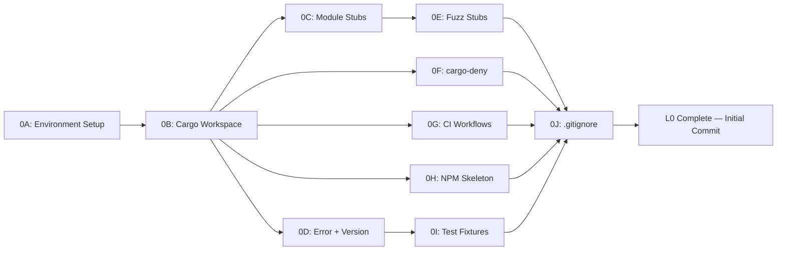

# L0: Foundation — Implementation Plan

## Environment Assessment

| Tool | Status | Action Required |
|---|---|---|
| `rustc` 1.96.0 | Installed (Arch package) | None — newer than our 1.79.0 floor |
| `cargo` 1.96.0 | Installed | None |
| `rustup` | Not installed | **Install** — needed for `wasm32-unknown-unknown` target |
| `wasm-pack` | Not installed | **Install** — needed for WASM builds |
| `cargo-fuzz` | Not installed | **Install** — needed for fuzz targets |
| `cargo-deny` | Not installed | **Install** — supply chain checks |
| `cargo-tarpaulin` | Not installed | Defer to L10 (not needed until coverage push) |
| `node` v20.20.2 | Installed | None |
| `npm` 11.16.0 | Installed | None |
| `wasm32-unknown-unknown` target | Unknown | Add via `rustup target add` after rustup install |

> [!IMPORTANT]
> **rustup**: Your Rust is installed via Arch's system package (`pacman`), not `rustup`. We need `rustup` for managing the `wasm32-unknown-unknown` target and `rust-toolchain.toml` pinning. This may conflict with the system Rust. Two options:
> 1. **Uninstall system Rust, install via rustup** (recommended for WASM development)
> 2. **Keep system Rust, manually install wasm32 target** (may require `--sysroot` hacks)

## Open Questions

> [!IMPORTANT]
> 1. **rustup vs system Rust**: Do you want to switch from Arch's `pacman` Rust to `rustup`-managed Rust? This is the standard approach for WASM development but requires removing the system package first.
> 2. **CI Provider**: The plan assumes GitHub Actions. Are you using GitHub, or a different forge (GitLab, Codeberg, etc.)?
> 3. **Test Fixtures**: We need 5 beatmap+replay pairs. Do you have specific maps/replays in mind, or should we use publicly available ones from osu! community resources?

---

## Proposed Changes

### Phase 0A: Environment Setup

#### [NEW] `rust-toolchain.toml`

Pins the Rust toolchain for reproducible builds.

```toml
[toolchain]
channel = "stable"
targets = ["wasm32-unknown-unknown"]
components = ["clippy", "rustfmt"]
```

#### Tool Installation Commands

```bash
# 1. Install rustup (if approved — see Open Question #1)
curl --proto '=https' --tlsv1.2 -sSf https://sh.rustup.rs | sh

# 2. Add WASM target
rustup target add wasm32-unknown-unknown

# 3. Install wasm-pack
cargo install wasm-pack

# 4. Install cargo-fuzz (requires nightly for libfuzzer)
cargo install cargo-fuzz

# 5. Install cargo-deny
cargo install cargo-deny
```

---

### Phase 0B: Cargo Workspace

#### [NEW] `Cargo.toml` (workspace root)

```toml
[workspace]
resolver = "2"
members = [
    "crates/osu-engine",
    "crates/osu-engine-wasm",
    "crates/osu-engine-bench",
]

[workspace.package]
version = "0.1.0"
edition = "2024"
license = "MIT"
repository = "https://github.com/user/OsuWeb"

[workspace.dependencies]
# Serialization
serde = { version = "=1.0.219", features = ["derive"] }
serde_json = "=1.0.140"

# LZMA decompression (.osr replay data)
lzma-rs = "=0.3.0"

# WASM bindings
wasm-bindgen = "=0.2.100"
js-sys = "=0.3.77"

# Testing
pretty_assertions = "=1.4.1"
proptest = "=1.6.0"

# Benchmarking
criterion = { version = "=0.5.1", features = ["html_reports"] }
```

#### [NEW] `crates/osu-engine/Cargo.toml`

Core engine library — pure Rust, no WASM dependencies.

```toml
[package]
name = "osu-engine"
version.workspace = true
edition.workspace = true

[dependencies]
serde.workspace = true
lzma-rs.workspace = true

[dev-dependencies]
pretty_assertions.workspace = true
proptest.workspace = true
```

#### [NEW] `crates/osu-engine-wasm/Cargo.toml`

WASM binding crate — thin layer over `osu-engine`.

```toml
[package]
name = "osu-engine-wasm"
version.workspace = true
edition.workspace = true

[lib]
crate-type = ["cdylib", "rlib"]

[dependencies]
osu-engine = { path = "../osu-engine" }
wasm-bindgen.workspace = true
js-sys.workspace = true
serde.workspace = true
serde_json.workspace = true

[dev-dependencies]
wasm-bindgen-test = "=0.3.50"
```

#### [NEW] `crates/osu-engine-bench/Cargo.toml`

Benchmark harness.

```toml
[package]
name = "osu-engine-bench"
version.workspace = true
edition.workspace = true

[[bench]]
name = "engine_benchmarks"
harness = false

[dependencies]
osu-engine = { path = "../osu-engine" }

[dev-dependencies]
criterion.workspace = true
```

---

### Phase 0C: Module Stubs (Pipeline Architecture)

All modules go in `crates/osu-engine/src/`. Each module gets a stub file with doc comments explaining its pipeline stage role.

#### [NEW] Module Structure

```
crates/osu-engine/src/
├── lib.rs                  # Crate root — re-exports public API
├── math/                   # L1: Core Math
│   ├── mod.rs
│   ├── vec2.rs             # 2D vector type
│   ├── curves.rs           # Bézier, Catmull-Rom, Arc
│   └── trunc.rs            # Integer truncation helpers
├── parser/                 # L2: Serialization (Pipeline Stage 1)
│   ├── mod.rs
│   ├── osr.rs              # .osr replay parser
│   ├── osu.rs              # .osu beatmap parser
│   └── lzma.rs             # LZMA decompression wrapper
├── model/                  # L3: Immutable Data Model
│   ├── mod.rs
│   ├── beatmap.rs          # ParsedBeatmap
│   ├── replay.rs           # ParsedReplay
│   ├── hit_object.rs       # HitCircle, Slider, Spinner
│   └── mods.rs             # ModSet, ModFlags
├── preprocess/             # L4: Preprocessor (Pipeline Stage 2)
│   ├── mod.rs
│   ├── difficulty.rs       # Mod-adjusted AR/CS/OD/HP
│   ├── stacking.rs         # Stacking algorithm v1/v2
│   └── slider_paths.rs     # Curve computation + arc-length tables
├── pipeline/               # L5: Timeline Pipelines (Stages 3–5)
│   ├── mod.rs
│   ├── judgement.rs         # JudgementTimeline (Stage 3)
│   ├── score.rs            # ScoreTimeline (Stage 4)
│   └── visibility.rs       # VisibilityTimeline (Stage 5)
├── engine/                 # L6: Query Engine (Stage 6)
│   ├── mod.rs
│   ├── snapshot.rs          # SnapshotBuilder
│   ├── query.rs             # query(t), query_batch()
│   └── index.rs             # Binary search indices
├── error.rs                # EngineError taxonomy
└── version.rs              # EngineVersion (5-dimension)
```

---

### Phase 0D: Core Infrastructure Types

#### [NEW] `crates/osu-engine/src/error.rs`

6-category error taxonomy from API Spec §17.

```rust
/// Error taxonomy for all engine operations.
/// 
/// Categorized per API Specification §17 into 6 domains:
/// - parse: Invalid or corrupt input files
/// - decompression: LZMA decompression failures  
/// - validation: Semantically invalid but parseable data
/// - engine: Runtime query failures
/// - memory: WASM memory allocation failures
/// - internal: Bug in engine code (should never happen)
#[derive(Debug, Clone, PartialEq)]
pub enum EngineError {
    // Parse errors (P-*)
    InvalidMagic { expected: &'static str, found: Vec<u8> },
    UnexpectedEof { context: &'static str, offset: usize },
    InvalidUtf8 { context: &'static str, offset: usize },
    MalformedField { field: &'static str, value: String },
    UnsupportedVersion { version: i32 },

    // Decompression errors (D-*)
    LzmaDecompressionFailed { source: String },
    DecompressionOutputTooLarge { limit_bytes: usize, actual_bytes: usize },
    DecompressionTimeout { elapsed_ms: u64, limit_ms: u64 },

    // Validation errors (V-*)
    InvalidGameMode { mode: u8, expected: u8 },
    TimestampOutOfRange { timestamp_ms: f64, duration_ms: f64 },
    EmptyReplayFrames,
    EmptyHitObjects,

    // Engine errors (E-*)
    EngineNotInitialized,
    QueryOutOfRange { t: f64, min: f64, max: f64 },
    BatchTooLarge { count: usize, limit: usize },

    // Memory errors (M-*)
    WasmAllocationFailed { requested_bytes: usize },
    HandleInvalid { handle: u32 },
    HandleAlreadyFreed { handle: u32 },

    // Internal errors (I-*) — should never happen
    InternalError { message: String },
}

impl EngineError {
    /// Returns the error category code prefix.
    pub fn category(&self) -> &'static str {
        match self {
            Self::InvalidMagic { .. }
            | Self::UnexpectedEof { .. }
            | Self::InvalidUtf8 { .. }
            | Self::MalformedField { .. }
            | Self::UnsupportedVersion { .. } => "parse",

            Self::LzmaDecompressionFailed { .. }
            | Self::DecompressionOutputTooLarge { .. }
            | Self::DecompressionTimeout { .. } => "decompression",

            Self::InvalidGameMode { .. }
            | Self::TimestampOutOfRange { .. }
            | Self::EmptyReplayFrames
            | Self::EmptyHitObjects => "validation",

            Self::EngineNotInitialized
            | Self::QueryOutOfRange { .. }
            | Self::BatchTooLarge { .. } => "engine",

            Self::WasmAllocationFailed { .. }
            | Self::HandleInvalid { .. }
            | Self::HandleAlreadyFreed { .. } => "memory",

            Self::InternalError { .. } => "internal",
        }
    }

    /// Returns the specific error code (e.g., "P-001").
    pub fn code(&self) -> &'static str {
        match self {
            Self::InvalidMagic { .. } => "P-001",
            Self::UnexpectedEof { .. } => "P-002",
            Self::InvalidUtf8 { .. } => "P-003",
            Self::MalformedField { .. } => "P-004",
            Self::UnsupportedVersion { .. } => "P-005",
            Self::LzmaDecompressionFailed { .. } => "D-001",
            Self::DecompressionOutputTooLarge { .. } => "D-002",
            Self::DecompressionTimeout { .. } => "D-003",
            Self::InvalidGameMode { .. } => "V-001",
            Self::TimestampOutOfRange { .. } => "V-002",
            Self::EmptyReplayFrames => "V-003",
            Self::EmptyHitObjects => "V-004",
            Self::EngineNotInitialized => "E-001",
            Self::QueryOutOfRange { .. } => "E-002",
            Self::BatchTooLarge { .. } => "E-003",
            Self::WasmAllocationFailed { .. } => "M-001",
            Self::HandleInvalid { .. } => "M-002",
            Self::HandleAlreadyFreed { .. } => "M-003",
            Self::InternalError { .. } => "I-001",
        }
    }
}

impl std::fmt::Display for EngineError {
    fn fmt(&self, f: &mut std::fmt::Formatter<'_>) -> std::fmt::Result {
        write!(f, "[{}] {}: {:?}", self.code(), self.category(), self)
    }
}

impl std::error::Error for EngineError {}

/// Convenience alias.
pub type EngineResult<T> = Result<T, EngineError>;
```

#### [NEW] `crates/osu-engine/src/version.rs`

5-dimension versioning from API Spec §15.2.

```rust
/// 5-dimension versioning system.
///
/// Each dimension tracks a different aspect of the engine that can
/// change independently. See API Specification §15.2.
#[derive(Debug, Clone, PartialEq)]
pub struct EngineVersion {
    /// SemVer of the engine API (e.g., "0.1.0")
    pub api: &'static str,

    /// Snapshot schema version (monotonically increasing integer)
    pub snapshot_schema: u32,

    /// Golden dataset version tag (e.g., "lazer-2024.1115.0-r3")
    pub golden_dataset: &'static str,

    /// Beatmap parser version (monotonically increasing integer)
    pub beatmap_parser: u32,

    /// Replay parser version (monotonically increasing integer)
    pub replay_parser: u32,

    /// Short git commit hash (set at build time)
    pub git_hash: &'static str,
}

/// Current engine version. Updated at each release.
pub const ENGINE_VERSION: EngineVersion = EngineVersion {
    api: env!("CARGO_PKG_VERSION"),
    snapshot_schema: 1,
    golden_dataset: "none",
    beatmap_parser: 1,
    replay_parser: 1,
    git_hash: "dev",
};

#[cfg(test)]
mod tests {
    use super::*;

    #[test]
    fn version_is_populated() {
        let v = &ENGINE_VERSION;
        assert!(!v.api.is_empty());
        assert_eq!(v.snapshot_schema, 1);
        assert_eq!(v.beatmap_parser, 1);
        assert_eq!(v.replay_parser, 1);
    }
}
```

---

### Phase 0E: Fuzz Target Stubs

#### [NEW] `crates/osu-engine/fuzz/Cargo.toml`

```toml
[package]
name = "osu-engine-fuzz"
version = "0.0.0"
publish = false
edition = "2024"

[package.metadata]
cargo-fuzz = true

[dependencies]
libfuzzer-sys = "0.4"
osu-engine = { path = ".." }

[[bin]]
name = "fuzz_osr_parse"
path = "fuzz_targets/fuzz_osr_parse.rs"
test = false
doc = false

[[bin]]
name = "fuzz_osu_parse"
path = "fuzz_targets/fuzz_osu_parse.rs"
test = false
doc = false
```

#### [NEW] `crates/osu-engine/fuzz/fuzz_targets/fuzz_osr_parse.rs`

```rust
#![no_main]
use libfuzzer_sys::fuzz_target;

fuzz_target!(|data: &[u8]| {
    // Will call osu_engine::parser::parse_osr(data) once implemented.
    // For now, this is a stub that validates the fuzz infrastructure works.
    let _ = data;
});
```

#### [NEW] `crates/osu-engine/fuzz/fuzz_targets/fuzz_osu_parse.rs`

```rust
#![no_main]
use libfuzzer_sys::fuzz_target;

fuzz_target!(|data: &[u8]| {
    // Will call osu_engine::parser::parse_osu(data) once implemented.
    let _ = data;
});
```

---

### Phase 0F: Supply Chain (cargo-deny)

#### [NEW] `deny.toml`

```toml
[advisories]
db-path = "~/.cargo/advisory-db"
db-urls = ["https://github.com/rustsec/advisory-db"]
vulnerability = "deny"
unmaintained = "warn"

[licenses]
allow = [
    "MIT",
    "Apache-2.0",
    "BSD-2-Clause",
    "BSD-3-Clause",
    "ISC",
    "Unicode-3.0",
    "Zlib",
]
confidence-threshold = 0.8

[bans]
multiple-versions = "warn"
wildcards = "deny"

[sources]
unknown-registry = "deny"
unknown-git = "deny"
allow-registry = ["https://github.com/rust-lang/crates.io-index"]
allow-git = []
```

---

### Phase 0G: CI Workflow Stubs

#### [NEW] `.github/workflows/ci.yml`

```yaml
name: CI

on:
  push:
    branches: [main]
  pull_request:

env:
  CARGO_TERM_COLOR: always
  RUST_BACKTRACE: 1

jobs:
  check:
    name: Check / Lint / Test
    runs-on: ubuntu-latest
    steps:
      - uses: actions/checkout@v4
      - uses: dtolnay/rust-toolchain@stable
        with:
          targets: wasm32-unknown-unknown
          components: clippy, rustfmt
      - uses: Swatinem/rust-cache@v2

      - name: Format check
        run: cargo fmt --all -- --check

      - name: Clippy
        run: cargo clippy --workspace --all-targets -- -D warnings

      - name: Unit tests
        run: cargo test --workspace

      - name: WASM build
        run: |
          cargo install wasm-pack
          wasm-pack build crates/osu-engine-wasm --target web --release

      - name: Binary size check
        run: |
          WASM_SIZE=$(gzip -9 -c crates/osu-engine-wasm/pkg/osu_engine_wasm_bg.wasm | wc -c)
          echo "WASM size (gzipped): $WASM_SIZE bytes"
          if [ "$WASM_SIZE" -gt 819200 ]; then
            echo "::warning::WASM binary exceeds 800 KB gzipped ($WASM_SIZE bytes)"
          fi

      - name: Supply chain check
        run: |
          cargo install cargo-deny
          cargo deny check
```

---

### Phase 0H: NPM Package Skeleton

#### [NEW] `npm/package.json`

```json
{
  "name": "@osurender/engine",
  "version": "0.1.0",
  "description": "WebAssembly osu! game logic engine",
  "type": "module",
  "main": "osu_engine_wasm.js",
  "types": "osu_engine_wasm.d.ts",
  "files": [
    "osu_engine_wasm.js",
    "osu_engine_wasm.d.ts",
    "osu_engine_wasm_bg.wasm"
  ],
  "scripts": {
    "type-check": "tsc --noEmit",
    "build": "wasm-pack build ../crates/osu-engine-wasm --target web --out-dir ../../npm"
  },
  "keywords": ["osu", "wasm", "game-engine", "replay"],
  "license": "MIT"
}
```

#### [NEW] `npm/tsconfig.json`

```json
{
  "compilerOptions": {
    "strict": true,
    "target": "ES2022",
    "module": "ES2022",
    "moduleResolution": "bundler",
    "declaration": true,
    "skipLibCheck": true,
    "noEmit": true
  },
  "include": ["*.ts", "*.d.ts"]
}
```

---

### Phase 0I: Test Fixtures

#### [NEW] `tests/fixtures/README.md`

Document what fixtures are included and how to update them.

#### [NEW] Directory Structure

```
tests/
├── fixtures/
│   ├── README.md
│   ├── beatmaps/          # .osu files
│   │   ├── simple_circles.osu
│   │   ├── slider_heavy.osu
│   │   ├── spinner_test.osu
│   │   ├── stacking_test.osu
│   │   └── marathon.osu
│   └── replays/           # .osr files matching the beatmaps
│       ├── simple_circles.osr
│       ├── slider_heavy.osr
│       ├── spinner_test.osr
│       ├── stacking_test.osr
│       └── marathon.osr
```

---

### Phase 0J: .gitignore Update

#### [MODIFY] `.gitignore`

Add Rust/WASM/Node patterns.

---

## Execution Order



## Verification Plan

After all phases complete:

| Check | Command |
|---|---|
| Workspace compiles | `cargo build --workspace` |
| Tests pass | `cargo test --workspace` |
| Clippy clean | `cargo clippy --workspace -- -D warnings` |
| Format clean | `cargo fmt --all -- --check` |
| WASM builds | `wasm-pack build crates/osu-engine-wasm --target web` |
| Fuzz targets listed | `cd crates/osu-engine && cargo fuzz list` |
| Supply chain | `cargo deny check` |
| Git status | Clean working tree, initial commit tagged |
