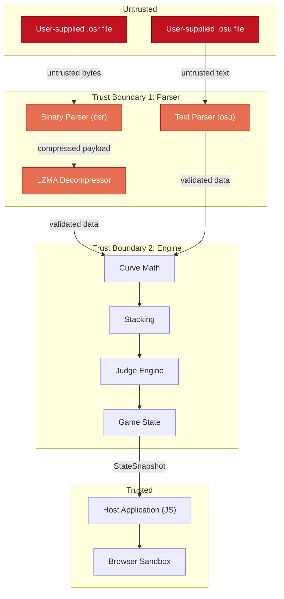

# Security Threat Model
## osu-engine-wasm — Trust Boundaries, Attack Surface, and Mitigations

| | |
|---|---|
| **Document ID** | ENG-SEC-0050 |
| **Version** | 1.0 |
| **Author** | Security Engineering |
| **Parent Document** | [BRD — ENG-BRD-0042](./BRD.md) (§14) |
| **Last Revised** | 2026-06-26 |

---

## Table of Contents

1. [Overview](#1-overview)
2. [Assets](#2-assets)
3. [Trust Boundaries](#3-trust-boundaries)
4. [Threat Actors](#4-threat-actors)
5. [Attack Surface Analysis](#5-attack-surface-analysis)
6. [Threat Catalog (STRIDE)](#6-threat-catalog-stride)
7. [Supply Chain Threats](#7-supply-chain-threats)
8. [Mitigation Summary](#8-mitigation-summary)
9. [Security Testing Requirements](#9-security-testing-requirements)
10. [Incident Response](#10-incident-response)

---

## 1. Overview

### 1.1 System Description

`osu-engine-wasm` is a client-side WASM library that parses user-supplied binary (`.osr`) and text (`.osu`) files and exposes game state via a query API. It runs entirely within the browser sandbox (or Node.js process) with no network access, no filesystem access, and no persistent storage.

### 1.2 Security Posture

| Property | Value |
|---|---|
| Network access | None (zero imports) |
| Filesystem access | None |
| User authentication | None |
| Persistent storage | None |
| Execution context | Browser WASM sandbox / Node.js |
| Input sources | User-supplied `.osr` and `.osu` files |

### 1.3 Key Insight

> The primary threat is **malicious input files**. Since the engine has no network or filesystem access, the attack surface is the **parser** — specifically the LZMA decompressor and the text/binary format parsers.

---

## 2. Assets

| Asset | Description | Confidentiality | Integrity | Availability |
|---|---|---|---|---|
| **Host application** | The web page embedding the engine | N/A | High | High |
| **Browser tab memory** | WASM linear memory + JS heap | Low | High | High |
| **User CPU time** | Processing resources | N/A | N/A | High |
| **Engine output** | StateSnapshot data | Low | High | Medium |
| **Source code** | Open source — not confidential | None | High | High |
| **NPM package** | Published artifact | N/A | High | High |

---

## 3. Trust Boundaries

| Boundary | Description | Security Requirement |
|---|---|---|
| **TB1: Input → Parser** | Untrusted bytes enter the system | All input must be validated; no panics on arbitrary input |
| **TB2: Parser → Engine** | Validated data flows to computation | Type-safe Rust structs; invalid states unrepresentable |
| **TB3: Engine → JS** | Computed data crosses WASM boundary | Serialization must not expose internal pointers |

---

## 4. Threat Actors

| Actor | Capability | Motivation | Likelihood |
|---|---|---|---|
| **Curious user** | Uploads unusual but legitimate files | Accidental crash, unexpected behavior | High |
| **Malicious user** | Crafts files specifically to cause harm | Crash the tab, exhaust memory, exploit parser | Medium |
| **Supply chain attacker** | Compromises a dependency crate | Code execution, data exfiltration | Low |
| **CDN attacker** | Serves modified WASM binary | Code execution in user's browser | Low |

---

## 5. Attack Surface Analysis

### 5.1 Input Attack Surface

| Entry Point | Input Type | Size Range | Attack Vectors |
|---|---|---|---|
| `OsuReplay.parse(bytes)` | `Uint8Array` | 10 KB – 50 MB | LZMA bomb, truncation, overflow, invalid UTF-8 |
| `OsuBeatmap.parse(bytes)` | `Uint8Array` | 1 KB – 500 KB | Malformed sections, extreme values, injection |
| `GameEngine.create(b, r)` | Validated structs | N/A | Mismatched data (hash mismatch), extreme object counts |
| `query(t)` | `f64` | -∞ to +∞ | NaN, Infinity, negative values, very large values |
| `precompute_curves(n)` | `u32` | 0 – 128 | Extreme values (0, MAX) |

### 5.2 LZMA Decompression (Highest Risk)

The LZMA decompressor is the most dangerous attack surface because:
1. It accepts arbitrary compressed data
2. A small input can decompress to enormous output (decompression bomb)
3. LZMA decoders have historically contained vulnerabilities
4. The decompressed output is then parsed as text (secondary attack surface)

**Mitigations**:

| Mitigation | Implementation | Traced From |
|---|---|---|
| Output size cap: 256 MB | Streaming reader with byte counter; abort if exceeded | BRD §14.1 |
| Input size validation | Check compressed data length against header-declared size | Parser design |
| Streaming decompress | `lzma-rs` streaming reader, not full in-memory | TDD §2.5 |
| **CPU timeout: 10s** | **Parsing runs in Web Worker; main thread calls `Worker.terminate()` if timeout exceeded** | **ADR-018** |
| **Mandatory Worker isolation** | **All parsing runs in a dedicated Worker; main thread is never blocked** | **ADR-017, ADR-018** |

> [!IMPORTANT]
> **Size caps protect memory but NOT the CPU.** A maliciously crafted LZMA payload can cause 30+ seconds of CPU time even with output under 256 MB. The ONLY reliable mitigation is `Worker.terminate()`, which kills the entire Worker execution context. There is no way to cancel a running synchronous WASM function from JavaScript.

### 5.3 Text Parser Attack Surface

The `.osu` text parser processes untrusted text line-by-line:

| Attack | Example | Mitigation |
|---|---|---|
| Extreme line count | 10 million hit objects | Object count cap: 100,000 |
| Extreme line length | 1 MB single line | Line length cap: 4,096 bytes |
| Extreme coordinate values | `x=1e308, y=-1e308` | Clamp to playfield bounds |
| NaN/Infinity in timing | `msPerBeat=NaN` | Reject non-finite floats |
| Missing required sections | No `[TimingPoints]` | Return `MissingSection` error |
| Duplicate sections | Two `[HitObjects]` blocks | Use first, ignore subsequent |
| Non-UTF-8 bytes | Binary data as `.osu` | UTF-8 validation on input |
| Path traversal in strings | `AudioFilename: ../../../etc/passwd` | String fields not used for file I/O |

### 5.4 Numeric Attack Surface

| Attack | Target | Example | Mitigation |
|---|---|---|---|
| NaN propagation | `query(NaN)` | Returns empty snapshot (t clamped to 0) | NaN/Inf check on input |
| Integer overflow | Combo counter | 4 billion objects | `u32` overflow check; max combo is bounded by object count |
| Float precision loss | Score accumulation | Marathon maps | `f64` sufficient for 10M+ score values |
| Division by zero | Velocity calc | `msPerBeat = 0` | Check for zero; use fallback value |

---

## 6. Threat Catalog (STRIDE)

### 6.1 Spoofing

| ID | Threat | Applicable? | Mitigation |
|---|---|---|---|
| S-1 | Spoofed replay file (claim to be another player) | No — engine doesn't authenticate | N/A — authentication is host responsibility |
| S-2 | Spoofed WASM binary (modified NPM package) | Yes | SRI hashes, `npm audit`, lockfile pinning |

### 6.2 Tampering

| ID | Threat | Applicable? | Mitigation |
|---|---|---|---|
| T-1 | Modified `.osr` produces incorrect judgements | Yes — but this is expected behavior | Engine processes what it's given; integrity is the host's responsibility |
| T-2 | CDN serves modified WASM | Yes | Subresource Integrity (SRI) hashes in `<script>` tags |
| T-3 | NPM supply chain compromise | Yes | Pinned dependencies, `cargo deny`, lockfile |

### 6.3 Repudiation

Not applicable — the engine has no logging, authentication, or audit trail requirements.

### 6.4 Information Disclosure

| ID | Threat | Applicable? | Mitigation |
|---|---|---|---|
| I-1 | WASM memory read beyond bounds | No — WASM sandbox prevents this | Browser enforced |
| I-2 | Internal pointers leaked via API | Unlikely | Handle-based model (ADR-007) — only opaque u32 handles cross the boundary |
| I-3 | Heap spray via large allocations | Unlikely | Memory caps on all allocations |

### 6.5 Denial of Service

| ID | Threat | Severity | Mitigation |
|---|---|---|---|
| D-1 | **LZMA decompression bomb** | **High** | 256 MB output cap; streaming decompress |
| D-2 | **Extreme object count** | **High** | 100,000 object cap per beatmap |
| D-3 | **Extreme replay frame count** | **Medium** | 1,000,000 frame cap (33 min at 500 fps) |
| D-4 | **CPU exhaustion via complex curves** | **Medium** | Curve sample count capped at 128 per segment |
| D-5 | **Memory exhaustion via many handles** | **Low** | Handle arena has 64K slot limit |
| D-6 | **Infinite loop in parser** | **Medium** | All loops have bounded iteration counts |
| D-7 | **Stack overflow via deep recursion** | **Low** | No recursive algorithms in parsers; De Casteljau is iterative |
| D-8 | **CPU exhaustion via LZMA decompression** | **High** | Mandatory Worker isolation (ADR-018); 10s timeout; `Worker.terminate()` kill switch |

### 6.6 Elevation of Privilege

| ID | Threat | Applicable? | Mitigation |
|---|---|---|---|
| E-1 | WASM sandbox escape | Theoretically possible via browser bug | Not our responsibility; browser vendor issue |
| E-2 | Node.js process exploitation | Extremely unlikely from pure computation | No `eval`, no dynamic code generation, no `require` |

---

## 7. Supply Chain Threats

### 7.1 Dependency Inventory

| Crate | Version | Purpose | Risk | Justification |
|---|---|---|---|---|
| `lzma-rs` | pinned | LZMA decompression | Medium — parses untrusted compressed data | No alternative; well-maintained; fuzz-tested |
| `wasm-bindgen` | pinned | JS↔WASM bridge | Low — code generation only | Official Rust WASM tool; widely audited |
| `serde` | pinned | Serialization | Low — operates on validated data | De facto standard; extensively audited |
| `wee_alloc` | pinned | Small allocator | Low — memory allocation | Reduces binary size; widely used in WASM |

### 7.2 Supply Chain Controls

| Control | Implementation | Frequency |
|---|---|---|
| `cargo deny check advisories` | Check for known CVEs | Every CI run |
| `cargo deny check licenses` | Verify license compatibility | Every CI run |
| `Cargo.lock` committed | Pin exact dependency versions | Always |
| Dependency count audit | Max 4 direct deps, reviewed transitive | Every PR adding deps |
| `cargo vet` (future) | Third-party audit attestations | Quarterly |
| WASM binary hash verification | SHA-256 of release `.wasm` published | Every release |

### 7.3 Build Reproducibility

| Property | Implementation |
|---|---|
| Rust version pinned | `rust-toolchain.toml` → `1.79.0` |
| All crates pinned | `Cargo.lock` committed |
| Build flags documented | `--release --target wasm32-unknown-unknown` |
| WASM post-processing | `wasm-opt -Os` with pinned `binaryen` version |
| Binary hash published | SHA-256 in GitHub Release notes |
| Reproducible builds | `cargo build` should produce identical binary from same inputs |

---

## 8. Mitigation Summary

| Threat | Severity | Mitigation | Status |
|---|---|---|---|
| LZMA bomb | High | 256 MB output cap + streaming | Designed |
| Extreme object count | High | 100K cap | Designed |
| Malformed binary input | High | Result-based error handling, no panics | Designed |
| NaN/Infinity propagation | Medium | Input validation + clamping | Designed |
| Supply chain compromise | Medium | Pinned deps + cargo deny + lockfile | Designed |
| CDN tampering | Medium | SRI hashes | Host responsibility |
| CPU exhaustion (LZMA) | **High** | Worker isolation + 10s timeout + terminate() | **Designed (ADR-018)** |
| CPU exhaustion (other) | Medium | Bounded loops + curve caps | Designed |
| Memory exhaustion | Medium | Arena limits + per-allocation caps | Designed |
| Use-after-free | Low | Handle-based model + generation counters | Designed (ADR-007) |
| WASM sandbox escape | Very Low | Browser vendor responsibility | Out of scope |

---

## 9. Security Testing Requirements

### 9.1 Mandatory Tests

| Test | Target | Frequency | Pass Criteria |
|---|---|---|---|
| Fuzz `.osr` parser | `fuzz_osr_parse` | 1 hour nightly | Zero crashes |
| Fuzz `.osu` parser | `fuzz_osu_parse` | 1 hour nightly | Zero crashes |
| Fuzz full pipeline | `fuzz_full_pipeline` | 1 hour nightly | Zero crashes |
| LZMA bomb test | `SEC-001` | Every CI | Error returned, no OOM |
| **LZMA CPU exhaustion** | **`SEC-009`** | **Every CI** | **Worker timeout triggers; error returned within 10s** |
| Huge string test | `SEC-002` | Every CI | Error returned |
| NaN coordinate test | `SEC-004` | Every CI | Graceful handling |
| Zero-byte file | `SEC-007` | Every CI | Error returned |
| `cargo deny check` | All dependencies | Every CI | Zero advisories |

### 9.2 Release Gate

- Extended fuzz run (1 hour per target) clean
- All SEC-* tests pass
- `cargo deny` clean
- Dependency count ≤ 4 (direct)
- No `unsafe` blocks outside of `wasm-bindgen` generated code

---

## 10. Incident Response

### 10.1 If a Parser Crash Is Found

1. **Minimize** the crashing input: `cargo fuzz tmin <target> <artifact>`
2. **Commit** the minimized input to `fuzz/artifacts/` as a regression test
3. **File** as P0 severity
4. **Fix** within 24 hours
5. **Release** patch version with the fix
6. **Notify** downstream consumers via GitHub advisory

### 10.2 If a Dependency CVE Is Published

1. `cargo deny check advisories` will fail in CI
2. Assess whether the CVE applies to our usage
3. If applicable: update the dependency, release patch
4. If not applicable: add exception to `deny.toml` with justification

### 10.3 If a Supply Chain Attack Is Suspected

1. Freeze all dependency updates
2. Audit `Cargo.lock` diff against last known good state
3. Rebuild from pinned sources and compare binary hashes
4. If compromised: yank affected NPM version, publish advisory

---

*End of Security Threat Model. Related: [BRD §14](./BRD.md) · [Test Plan §12](./Test_Plan.md) · [ADR-016](./ADR_Registry.md#adr-016-no-external-runtime-dependencies-in-wasm)*
