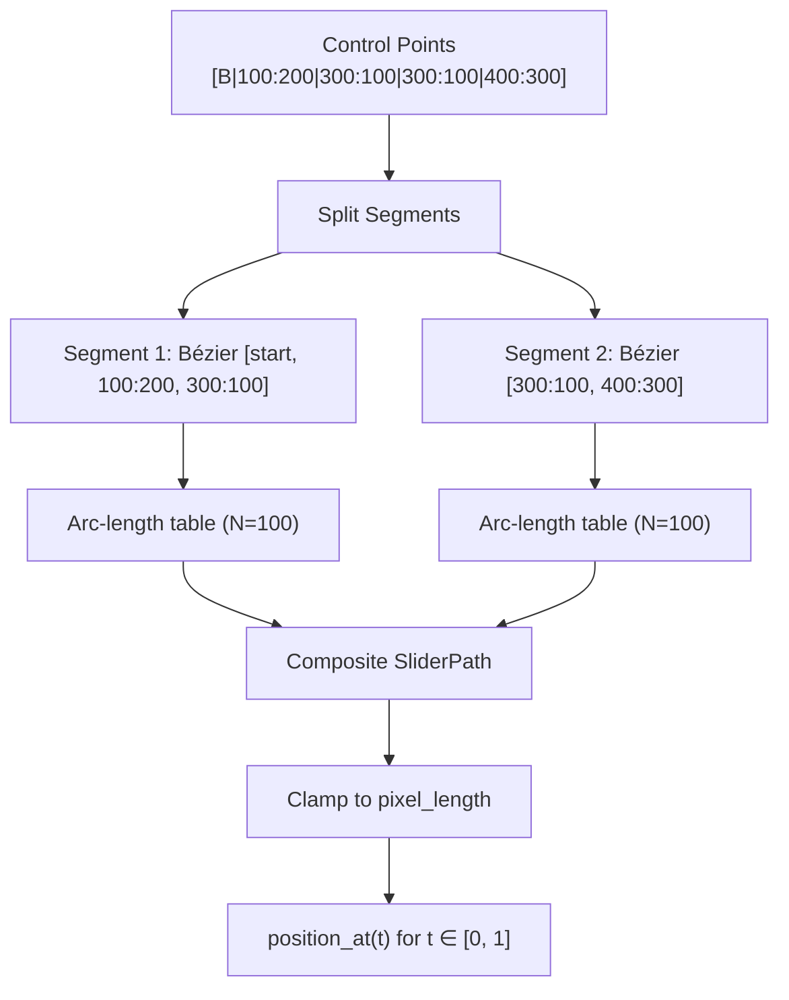

# Technical Design Document
## osu-engine-wasm — Algorithm & Implementation Details

| | |
|---|---|
| **Document ID** | ENG-TDD-0044 |
| **Version** | 1.0 — DRAFT |
| **Author** | Systems Engineering |
| **Parent Document** | [BRD — ENG-BRD-0042](./BRD.md), [ADD — ENG-ADD-0043](./Architecture_Design_Document.md) |
| **Last Revised** | 2026-06-25 |

---

## Table of Contents

1. [Introduction](#1-introduction)
2. [.osr Binary Format & Parser Design](#2-osr-binary-format--parser-design)
3. [.osu Text Format & Parser Design](#3-osu-text-format--parser-design)
4. [Curve Mathematics](#4-curve-mathematics)
5. [Stacking Algorithm](#5-stacking-algorithm)
6. [Mod Engine](#6-mod-engine)
7. [Timing & Velocity System](#7-timing--velocity-system)
8. [Judge Engine](#8-judge-engine)
9. [Scoring System](#9-scoring-system)
10. [Game State Query Pipeline](#10-game-state-query-pipeline)
11. [Numerical Considerations](#11-numerical-considerations)
12. [Algorithm Complexity Analysis](#12-algorithm-complexity-analysis)

---

## 1. Introduction

This Technical Design Document provides algorithm-level specifications for every computational component in `osu-engine-wasm`. Each section includes:

- The mathematical formulation
- The reference implementation location in osu!lazer (C#) and danser-go
- Rust pseudocode
- Edge cases and degenerate inputs
- Test vector expectations

For architectural context (component boundaries, interface contracts, deployment), see the [Architecture Design Document](./Architecture_Design_Document.md).

---

## 2. .osr Binary Format & Parser Design

### 2.1 Binary Layout

The `.osr` file is a sequential binary format. All multi-byte integers are **little-endian**.

```
┌─────────────────────────────────────────────────────────────────────┐
│  Offset   │  Type          │  Field                                 │
├───────────┼────────────────┼────────────────────────────────────────┤
│  0x00     │  u8            │  Game mode (0=osu!, 1=taiko, etc.)     │
│  0x01     │  i32 (LE)      │  Game version (e.g., 20230326)         │
│  0x05     │  osu-string    │  Beatmap MD5 hash                      │
│  varies   │  osu-string    │  Player name                           │
│  varies   │  osu-string    │  Replay MD5 hash                       │
│  varies   │  u16 (LE)      │  Count 300                             │
│  varies   │  u16 (LE)      │  Count 100                             │
│  varies   │  u16 (LE)      │  Count 50                              │
│  varies   │  u16 (LE)      │  Count Geki                            │
│  varies   │  u16 (LE)      │  Count Katu                            │
│  varies   │  u16 (LE)      │  Count Miss                            │
│  varies   │  i32 (LE)      │  Total score                           │
│  varies   │  u16 (LE)      │  Max combo                             │
│  varies   │  u8            │  Perfect (bool)                        │
│  varies   │  i32 (LE)      │  Mod bitmask                           │
│  varies   │  osu-string    │  Life bar graph                        │
│  varies   │  i64 (LE)      │  Timestamp (Windows ticks)             │
│  varies   │  i32 (LE)      │  Compressed replay data length         │
│  varies   │  [u8; len]     │  LZMA-compressed replay data           │
│  varies   │  *see below*   │  Online score ID (version-dependent)   │
└─────────────────────────────────────────────────────────────────────┘
```

#### Online score ID — the field width depends on the replay version

| Replay version | Score ID field |
|---|---|
| `>= 20140721` | `i64` (LE) |
| `>= 20121008` and `< 20140721` | **`i32` (LE)** |
| `< 20121008` | **absent entirely** |

lazer normalises a score ID of `0` to "no online ID"; we model that as `None`.

Source: `LegacyScoreDecoder.cs` L107-110.

> **Errata (2026-07-14):** This table previously read *"`i64` (LE) — Online score
> ID (≥ 2018 format)"*. Both halves were wrong. The `i64` threshold is 20140721,
> not 2018; there is an `i32` form for the 20121008–20140720 window; and older
> replays omit the field. A parser reading a fixed `i64` misparses every replay
> in the `i32` window and reads past the end of anything older. Fixtures
> `old_format_2013.osr` and `ancient_2011.osr` pin this.

Replays of version `>= 30000001` (lazer-authored) append a compressed score-info
byte array after the score ID. Nothing downstream consumes it, but it must be
accounted for when validating that the header was sized correctly.
Source: `LegacyScoreDecoder.cs` L117-118.

### 2.2 osu-string Encoding

Referenced from `references/osu-reverse-mapper/script.js` L925–943:

```
┌─────────────────────────────────────────┐
│  Byte 0:  0x00  → null/empty string     │
│           0x0B  → string follows         │
│  Byte 1+: ULEB128-encoded string length │
│  Byte N+: UTF-8 encoded string bytes    │
└─────────────────────────────────────────┘
```

Implemented in `parser/binary.rs` as `ByteReader::read_osu_string`. Two details
matter:

- **The length cap is 1 MiB, not 512 bytes.** The cap exists so a crafted
  ULEB128 length cannot drive a huge allocation — but 512 is too small for real
  files: the life-bar graph field runs to several KB on long maps, so a 512-byte
  cap rejects legitimate replays.
- **`0x00` yields an empty string, not `None`.** Every caller in the header wants
  a string, and the format does not meaningfully distinguish "absent" from
  "empty".

> **Errata (2026-07-14):** the previous pseudocode here used a 512-byte cap and
> an `Option<String>` return. Both are corrected above.

### 2.3 ULEB128 Decoding

Implemented in `parser/binary.rs` as `ByteReader::read_uleb128`.

The decode loop must be bounded, or a crafted `.osr` supplying an unbroken run of
continuation bytes (`0xFF 0xFF 0xFF …`) spins it. Reject once the shift passes
63 bits, and use a **checked** shift so the accumulator cannot silently wrap.

> **Errata (2026-07-14):** the previous pseudocode used `if shift > 35`, which is
> both arbitrary and *too low to represent the values it then accepts* — a length
> needing 36+ bits would be rejected, while the `usize` it accumulates into holds
> 64. It also used an unchecked `<<`, which wraps rather than erroring. The
> implementation uses `checked_shl` with a 63-bit ceiling.

### 2.4 Replay Data Decompression & Frame Parsing

The LZMA-compressed payload decompresses to a comma-separated string of pipe-delimited frames:

```
Δt|x|y|keyFlags,Δt|x|y|keyFlags,...,-12345|0|0|seed
```

- `Δt`: Delta time in milliseconds since previous frame (first frame: absolute offset)
- `x`, `y`: Cursor position in osu! playfield coordinates (0–512, 0–384)
- `keyFlags`: Bitmask: bit 0 = M1, bit 1 = M2, bit 2 = K1, bit 3 = K2, bit 4 = smoke

**Seed frame**: `Δt = -12345` carries the ScoreV2 RNG seed in the `seed` field.

Implemented in `parser/osr.rs` as `parse_frame_text` + `apply_stable_frame_quirks`.
Five rules govern this stream, and a naive parser gets four of them wrong.

#### 2.4.1 Deltas are integers

Parse `Δt` as an **`i64`**, falling back to `round(f64)` only if that fails.

stable's format does not permit fractional deltas, and lazer parses them as
integers *specifically* to avoid floating-point accumulation error across
thousands of frames. The float fallback exists only because a window of lazer
builds briefly emitted fractional values (fixed in ppy/osu#12583).

Accumulating in `f64` reintroduces exactly the drift the integer path exists to
prevent. Source: `LegacyScoreDecoder.cs` L291-306.

#### 2.4.2 The seed frame is skipped, not terminating

Compare `parts[0]` to the **string** `"-12345"` and `continue`. Do **not**
`break`, and do **not** accumulate its delta.

A `break` appears to work only because the seed frame is conventionally last. It
is not guaranteed to be, and lazer does not rely on it being so.
Source: `LegacyScoreDecoder.cs` L282-286.

#### 2.4.3 Time starts at the beatmap offset

The accumulator starts at `beatmapOffset` — **24 ms** if the target beatmap is
format < 5, otherwise 0. This is the same `EARLY_VERSION_TIMING_OFFSET` that
`LegacyBeatmapDecoder` bakes into hit object times (§3.5). **If the two disagree,
every old map desyncs by 24 ms.** Source: `LegacyScoreDecoder.cs` L98, L270.

#### 2.4.4 Coordinates are bounded

`|x|, |y| <= MAX_COORDINATE_VALUE` (131072). lazer throws rather than clamping.
Source: `Parsing.cs` L14.

#### 2.4.5 The four osu!stable frame quirks

Applied **after** parsing, in this order. These exist because stable's
`ReplayWatcher` wrote frames the format does not really describe. Without them,
frame timing is wrong at the start of essentially every stable-recorded replay.

1. If `len >= 2 && frames[1].time < frames[0].time`:
   `frames[1].time = frames[0].time; frames[0].time = 0`
2. If `len >= 3 && frames[0].time > frames[2].time`:
   `frames[0].time = frames[1].time = frames[2].time`
3. Stable writes **two leading sentinel frames at position `(256, -500)`**.
   Drop index 1 if it is a sentinel, then index 0.
4. **Never allow backwards time traversal**: drop any frame whose time precedes
   the previously emitted frame. (lazer notes this differs slightly from stable,
   which interpolates an intermediate frame instead. We match lazer.)

Source: `LegacyScoreDecoder.cs` L319-351, citing `osu-stable-reference`
`ReplayWatcher.cs` L62-71.

Note that rules 2 and 4 interact: rule 2 *repairs* a leading out-of-order run
rather than dropping it, so no frame is lost in that case.

> **Errata (2026-07-14):** the pseudocode previously here accumulated deltas in
> `f64`, `break`ed on the seed frame, started time at `0`, did not bound
> coordinates, and omitted all four quirks. It also used `.unwrap_or(0.0)` on
> coordinates, silently turning malformed input into `(0, 0)` cursor positions.

### 2.5 LZMA Decompression Safety

Per BRD §14.1, implemented in `parser/lzma.rs`:

- Output capped at **256 MB**.
- **The cap is enforced during decompression, not after.** `lzma-rs` streams into
  a `Write` sink, so a bounded sink aborts the stream mid-flight. Checking the
  output size afterwards would be too late — the memory would already be
  committed, which is precisely the attack.
- The declared payload length is attacker-controlled and is **never** used to
  pre-allocate.
- Corrupt data returns `LzmaDecompressionFailed`; hitting the cap returns
  `DecompressionOutputTooLarge`. The two are distinguished so the caller gets an
  actionable code.

---

## 3. .osu Text Format & Parser Design

### 3.1 Section Structure

The `.osu` file is INI-like with `[SectionName]` headers. Reference: `references/osu/osu.Game/Beatmaps/Formats/LegacyBeatmapDecoder.cs`.

```
osu file format v14

[General]
AudioFilename: audio.mp3
Mode: 0

[Difficulty]
CircleSize:4
OverallDifficulty:9
ApproachRate:9.5
SliderMultiplier:1.8
SliderTickRate:1

[TimingPoints]
offset,msPerBeat,meter,sampleSet,sampleIndex,volume,uninherited,effects
1500,500,4,2,0,100,1,0
3000,-100,4,2,0,100,0,0

[HitObjects]
x,y,time,type,hitSound,objectParams...,hitSample
256,192,1500,1,0,0:0:0:0:
100,200,2000,6,0,B|200:200|300:100,1,200,0|0,0:0|0:0,0:0:0:0:
```

### 3.2 Hit Object Type Bitmask

```
Bit 0 (1):   Circle
Bit 1 (2):   Slider
Bit 2 (4):   New Combo
Bit 3 (8):   Spinner
Bits 4-6:    Combo color skip count
Bit 7 (128): osu!mania hold (ignored for Standard)
```

Reference: `references/osu/osu.Game/Beatmaps/Legacy/LegacyHitObjectType.cs`

The bits are tested in order — circle, then slider, then spinner — because they
are not mutually exclusive in a malformed file. A type byte with none of the
three set is a `MalformedField` error.

```rust
// Implemented in parser/osu.rs (Builder::hit_object).
let kind = if type_flags & TYPE_CIRCLE != 0 {
    HitObjectKind::Circle
} else if type_flags & TYPE_SLIDER != 0 {
    HitObjectKind::Slider(/* ... */)
} else if type_flags & TYPE_SPINNER != 0 {
    HitObjectKind::Spinner(/* ... */)
} else {
    return Err(EngineError::MalformedField { field: "hit_object_type", .. });
};

let new_combo        = type_flags & TYPE_NEW_COMBO != 0;
let combo_color_skip = (type_flags >> 4) & 0x07;
```

> **Errata (2026-07-14):** the previous snippet declared a return type of
> `(ObjectKind, bool, u8)` and then `return Err(...)` from inside it — it does
> not compile. Corrected above.

### 3.3 Slider Object Parsing

Slider format: `x,y,time,type,hitSound,curveType|controlPoints,repeat,pixelLength,...`

Control point format: `B|x1:y1|x2:y2|x3:y3` where `B` = Bézier, `C` = Catmull, `P` = Perfect, `L` = Linear.

**Composite Bézier detection**: If two consecutive control points are identical, they delimit a segment boundary.

**The hit object's own position is prepended as control point 0.** The file omits
it, but every curve algorithm expects the path to start there.

#### 3.3.1 The curve type character

| Char | Curve |
|---|---|
| `B` | Bézier (`B` + digit selects a lazer-era B-spline of that degree; treated as Bézier) |
| `L` | Linear |
| `P` | Perfect arc |
| `C` **or anything else** | **Catmull** |

**An unrecognised character is not an error — it falls back to Catmull.** lazer's
switch is literally `default: case 'C':`. A parser that rejected unknown curve
types would fail on files the game loads without complaint.
Source: `ConvertHitObjectParser.cs` L237-257.

> **Errata (2026-07-14):** the previous pseudocode returned
> `ParseError::UnknownCurveType` for an unrecognised character. lazer never
> errors here. The snippet also indexed `parts[0]`, `coords[0]`, and `coords[1]`
> unchecked — each a panic on malformed input, in the parser whose entire
> contract is that it must not panic on malformed input.

#### 3.3.2 `repeat` is really `slides`

The field named `repeat` in the format is the **slide count**: `1` means "no
repeat". lazer stores `repeatCount = max(0, slides - 1)` internally. A slide
count above **9000** is rejected outright.
Source: `ConvertHitObjectParser.cs` L87-93.

`pixelLength` is clamped to `>= 0`, and a length of `0` is treated as absent.

#### 3.3.3 Perfect curves are downgraded at parse time

On legacy maps (format version < 128, `FIRST_LAZER_VERSION`), a `P` curve is
rewritten **before it ever reaches the flattener**:

| Condition | Becomes |
|---|---|
| control point count != 3 | **Bézier** |
| 3 **collinear** control points | **Linear** |

Collinearity is a cross-product test against `Precision.AlmostEquals` (ε = 1e-3).
On lazer-format maps (>= 128), only a control set longer than 3 is downgraded —
lazer permits perfect curves with fewer than 3 points and with collinear points.

Source: `ConvertHitObjectParser.cs` L366-383, L424-426.

> This parse-time rule is the origin of the "a collinear perfect curve behaves as
> a line" folklore, which BRD §8.4.3 once mangled into a fabricated
> "circumradius > 500 osu!px" rule. It does **not** contradict the flattener's own
> collinear → Bézier fallback (§4.3, [ADR-021](./ADR_Registry.md)): on legacy maps
> the flattener never sees a collinear `P`, because the parser already rewrote it.

### 3.4 Timing Point Parsing

```
offset, msPerBeat, meter, sampleSet, sampleIndex, volume, uninherited, effects
```

- If `uninherited == 1`: this is a **red line** (BPM change). `msPerBeat` is the beat duration.
- If `uninherited == 0`: this is a **green line** (inherited). `msPerBeat` is negative; the slider velocity multiplier is `(-100 / msPerBeat)`.

Reference: `references/osu/osu.Game/Beatmaps/ControlPoints/TimingControlPoint.cs`

**Critical**: The effective slider velocity at any time `t` depends on:
1. The base `SliderMultiplier` from `[Difficulty]`
2. The velocity multiplier from the most recent inherited timing point at or before `t`
3. The `DifficultyControlPoint` in lazer maps

This is the most common source of slider duration bugs in third-party implementations (BRD §8.3).

**Old maps omit trailing fields.** `uninherited` may be absent entirely; when it
is, a positive `msPerBeat` implies a red line — which is the correct fallback,
since only inherited lines carry a negative beat length.

### 3.5 Early-Version Timing Offset

Beatmaps of **format version < 5** get **+24 ms** added to every hit object time
*and* every timing point time, correcting a timing change that was once applied
at the game-client level.

```
EARLY_VERSION_TIMING_OFFSET = 24   // LegacyBeatmapDecoder.cs L27-29, L74
```

Apply it **at parse time**, exactly as `LegacyBeatmapDecoder` does, so no
downstream layer needs to know the beatmap's format version.

> **This offset must also be applied to replay frame times** (§2.4.3). The two
> are the same constant for the same reason, and if they ever disagree, every
> pre-v5 map desyncs by 24 ms. `LegacyScoreDecoder.cs` L98 reads the offset
> straight out of the beatmap decoder for precisely this reason.

### 3.6 Difficulty Defaults and Clamping

Absent from the original TDD, and all three rules are load-bearing.

**Defaults.** HP, CS, OD, and AR each default to **5** when the key is absent
(`BeatmapDifficulty.cs` L14).

**AR falls back to OD.** Maps predating the `ApproachRate` field omit it
entirely; AR then mirrors OD. Track whether an explicit `ApproachRate` key was
seen — it must win regardless of whether it appears before or after
`OverallDifficulty` in the file (`LegacyBeatmapDecoder.cs` L408-417).

**Clamps, applied after parsing** (`LegacyBeatmapDecoder.cs` L117-131):

| Field | Range |
|---|---|
| `HPDrainRate` | 0 – 10 |
| `CircleSize` | 0 – 10 (osu!Standard) |
| `OverallDifficulty` | 0 – 10 |
| `ApproachRate` | 0 – 10 |
| `SliderMultiplier` | 0.4 – 3.6 |
| `SliderTickRate` | 0.5 – 8 |

A map declaring `OverallDifficulty: 99` is *accepted* by osu! and silently
clamped to 10. Rejecting it and honouring it are both wrong.

---

## 4. Curve Mathematics

### 4.1 Composite Bézier Curves

Reference: `references/osu/osu.Game/Rulesets/Objects/SliderPath.cs`, `references/danser-go/framework/math/curves/bezier.go`

#### 4.1.1 Segment Splitting

A control point list like `[A, B, C, C, D, E]` splits into two segments: `[A, B, C]` and `[C, D, E]`, where the repeated point `C` is the boundary.

```rust
fn split_bezier_segments(points: &[Point]) -> Vec<Vec<Point>> {
    let mut segments = Vec::new();
    let mut current = vec![points[0]];

    for i in 1..points.len() {
        if points[i] == points[i - 1] {
            // Repeated point = segment boundary
            if current.len() >= 2 {
                segments.push(current);
            }
            current = vec![points[i]];
        } else {
            current.push(points[i]);
        }
    }

    if current.len() >= 2 {
        segments.push(current);
    }

    segments
}
```

#### 4.1.2 De Casteljau Algorithm

For a Bézier segment of degree n with control points P₀…Pₙ, the point at parameter t ∈ [0, 1]:

```
B(t) = de_casteljau(P₀, P₁, …, Pₙ, t)

// Recursive definition:
// B¹ᵢ(t) = (1-t)·Pᵢ + t·Pᵢ₊₁
// Bʳᵢ(t) = (1-t)·Bʳ⁻¹ᵢ(t) + t·Bʳ⁻¹ᵢ₊₁(t)
// B(t) = Bⁿ₀(t)
```

```rust
fn de_casteljau(points: &[Point], t: f64) -> Point {
    let n = points.len();
    let mut work = points.to_vec();

    for level in 1..n {
        for i in 0..n - level {
            work[i] = Point {
                x: (1.0 - t) * work[i].x + t * work[i + 1].x,
                y: (1.0 - t) * work[i].y + t * work[i + 1].y,
            };
        }
    }

    work[0]
}
```

#### 4.1.3 Bézier Flattening (Approximation)

For rendering and arc-length computation, Bézier curves are flattened to polylines. Reference: `references/danser-go/framework/math/curves/bezierapproximator.go`.

The tolerance-based subdivision approach:
1. If the control polygon's maximum deviation from the line P₀→Pₙ is < tolerance (0.25 osu!px), output the segment as a line
2. Otherwise, split at t=0.5 and recurse on both halves

> **Implementation note (L1):** The Rust implementation uses an iterative stack
> rather than recursion to avoid stack overflow on high-degree curves. It also
> uses midpoint-averaged De Casteljau subdivision (`subdivide` + `approximate_segment`)
> which is more cache-friendly than the point-evaluation form shown in §4.1.2.
> The behavioral output is identical.

### 4.2 Catmull-Rom Splines

Reference: `references/danser-go/framework/math/curves/catmull.go`

Each group of 4 consecutive control points [P₀, P₁, P₂, P₃] defines one cubic segment. The parametric form:

```
q(t) = 0.5 × ((2P₁) + (-P₀ + P₂)t + (2P₀ - 5P₁ + 4P₂ - P₃)t² + (-P₀ + 3P₁ - 3P₂ + P₃)t³)
```

For the first and last segments, the missing points are duplicated from the endpoints.

### 4.3 Perfect Circular Arc

Reference: `references/danser-go/framework/math/curves/cirarc.go`

Given 3 non-collinear points A, B, C:

1. **Circumcenter** (center of the circle through A, B, C):
```
D = 2(Ax(By - Cy) + Bx(Cy - Ay) + Cx(Ay - By))
Ux = ((Ax² + Ay²)(By - Cy) + (Bx² + By²)(Cy - Ay) + (Cx² + Cy²)(Ay - By)) / D
Uy = ((Ax² + Ay²)(Cx - Bx) + (Bx² + By²)(Ax - Cx) + (Cx² + Cy²)(Bx - Ax)) / D
```

2. **Radius**: `r = distance(A, center)`

3. **Arc angles**:
```
θ_start = atan2(Ay - Uy, Ax - Ux)
θ_mid   = atan2(By - Uy, Bx - Ux)
θ_end   = atan2(Cy - Uy, Cx - Ux)
```

4. **Arc direction**: Determine if the arc goes clockwise or counter-clockwise by checking whether B is on the shorter arc from A to C.

5. **Fallback cases** — every one of these routes to the **Bézier**
   approximation, *not* to a straight line. In `SliderPath.calculateSubPath`,
   each condition `break`s out of the `PerfectCurve` case, and the
   fall-through at the end of the switch is `BSplineToPiecewiseLinear`
   (which, for a legacy slider with no explicit degree, reduces to a plain
   Bézier):

   | Condition | Source |
   |---|---|
   | Control point count != 3 | `SliderPath.cs` L345 |
   | `|D| < ε` (collinear / invalid arc) | `SliderPath.cs` L351, `PathApproximator.cs` L178 |
   | Arc would need >= 1000 points | `SliderPath.cs` L359 |

6. **Point count**: `amountPoints = 2·r <= 0.1 ? 2 : max(2, ceil(θ_range / (2·acos(1 - 0.1/r))))`
   (`PathApproximator.cs` L186). Note this grows without bound as `r → ∞`,
   which is precisely why the 1000-point cap above exists — it is also what
   prevents a crafted `.osu` from forcing an unbounded allocation.

> **Errata (2):** An earlier version of this document stated "If circumradius >
> 500 osu!px, also fall back to linear (matches lazer behavior)." No such radius
> threshold exists in lazer. The first errata below correctly removed it, but
> then claimed large-radius arcs "are handled naturally by the adaptive segment
> count formula." **That is also wrong** — the formula diverges as `r → ∞`, and
> lazer bounds it with an explicit 1000-point cap (`SliderPath.cs` L359) that
> falls back to Bézier. Both the original claim and its first correction were
> written without access to `PathApproximator.cs`, which was not vendored into
> `references/` until osu-framework was added. See §4.3 item 5.
>
> **Errata (1):** ~~Neither osu!lazer's `PathApproximator` nor danser-go's
> `ApproximateCircularArcLazer` perform a radius threshold check. Large-radius
> arcs are handled naturally by the adaptive segment count formula.~~ Superseded
> by Errata (2): the *radius* claim is right, the *"handled naturally"* claim is not.

### 4.4 Arc-Length Parameterization

Reference: `references/osu/osu.Game/Rulesets/Objects/SliderPath.cs`, `references/danser-go/framework/math/curves/multicurve.go`

All curve types must be arc-length parameterized so that `position_at(t)` with t ∈ [0, 1] returns points at uniform spacing along the curve.

> **Implementation note (L1):** Rather than sampling a `dyn RawCurve` at N=100
> fixed points, the Rust implementation builds the cumulative length table directly
> from the flattened polyline points. This eliminates the `RawCurve` trait and the
> fixed-N sampling, producing a higher-fidelity table that adapts to curve complexity.
> The lookup uses `slice::partition_point()` for O(log N) binary search.

**Lookup table approach** (conceptual — see `slider_path.rs` for actual implementation):

```rust
struct ArcLengthTable {
    /// N+1 entries: cumulative_lengths[i] = arc length from start to sample i
    cumulative_lengths: Vec<f64>,
    /// Total arc length
    total_length: f64,
    /// Number of samples (N)
    sample_count: usize,
}

impl ArcLengthTable {
    fn new(curve: &dyn RawCurve, n: usize) -> Self {
        let mut cumulative = Vec::with_capacity(n + 1);
        cumulative.push(0.0);

        let mut prev = curve.raw_position_at(0.0);
        for i in 1..=n {
            let t = i as f64 / n as f64;
            let curr = curve.raw_position_at(t);
            let segment_len = distance(prev, curr);
            cumulative.push(cumulative.last().unwrap() + segment_len);
            prev = curr;
        }

        let total = *cumulative.last().unwrap();
        ArcLengthTable { cumulative_lengths: cumulative, total_length: total, sample_count: n }
    }

    /// Given arc-length fraction d ∈ [0, 1], return parameter t
    fn parameter_at_distance(&self, d: f64) -> f64 {
        let target = d * self.total_length;

        // Binary search for the segment containing target
        let idx = self.cumulative_lengths
            .binary_search_by(|len| len.partial_cmp(&target).unwrap())
            .unwrap_or_else(|i| i.saturating_sub(1));

        if idx >= self.sample_count { return 1.0; }

        let seg_start = self.cumulative_lengths[idx];
        let seg_end = self.cumulative_lengths[idx + 1];
        let seg_length = seg_end - seg_start;

        if seg_length < 1e-10 {
            return idx as f64 / self.sample_count as f64;
        }

        let local_t = (target - seg_start) / seg_length;
        (idx as f64 + local_t) / self.sample_count as f64
    }
}
```

### 4.5 Slider Path Assembly

The complete `SliderPath` combines:
1. Splitting control points into segments by type
2. Building raw curves for each segment
3. Building composite arc-length table across all segments
4. Clamping to `pixel_length` (the slider may be shorter than the full curve)



---

## 5. Stacking Algorithm

### 5.1 Overview

Reference: `references/osu/osu.Game.Rulesets.Osu/Beatmaps/OsuBeatmapProcessor.cs` (283 lines), `references/danser-go/app/beatmap/stackleniency.go` (177 lines)

Stacking prevents overlapping objects from being visually indistinguishable. Each object receives a `stack_height: i32` that translates to a diagonal pixel offset.

### 5.2 Constants

```rust
const STACK_DISTANCE: f64 = 3.0;  // osu!px threshold for "same position"

fn stack_threshold(preempt: f64, stack_leniency: f64) -> f64 {
    // Truncation to integer matches stable behavior
    (preempt as i32) as f64 * stack_leniency
}

fn stack_offset(stack_height: i32, cs: f64) -> (f64, f64) {
    let scale = (1.0 - 0.7 * (cs - 5.0) / 5.0) / 2.0;
    let offset = stack_height as f64 * scale * -6.4;
    (offset, offset) // diagonal: same offset on X and Y
}
```

### 5.3 Algorithm v2 (Format ≥ 6)

The v2 algorithm processes objects in **reverse order**. This is the canonical implementation from lazer's `OsuBeatmapProcessor.applyStacking()`.

**Phase 1: Extend end index** — Find objects beyond the initial range that participate in stacks.

**Phase 2: Reverse pass** — For each object (from last to first):
- If it's a **circle**: walk backward, looking for objects within stack_distance. If found, increment their stack_height. Special case: circles under sliders get **negative** stack heights (shifted down-right).
- If it's a **slider**: walk backward, looking for objects whose end position is within stack_distance of this slider's start. If found, increment their stack_height.

Key detail from the source (line 157):
```csharp
// truncation to integer is required to match stable
if ((int)objectI.StartTime - (int)endTime > stackThreshold)
```

### 5.4 Algorithm v1 (Format < 6)

The v1 algorithm is simpler: forward pass, incrementing stack heights for objects within distance and time thresholds.

### 5.5 Key Insight from danser-go

From BRD §17.6 insight #6: Stacking leniency is **recalculated per-difficulty**. In danser-go's `ruleset.go` line 148:
```go
beatMap.CalculateStackLeniency(diff)
```
This means mods that change AR (and therefore preempt) affect stacking offsets.

---

## 6. Mod Engine

### 6.1 Mod Bitmask Mapping

Reference: `references/osu-reverse-mapper/script.js` L1051–1062, `references/danser-go/app/beatmap/difficulty/mods.go`

| Bit | Value | Mod | Acronym |
|---|---|---|---|
| 0 | 1 | NoFail | NF |
| 1 | 2 | Easy | EZ |
| 2 | 4 | TouchDevice | TD |
| 3 | 8 | Hidden | HD |
| 4 | 16 | HardRock | HR |
| 5 | 32 | SuddenDeath | SD |
| 6 | 64 | DoubleTime | DT |
| 7 | 128 | Relax | RX |
| 8 | 256 | HalfTime | HT |
| 9 | 512 | Nightcore | NC |
| 10 | 1024 | Flashlight | FL |
| 11 | 2048 | Autoplay | AT |
| 12 | 4096 | SpunOut | SO |
| 13 | 8192 | Autopilot | AP |
| 14 | 16384 | Perfect | PF |
| 22 | 4194304 | ScoreV2 | V2 |
| 29 | 536870912 | Mirror | MR |

### 6.2 Difficulty Transforms

```rust
fn apply_mods(base: &DifficultySettings, mods: &ModSet) -> DifficultySettings {
    let mut d = base.clone();

    if mods.easy {
        d.cs *= 0.5;
        d.ar *= 0.5;
        d.od *= 0.5;
        d.hp *= 0.5;
    }

    if mods.hard_rock {
        d.cs = (d.cs * 1.3).min(10.0);
        d.ar = (d.ar * 1.4).min(10.0);
        d.od = (d.od * 1.4).min(10.0);
        d.hp = (d.hp * 1.4).min(10.0);
    }

    // DT/HT do NOT multiply AR/OD directly.
    // Instead, compute preempt and hit windows from base AR/OD,
    // then apply the time factor.
    let time_factor = if mods.double_time || mods.nightcore { 2.0 / 3.0 }
                      else if mods.half_time { 4.0 / 3.0 }
                      else { 1.0 };

    let base_preempt = ar_to_preempt(d.ar);
    d.effective_preempt = base_preempt * time_factor;
    d.effective_ar = preempt_to_ar(d.effective_preempt);

    let base_windows = od_to_hit_windows(d.od);
    d.effective_300_window = base_windows.great * time_factor;
    d.effective_100_window = base_windows.ok * time_factor;
    d.effective_50_window = base_windows.meh * time_factor;

    d
}
```

### 6.3 AR ↔ Preempt Conversion

```rust
fn ar_to_preempt(ar: f64) -> f64 {
    if ar < 5.0 {
        1200.0 + 600.0 * (5.0 - ar) / 5.0  // 1200ms at AR5, 1800ms at AR0
    } else {
        1200.0 - 750.0 * (ar - 5.0) / 5.0   // 1200ms at AR5, 450ms at AR10
    }
}

fn preempt_to_ar(preempt: f64) -> f64 {
    if preempt > 1200.0 {
        5.0 - (preempt - 1200.0) / 120.0
    } else {
        5.0 + (1200.0 - preempt) / 150.0
    }
}
```

### 6.4 CS → Circle Radius

Reference: `references/osu-reverse-mapper/script.js` L54–61

```rust
fn cs_to_radius(cs: f64) -> f64 {
    // osu! playfield radius in osu!pixels
    64.0 * (1.0 - 0.7 * (cs - 5.0) / 5.0)
    // Equivalent: 54.4 - 4.48 * cs (for cs in [0, 10])
}
```

---

## 7. Timing & Velocity System

### 7.1 Control Point Timeline

```rust
struct ControlPointTimeline {
    /// BPM points (red lines), sorted by time
    timing_points: Vec<TimingPoint>,
    /// Velocity multiplier points (green lines), sorted by time
    velocity_points: Vec<VelocityPoint>,
}

impl ControlPointTimeline {
    /// Get the active BPM at time t
    fn bpm_at(&self, t: f64) -> f64 {
        let tp = self.timing_points.iter()
            .rev()
            .find(|p| p.time <= t)
            .unwrap_or(&self.timing_points[0]);
        60000.0 / tp.ms_per_beat
    }

    /// Get the effective slider velocity multiplier at time t
    fn velocity_at(&self, t: f64) -> f64 {
        self.velocity_points.iter()
            .rev()
            .find(|p| p.time <= t)
            .map(|p| p.multiplier)
            .unwrap_or(1.0)
    }
}
```

### 7.2 Slider Duration Calculation

```rust
fn slider_duration(
    slider: &Slider,
    base_slider_multiplier: f64,
    timing: &ControlPointTimeline,
) -> f64 {
    let ms_per_beat = timing.ms_per_beat_at(slider.start_time);
    let velocity_mult = timing.velocity_at(slider.start_time);
    let pixels_per_beat = base_slider_multiplier * 100.0 * velocity_mult;
    let beats = slider.pixel_length / pixels_per_beat;
    let duration = ms_per_beat * beats;
    duration * slider.repeat_count as f64
}
```

---

## 8. Judge Engine

### 8.1 Hit Window Computation

Reference: `references/osu/osu.Game.Rulesets.Osu/Scoring/OsuHitWindows.cs`

From the lazer source:
```csharp
public static readonly DifficultyRange GREAT_WINDOW_RANGE = new DifficultyRange(80, 50, 20);
public static readonly DifficultyRange OK_WINDOW_RANGE    = new DifficultyRange(140, 100, 60);
public static readonly DifficultyRange MEH_WINDOW_RANGE   = new DifficultyRange(200, 150, 100);
public const double MISS_WINDOW = 400;
```

The `DifficultyRange(min_val, mid_val, max_val)` maps OD via linear interpolation:
- OD 0 → min_val
- OD 5 → mid_val
- OD 10 → max_val

Then lazer applies: `window = Math.Floor(interpolated) - 0.5`

```rust
fn difficulty_range(od: f64, min: f64, mid: f64, max: f64) -> f64 {
    if od > 5.0 {
        mid + (max - mid) * (od - 5.0) / 5.0
    } else if od < 5.0 {
        mid - (mid - min) * (5.0 - od) / 5.0
    } else {
        mid
    }
}

fn od_to_hit_windows(od: f64) -> HitWindows {
    HitWindows {
        great: difficulty_range(od, 80.0, 50.0, 20.0).floor() - 0.5,
        ok:    difficulty_range(od, 140.0, 100.0, 60.0).floor() - 0.5,
        meh:   difficulty_range(od, 200.0, 150.0, 100.0).floor() - 0.5,
        miss:  400.0,
    }
}
```

### 8.2 Note Lock (Hit Policy)

Reference: `references/osu/osu.Game.Rulesets.Osu/UI/StartTimeOrderedHitPolicy.cs` (100 lines), `references/danser-go/app/rulesets/osu/ruleset.go` L665–690

**Lazer's `StartTimeOrderedHitPolicy`**:

```rust
fn check_hittable(
    target: &HitObject,
    time: f64,
    active_objects: &[HitObject],
) -> ClickAction {
    // Find the last blocking object before target's start time
    let blocking = active_objects.iter()
        .filter(|obj| obj.start_time < target.start_time)
        .filter(|obj| obj.is_circle()) // only circles block
        .last();

    match blocking {
        None => ClickAction::Hit,
        Some(blocker) => {
            if blocker.is_judged() || time >= blocker.start_time {
                ClickAction::Hit
            } else {
                ClickAction::Shake
            }
        }
    }
}
```

**Critical insight** from BRD §17.6 #3: danser-go's `GetResultForDelta()` shows that lazer uses `<=` comparisons with float windows, while stable uses `<` comparisons with integer-truncated windows. Our engine implements **lazer behavior** (per BRD §7.1).

### 8.3 Circle Judgement

```rust
fn judge_circle(
    circle: &HitCircle,
    frames: &[ReplayFrame],
    circle_radius: f64,
    hit_windows: &HitWindows,
) -> JudgementResult {
    // Find first key-down frame within miss window
    for frame in frames_in_window(frames, circle.time, hit_windows.miss) {
        if !frame.is_key_press() { continue; }

        let dist = distance(frame.position(), circle.stacked_position());
        if dist > circle_radius { continue; }

        let delta = (frame.time - circle.time).abs();

        let result = if delta <= hit_windows.great { HitResult::Great }
                     else if delta <= hit_windows.ok { HitResult::Ok }
                     else if delta <= hit_windows.meh { HitResult::Meh }
                     else { continue }; // outside all windows, keep searching

        return JudgementResult {
            result,
            time: frame.time,
            delta_ms: frame.time - circle.time,
        };
    }

    // No qualifying hit found → miss
    JudgementResult {
        result: HitResult::Miss,
        time: circle.time + hit_windows.miss,
        delta_ms: hit_windows.miss,
    }
}
```

### 8.4 Slider Judgement

Reference: `references/danser-go/app/rulesets/osu/slider.go`

Slider judging has multiple components:
1. **Head**: Judged like a circle (position + timing)
2. **Ticks**: Key must be held while ball passes over tick position
3. **Repeats**: Key must be held at repeat boundaries
4. **Tail**: Lenient — key must be held within a window around the end time
5. **Body**: Continuous tracking — key held while cursor is within `follow_radius` of the ball

```rust
struct SliderJudgement {
    head_result: HitResult,     // 300/100/50/miss
    ticks_hit: u32,
    ticks_total: u32,
    repeats_hit: u32,
    repeats_total: u32,
    tail_hit: bool,
    // Overall slider result: based on ratio of nested objects hit
}
```

---

## 9. Scoring System

### 9.1 ScoreV1 (Classic)

Reference: `references/danser-go/app/rulesets/osu/scorev1.go`

```
score += hit_value × (1 + max(combo - 1, 0) × difficulty_multiplier × mod_multiplier / 25)
```

Where:
- `hit_value` = 300, 100, 50, or 0 (miss)
- `difficulty_multiplier` = function of CS, OD, HP, object_count

### 9.2 Accuracy Calculation

```rust
fn compute_accuracy(c300: u32, c100: u32, c50: u32, cmiss: u32) -> f64 {
    let total = c300 + c100 + c50 + cmiss;
    if total == 0 { return 1.0; }
    (c300 as f64 * 300.0 + c100 as f64 * 100.0 + c50 as f64 * 50.0)
        / (total as f64 * 300.0)
}
```

### 9.3 Grade Calculation

| Grade | Condition |
|---|---|
| SS | 100% accuracy |
| S | > 90% 300s, < 1% 50s, no misses |
| A | > 80% 300s and no misses, OR > 90% 300s |
| B | > 70% 300s and no misses, OR > 80% 300s |
| C | > 60% 300s |
| D | Everything else |

---

## 10. Game State Query Pipeline

> [!NOTE]
> **Pipeline Architecture**: This section describes the runtime `query(t)` algorithm. The data flowing into this function is produced by a 6-stage preprocessing pipeline defined in [ADD §5.2](./Architecture_Design_Document.md) (ADR-020). Stages 1–5 (Parse → Preprocess → Judge → Score → Visibility) run once at `GameEngine::create()` time. Stage 6 (Snapshot Builder) runs per-query.

### 10.0 Pipeline Stage → Code Mapping

| Pipeline Stage | ADD §5.2 Name | TDD Section | Runs At |
|---|---|---|---|
| Stage 1 | Parse | §2, §3 | `create()` |
| Stage 2 | Preprocess | §5, §6, §7 | `create()` |
| Stage 3 | Judge | §8 | `create()` |
| Stage 4 | Score | §9 | `create()` |
| Stage 5 | Visibility | (part of §10.1 step 2) | `create()` |
| Stage 6 | **Snapshot Builder** | **§10.1 `query(t)`** | `query(t)` |

### 10.1 query(t) Algorithm

The `GameEngine` is a thin façade. All preprocessing is complete before `query(t)` is called. The query function performs **read-only lookups** into pre-computed timelines, making it a pure function of `t` (ADR-020).

```rust
impl GameEngine {
    pub fn query(&self, t: f64) -> StateSnapshot {
        // 1. Cursor interpolation (O(log n))
        let frame_idx = self.index.find_frame(t);
        let cursor = interpolate_cursor(&self.replay.frames, frame_idx, t);
        let keys = self.replay.frames[frame_idx].keys;

        // 2. Visible objects (O(log n + k) where k = visible count)
        //    Reads from pre-computed VisibilityTimeline (Stage 5)
        let visible = self.index.visible_objects(t, self.effective_preempt);

        // 3. Object state computation (O(k))
        let visible_objects: Vec<VisibleObject> = visible.iter()
            .map(|&idx| self.compute_object_state(idx, t))
            .collect_into(&mut self.scratch_buffer); // reuse allocation

        // 4. Judgements up to t (O(log n))
        //    Reads from pre-computed JudgementTimeline (Stage 3)
        //    and ScoreTimeline (Stage 4)
        let judged_count = self.index.judgements_up_to(t);
        let (combo, accuracy, score) = self.scoring.state_at(judged_count);

        // 5. Recent judgements (last 5 for hit error display)
        let recent = &self.judgements[judged_count.saturating_sub(5)..judged_count];

        StateSnapshot {
            t,
            cursor,
            keys,
            visible_objects,
            combo,
            max_combo: self.scoring.max_combo_at(judged_count),
            accuracy,
            score,
            hp: self.health.hp_at(t),
            recent_judgements: recent.to_vec(),
            frame_index: frame_idx,
            effective_ar: self.difficulty.effective_ar,
            effective_cs: self.difficulty.cs,
            effective_od: self.difficulty.od,
            preempt_ms: self.difficulty.effective_preempt,
            fade_in_ms: self.difficulty.fade_in,
            circle_radius: cs_to_radius(self.difficulty.cs),
        }
    }
}
```

### 10.2 Cursor Interpolation

Reference: `references/osu-reverse-mapper/script.js` L375–395

```rust
fn interpolate_cursor(frames: &[ReplayFrame], idx: usize, t: f64) -> Position {
    if idx == 0 { return frames[0].position(); }
    if idx >= frames.len() { return frames.last().unwrap().position(); }

    let prev = &frames[idx - 1];
    let next = &frames[idx];

    if (next.time - prev.time).abs() < 0.001 {
        return next.position();
    }

    let frac = (t - prev.time) / (next.time - prev.time);
    let frac = frac.clamp(0.0, 1.0);

    Position {
        x: prev.x as f64 + (next.x as f64 - prev.x as f64) * frac,
        y: prev.y as f64 + (next.y as f64 - prev.y as f64) * frac,
    }
}
```

### 10.3 Object Visibility Window

```rust
fn is_visible(object: &HitObject, t: f64, preempt: f64) -> bool {
    let appear_time = object.start_time - preempt;
    let disappear_time = object.end_time + 800.0; // fade-out duration
    t >= appear_time && t <= disappear_time
}

fn compute_alpha(object: &HitObject, t: f64, preempt: f64, fade_in: f64) -> f64 {
    let appear_time = object.start_time - preempt;
    let fully_visible = appear_time + fade_in;

    if t < appear_time { return 0.0; }
    if t < fully_visible { return (t - appear_time) / fade_in; }
    if t <= object.end_time { return 1.0; }

    // Fade out after hit/miss
    let fade_out_duration = 240.0; // ms
    let fade_progress = (t - object.end_time) / fade_out_duration;
    (1.0 - fade_progress).max(0.0)
}

fn compute_approach_scale(object: &HitObject, t: f64, preempt: f64) -> f64 {
    let progress = (object.start_time - t) / preempt;
    if progress <= 0.0 { return 1.0; }
    1.0 + progress * 3.0  // approach circle starts at 4x size
}
```

---

## 11. Numerical Considerations

### 11.1 Floating-Point Strategy (ADR-013)

Per ADR-013 ("Measure-first floating-point strategy"), the engine does **NOT** preemptively apply cross-platform floating-point workarounds. Instead:

1. **Write idiomatic Rust** — Use standard `f64` operations
2. **Run differential tests** on x86, ARM, and WASM targets
3. **If divergence is detected**, add targeted workarounds for the specific operations that diverge

This is based on the observation that:
- WASM specifies IEEE 754 semantics; all operations are well-defined
- Rust `f64` on `wasm32-unknown-unknown` uses WASM's `f64.*` instructions which are deterministic
- The primary risk is **x86 native vs WASM** divergence when running Criterion benchmarks natively

#### Known FP Risks

| Concern | Risk Level | Mitigation |
|---|---|---|
| FMA (fused multiply-add) | Medium | `#[cfg(not(target_arch = "wasm32"))]` check; or `#[deny(fma)]` lint |
| Expression reordering | Low | Rust does not reorder FP operations across sequence points by default |
| 80-bit x87 intermediates | None on WASM | Only affects native x86 without SSE; Rust defaults to SSE on x86-64 |
| Rounding mode | None | Both C# and Rust/WASM use round-to-nearest-even |
| f32 ↔ f64 truncation | Low | Positions use `f32`; scores/times use `f64`; no unexpected truncation |
| Operation order between C#/Rust | **High** | Addressed by differential testing against golden data |

#### Cross-Platform Divergence Detection

The CI pipeline runs differential tests on **three targets** to catch FP divergence:

```
┌─────────────────────────────────────────┐
│  Golden Data (from lazer, pinned)       │
│  ┌─────────────┬─────────────┬────────┐ │
│  │ x86_64      │ aarch64     │ wasm32 │ │
│  │ (native)    │ (native)    │ (node) │ │
│  └──────┬──────┴──────┬──────┴───┬────┘ │
│         │             │          │       │
│         v             v          v       │
│  Compare all three outputs pairwise     │
│  Any delta > tolerance → P0 bug         │
└─────────────────────────────────────────┘
```

If divergence is found between targets but all match lazer within tolerance, the WASM target wins (production target). If any target diverges from lazer beyond tolerance, investigate the specific operation.

### 11.2 Integer Truncation Requirements

The stacking algorithm requires **integer truncation** to match stable behavior:

```rust
// CORRECT (matches lazer):
if (object_i.start_time as i32) - (end_time as i32) > stack_threshold as i32 { ... }

// WRONG (would diverge):
if object_i.start_time - end_time > stack_threshold { ... }
```

#### 11.2.1 Truncation Semantics: Rust vs C#

Both Rust's `f64 as i32` and C#'s `(int)` cast **truncate towards zero** (not floor):

| Input (f64) | Rust `as i32` | C# `(int)` | C# `Math.Floor()` | `floor()` as `i32` |
|---|---|---|---|---|
| `3.7` | `3` | `3` | `3.0` | `3` |
| `-3.7` | **`-3`** | **`-3`** | **`-4.0`** | **`-4`** |
| `-0.5` | **`0`** | **`0`** | **`-1.0`** | **`-1`** |
| `0.0` | `0` | `0` | `0.0` | `0` |
| `-1.0` | `-1` | `-1` | `-1.0` | `-1` |
| `NaN` | **`0`** (Rust saturating) | **Undefined** | `NaN` | — |
| `1e20` | **`i32::MAX`** (saturating) | **OverflowException** | `1e20` | — |

> [!CAUTION]
> **The critical difference**: `(int)(-3.7)` = `-3` (truncate towards zero), but `Math.Floor(-3.7)` = `-4.0` (true floor). If osu!lazer uses `Math.Floor()` in one place and `(int)` cast in another, we must match each **exactly**. Confusing the two for negative values will cause stacking, hit window, and scoring divergence.

#### 11.2.2 Site-by-Site Truncation Analysis

Every integer truncation site in the engine must be explicitly classified:

| Site | C# Lazer Code | Semantics | Rust Equivalent | Negative Edge Case |
|---|---|---|---|---|
| Stack threshold | `(int)startTime - (int)endTime` | Truncate towards zero | `start_time as i32 - end_time as i32` | Negative times in overlapping objects |
| Hit window | `Math.Floor(base) - 0.5` | True floor | `base.floor() - 0.5` | Negative OD after EZ mod (OD can reach 0) |
| Score multiplier | `(int)(combo * multiplier)` | Truncate towards zero | `(combo as f64 * multiplier) as i32` | Not applicable (always positive) |
| Slider velocity | `1.0 / (msPerBeat / -100.0)` | No truncation (float) | Same | Negative slider velocity (green lines) |
| BPM calculation | `60000.0 / msPerBeat` | No truncation (float) | Same | Negative BPM (invalid, but must handle) |
| Object type bitmask | `type & 0x0B` | Integer bitwise | `type_byte & 0x0B` | Not applicable |

#### 11.2.3 Rust Saturation Behavior

Rust's `f64 as i32` uses **saturating casts** since Rust 1.45 (previously undefined behavior!):

```rust
// Rust saturating casts (stable since 1.45):
assert_eq!(f64::NAN as i32, 0);           // NaN → 0
assert_eq!(f64::INFINITY as i32, i32::MAX); // +∞ → 2147483647
assert_eq!(f64::NEG_INFINITY as i32, i32::MIN); // -∞ → -2147483648
assert_eq!(1e20_f64 as i32, i32::MAX);     // overflow → saturate
assert_eq!(-1e20_f64 as i32, i32::MIN);    // underflow → saturate
```

C# throws `OverflowException` for out-of-range values in `checked` context, and wraps in `unchecked`. Lazer generally runs in `unchecked` context, but the specific behavior for extreme values doesn't matter because legitimate osu! timestamps are always in the 0–3,600,000 ms range.

#### 11.2.4 Helper Function

To enforce consistency, all truncation goes through a single helper:

```rust
/// Truncate f64 to i32, matching C#'s unchecked `(int)` cast behavior.
/// Truncation is TOWARDS ZERO, not floor.
///
/// This is NOT the same as `.floor() as i32` for negative values.
/// -3.7 → -3 (not -4)
#[inline(always)]
fn trunc_i32(v: f64) -> i32 {
    // Rust `as i32` truncates towards zero, matching C# `(int)` exactly.
    // Saturates on NaN/Inf/overflow (safe, matches no real osu! data).
    v as i32
}

/// True floor to i32, matching C#'s `(int)Math.Floor()` behavior.
/// Floor rounds towards negative infinity.
///
/// -3.7 → -4 (not -3)
#[inline(always)]
fn floor_i32(v: f64) -> i32 {
    v.floor() as i32
}
```

#### 11.2.5 Mandatory Test Vectors

The following test vectors MUST pass for truncation correctness:

```rust
#[cfg(test)]
mod truncation_tests {
    use super::*;

    // ── Positive values (both truncate and floor agree) ──
    #[test] fn trunc_positive_3_7() { assert_eq!(trunc_i32(3.7), 3); }
    #[test] fn trunc_positive_3_0() { assert_eq!(trunc_i32(3.0), 3); }
    #[test] fn floor_positive_3_7() { assert_eq!(floor_i32(3.7), 3); }

    // ── Negative values (truncate and floor DIFFER) ──
    #[test] fn trunc_negative_3_7() { assert_eq!(trunc_i32(-3.7), -3); } // towards zero
    #[test] fn floor_negative_3_7() { assert_eq!(floor_i32(-3.7), -4); } // towards -∞

    // ── Near-zero negatives (most dangerous) ──
    #[test] fn trunc_negative_0_5() { assert_eq!(trunc_i32(-0.5), 0); }  // towards zero
    #[test] fn floor_negative_0_5() { assert_eq!(floor_i32(-0.5), -1); } // towards -∞
    #[test] fn trunc_negative_0_1() { assert_eq!(trunc_i32(-0.1), 0); }
    #[test] fn floor_negative_0_1() { assert_eq!(floor_i32(-0.1), -1); }

    // ── Stacking: negative time difference ──
    #[test]
    fn stack_negative_time_diff() {
        let start_time: f64 = 1000.3;
        let end_time: f64 = 1002.7;
        // C#: (int)1000.3 - (int)1002.7 = 1000 - 1002 = -2
        assert_eq!(trunc_i32(start_time) - trunc_i32(end_time), -2);
        // NOT: (1000.3 - 1002.7).floor() = (-2.4).floor() = -3
    }

    // ── Hit window: floor() with negative offset ──
    #[test]
    fn hit_window_floor_minus_half() {
        let base_window: f64 = 79.5;
        // C#: Math.Floor(79.5) - 0.5 = 79.0 - 0.5 = 78.5
        assert_eq!(base_window.floor() - 0.5, 78.5);

        let tight_window: f64 = 0.5;
        // C#: Math.Floor(0.5) - 0.5 = 0.0 - 0.5 = -0.5
        assert_eq!(tight_window.floor() - 0.5, -0.5);
    }

    // ── Edge: NaN/Inf (Rust saturating, should never occur in practice) ──
    #[test] fn trunc_nan() { assert_eq!(trunc_i32(f64::NAN), 0); }
    #[test] fn trunc_inf() { assert_eq!(trunc_i32(f64::INFINITY), i32::MAX); }
    #[test] fn trunc_neg_inf() { assert_eq!(trunc_i32(f64::NEG_INFINITY), i32::MIN); }
}
```

Other integer truncation sites:
- Hit window calculation: `window.floor() - 0.5` (lazer uses `Math.Floor`, NOT `(int)` cast)
- Score accumulation: integer arithmetic for `hit_value × combo_multiplier` (uses `(int)` truncation)
- BPM calculation: `60000.0 / ms_per_beat` (no truncation — float math)
- Slider velocity: float division — no truncation (green line multiplier is `100.0 / -msPerBeat`)

### 11.3 Tolerance Table

| Value | Tolerance | Applies To | Failure Priority |
|---|---|---|---|
| Position (osu!px) | ≤ 0.01 | Cursor, object positions, slider ball | P1 |
| Time (ms) | ≤ 0.001 | Frame interpolation, visibility windows | P1 |
| Combo | Exact (0) | Integer comparisons | **P0** |
| Score | Exact (0) | Integer comparisons | **P0** |
| Accuracy | ≤ 0.0001 | Floating-point accumulation | P1 |
| HP | ≤ 0.001 | Drain model floating-point | P2 |
| Slider ball position | ≤ 0.5 | Arc-length parameterization | P1 |
| Approach circle scale | ≤ 0.001 | Visual only | P2 |

### 11.4 Marathon Map Accumulation Risk

For marathon maps (10+ minutes, 5000+ objects), cumulative floating-point error can grow. The engine mitigates this via:

1. **Precomputed prefix sums**: Combo and score are stored as precomputed arrays indexed by `judgement_count`, not accumulated in a running variable
2. **Accuracy from counts**: Accuracy is computed from `(300*c300 + 100*c100 + 50*c50) / (300*total)` at query time, not accumulated
3. **HP drain**: If FP drift is observed, HP can be recomputed from the nearest health checkpoint

---

## 12. Algorithm Complexity Analysis

| Operation | Time Complexity | Space Complexity | Notes |
|---|---|---|---|
| `.osr` parse | O(n) where n = compressed bytes | O(f) where f = frame count | Streaming decompress |
| `.osu` parse | O(n) where n = file size | O(h + t) where h = objects, t = timing points | Single pass |
| Curve build (per slider) | O(s × N) where s = segments, N = samples | O(N) per slider | N = 100 default |
| Stacking | O(n²) worst case, O(n) typical | O(1) extra (in-place) | Reverse pass with early exit |
| Mod application | O(1) | O(1) | Constant-time transforms |
| Pre-compute judgements | O(f × h) where f = frames, h = objects | O(h) judgements | Full replay scan |
| `query(t)` | O(log f + log h + k) | O(k) for visible objects | k = visible count ≈ 5–20 |
| `query_batch(n)` | O(n × (log f + log h + k)) | O(n × columns) | Amortizes WASM boundary |
| `precompute_curves(n)` | O(S × n) where S = slider count | O(S × n × 2) floats | One-time cost |

### 12.1 Performance Budget at 60 fps

```
16.67 ms per frame budget
├── engine.query(t):     ≤ 0.1 ms
├── JS glue overhead:    ≤ 0.05 ms
├── Renderer:            ≤ 8.0 ms   (not our concern)
├── Audio sync:          ≤ 0.5 ms   (not our concern)
└── Headroom:            ~8.0 ms
```

### 12.2 Cache Hit Optimization

The engine's LRU query cache provides `O(1)` for consecutive queries at the same or nearby timestamps, which is the common case during playback:

| Access Pattern | Cache Behavior | Effective Complexity |
|---|---|---|
| Sequential playback (t monotonically increasing) | Cache hit for most fields; only `visible_objects` changes | O(k) |
| Scrubbing (random access) | Full cache miss; binary searches required | O(log n + k) |
| Paused (same t repeated) | 100% cache hit | O(1) |
| Batch query (sorted times) | Amortized sequential access | O(n + k̄) total |

---

## 13. Reference Code Location Index

A quick lookup table for where each algorithm's canonical implementation lives:

| Algorithm | Primary Reference | Secondary Reference | Notes |
|---|---|---|---|
| `.osr` parsing | `references/osu-reverse-mapper/script.js` L1–100 | `references/danser-go/app/osu/replay.go` | LZMA decompression |
| `.osu` parsing | `references/osu/osu.Game/Beatmaps/Formats/` | `references/osu-reverse-mapper/script.js` L100+ | Section-based |
| Bézier curves | `references/osu/osu.Game/Rulesets/Objects/SliderPath.cs` | `references/danser-go/framework/math/curves/bezier.go` | De Casteljau |
| Catmull-Rom | `references/danser-go/framework/math/curves/catmull.go` | — | Uniform Catmull-Rom |
| Perfect arc | `references/danser-go/framework/math/curves/cirarc.go` | — | Circumcenter math |
| Arc-length param | `references/osu/osu.Game/Rulesets/Objects/SliderPath.cs` | `references/danser-go/framework/math/curves/multicurve.go` | Lookup table |
| Stacking v2 | `references/osu/osu.Game.Rulesets.Osu/Beatmaps/OsuBeatmapProcessor.cs` | `references/danser-go/app/beatmap/stackleniency.go` | Reverse pass |
| Hit windows | `references/osu/osu.Game.Rulesets.Osu/Scoring/OsuHitWindows.cs` | — | DifficultyRange |
| Note lock | `references/osu/osu.Game.Rulesets.Osu/UI/StartTimeOrderedHitPolicy.cs` | `references/danser-go/app/rulesets/osu/ruleset.go` L665+ | StartTime order |
| Slider judgement | `references/danser-go/app/rulesets/osu/slider.go` | — | Multi-component |
| Score v1 | `references/danser-go/app/rulesets/osu/scorev1.go` | — | Classic scoring |
| Mod transforms | `references/danser-go/app/beatmap/difficulty/mods.go` | `references/osu-reverse-mapper/script.js` L1051+ | Bitmask mapping |

---

*End of Technical Design Document. Related: [BRD](./BRD.md) · [ADD](./Architecture_Design_Document.md) · [Test Plan](./Test_Plan.md) · [API Spec](./API_Specification.md) · [ADR Registry](./ADR_Registry.md) · [Security Threat Model](./Security_Threat_Model.md)*
