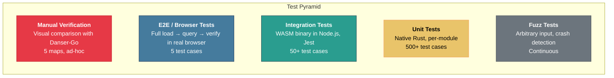
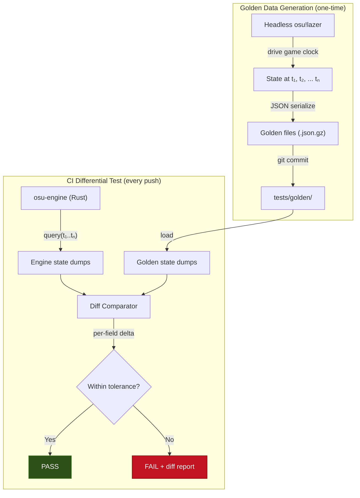
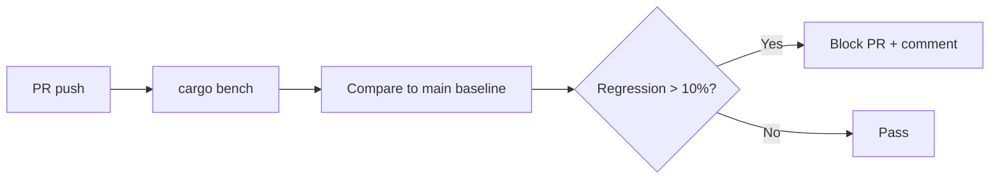
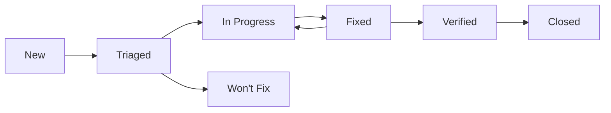
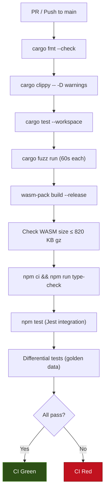

# Test Plan
## osu-engine-wasm — Comprehensive Verification & Validation Strategy

| | |
|---|---|
| **Document ID** | ENG-TP-0045 |
| **Version** | 1.0 — DRAFT |
| **Author** | QA Engineering |
| **Parent Document** | [BRD — ENG-BRD-0042](./BRD.md) (§13) |
| **Last Revised** | 2026-06-25 |

---

## Table of Contents

1. [Introduction](#1-introduction)
2. [Test Objectives](#2-test-objectives)
3. [Test Scope](#3-test-scope)
4. [Test Environment](#4-test-environment)
5. [Test Levels & Types](#5-test-levels--types)
6. [Unit Test Specifications](#6-unit-test-specifications)
7. [Integration Test Specifications](#7-integration-test-specifications)
8. [Differential Test Harness](#8-differential-test-harness)
9. [Fuzz Testing](#9-fuzz-testing)
10. [Performance Testing](#10-performance-testing)
11. [Regression Test Suite](#11-regression-test-suite)
12. [Security Testing](#12-security-testing)
13. [Browser Compatibility Testing](#13-browser-compatibility-testing)
14. [Test Data Management](#14-test-data-management)
15. [Defect Classification](#15-defect-classification)
16. [Test Automation & CI Integration](#16-test-automation--ci-integration)
17. [Exit Criteria](#17-exit-criteria)
18. [Risk-Based Test Prioritization](#18-risk-based-test-prioritization)
19. [Test Schedule](#19-test-schedule)
20. [Appendix A: Test Case Registry](#appendix-a-test-case-registry)

---

## 1. Introduction

### 1.1 Purpose

This Test Plan defines the complete verification and validation strategy for `osu-engine-wasm`. It ensures that the engine achieves **behavioral compatibility** with osu!lazer (BRD §7), meets all performance targets (BRD §11), and handles malformed input safely (BRD §14).

### 1.2 Testing Philosophy

> The engine is a **behavioral reimplementation**. Unlike a typical software project where tests verify against a specification, our tests verify against **observed lazer behavior**. osu!lazer is the executable specification. Our test suite is essentially a differential comparison engine.

### 1.3 References

| Document | Relevance |
|---|---|
| [BRD §7](./BRD.md) | Behavioral compatibility requirements |
| [BRD §13](./BRD.md) | Testing strategy overview |
| [BRD §14](./BRD.md) | Security requirements for parser hardening |
| [TDD](./Technical_Design_Document.md) | Algorithm details and edge cases |
| [ADD](./Architecture_Design_Document.md) | Component boundaries and interfaces |

---

## 2. Test Objectives

| ID | Objective | Success Criteria | Traced From |
|---|---|---|---|
| TO-1 | Verify parsing correctness | 100% of fixture files parse without error | BRD G1, G2 |
| TO-2 | Verify behavioral fidelity | All 50 golden datasets pass differential comparison within tolerances | BRD §7 |
| TO-3 | Verify parser robustness | Zero panics on arbitrary input after 1-hour fuzz run | BRD §14.1 |
| TO-4 | Verify performance | All benchmarks within targets on reference hardware | BRD §11 |
| TO-5 | Verify judgement accuracy | Replay header hit counts match engine-computed hit counts for all fixture replays | BRD G8 |
| TO-6 | Verify mod correctness | Effective AR/CS/OD/HP values match lazer's for all mod combinations | BRD G3 |
| TO-7 | Verify curve accuracy | Slider positions within 0.5 osu!px of lazer's SliderPath output | BRD G4 |
| TO-8 | Verify binary size | WASM binary ≤ 800 KB gzipped | BRD G12 |
| TO-9 | Verify API contract | TypeScript declarations compile without error; all methods return expected types | BRD §9 |
| TO-10 | Verify stacking | Stack offsets match lazer's OsuBeatmapProcessor for all fixture beatmaps | BRD G5 |

---

## 3. Test Scope

### 3.1 In Scope

| Component | Coverage Target |
|---|---|
| `parser::osr` | ≥ 95% line coverage |
| `parser::osu` | ≥ 95% line coverage |
| `curve::*` | ≥ 90% line coverage |
| `stacking::*` | ≥ 90% line coverage |
| `mods::*` | 100% mod combination coverage |
| `judge::*` | ≥ 90% line coverage |
| `scoring::*` | ≥ 90% line coverage |
| `engine::game_engine` | ≥ 85% line coverage |
| `osu-engine-wasm` (bindings) | ≥ 80% line coverage |
| **Overall workspace** | **≥ 90% line coverage** |

### 3.2 Out of Scope

| Item | Reason |
|---|---|
| WebGL renderer (`@osurender/renderer`) | Separate package, separate test plan |
| Audio synchronization | Host application responsibility |
| Skin loading | Not in v1.0 scope |
| osu!taiko / catch / mania | Not in v1.0 scope |

---

## 4. Test Environment

### 4.1 Environment Matrix

| Environment | Purpose | Configuration |
|---|---|---|
| **Native (Rust)** | Unit tests, benchmarks, fuzz testing | `cargo test --workspace`, Criterion, cargo-fuzz |
| **Node.js (WASM)** | Integration tests | `wasm-pack build --target nodejs`, Jest |
| **Browser (WASM)** | E2E testing, manual verification | Chrome 120+, Firefox 120+, Safari 17+ |
| **CI (GitHub Actions)** | Automated test pipeline | `ubuntu-latest`, Rust 1.79.0, Node 20 LTS |

### 4.2 Reference Hardware

| Spec | Value |
|---|---|
| CPU | Apple M2 / AMD Ryzen 5 6600H (or equivalent) |
| RAM | 16 GB |
| Browser | Chrome 120+ with default settings |
| Network | Irrelevant (no network in engine) |

### 4.3 Test Fixture Storage

```
tests/
├── fixtures/
│   ├── beatmaps/         ← .osu files (20 maps, 10 KB – 200 KB each)
│   │   ├── easy_short.osu
│   │   ├── normal_streams.osu
│   │   ├── hard_jumps.osu
│   │   ├── insane_tech.osu
│   │   ├── expert_speed.osu
│   │   ├── marathon_10min.osu
│   │   ├── stacking_edge_cases.osu
│   │   ├── slider_heavy.osu
│   │   ├── spinner_only.osu
│   │   ├── mixed_curve_types.osu
│   │   ├── catmull_sliders.osu
│   │   ├── perfect_arc_edge.osu
│   │   ├── high_sv_changes.osu
│   │   ├── format_v5.osu         ← stacking v1
│   │   ├── format_v14.osu        ← stacking v2
│   │   ├── extreme_ar0.osu
│   │   ├── extreme_ar11_dt.osu
│   │   ├── zero_length_slider.osu
│   │   ├── 2b_overlapping.osu
│   │   └── break_sections.osu
│   ├── replays/          ← .osr files (20 replays)
│   │   ├── nomod_fc.osr
│   │   ├── hdhr_fc.osr
│   │   ├── dthr_fc.osr
│   │   ├── ez_pass.osr
│   │   ├── ht_pass.osr
│   │   ├── hd_pass.osr
│   │   ├── hr_fc.osr
│   │   ├── fl_pass.osr
│   │   ├── relax_pass.osr
│   │   ├── many_misses.osr
│   │   ├── slider_breaks.osr
│   │   ├── spinner_heavy.osr
│   │   ├── marathon_replay.osr
│   │   ├── low_accuracy.osr
│   │   ├── perfect_score.osr
│   │   ├── old_format_2013.osr
│   │   ├── new_format_2024.osr
│   │   ├── high_frame_rate.osr
│   │   ├── low_frame_rate.osr
│   │   └── autopilot_replay.osr
│   └── malformed/        ← Intentionally broken files for security testing
│       ├── truncated.osr
│       ├── invalid_magic.osr
│       ├── lzma_bomb.osr
│       ├── huge_string.osu
│       ├── negative_coords.osu
│       ├── missing_sections.osu
│       ├── infinite_slider.osu
│       ├── nan_timing.osu
│       └── empty.osr
├── golden/               ← Differential test golden data
│   ├── {beatmap_hash}_{replay_hash}.json.gz
│   └── ...  (50 datasets)
└── fuzz/
    ├── corpus/
    │   ├── osr/          ← Seed corpus for .osr fuzzing
    │   └── osu/          ← Seed corpus for .osu fuzzing
    └── artifacts/        ← Crash-causing inputs (committed when found)
```

---

## 5. Test Levels & Types



| Level | Framework | Runs In | Frequency |
|---|---|---|---|
| Unit Tests | `#[cfg(test)]` / `cargo test` | Native | Every PR, every push |
| Fuzz Tests | `cargo-fuzz` / `libfuzzer` | Native | 60s per PR, 1hr nightly |
| Integration Tests | Jest + `@wasm-pack/core` | Node.js (WASM) | Every PR |
| Differential Tests | Custom harness + golden data | Native | Every push to main |
| Performance Tests | Criterion | Native | Every push to main |
| Browser Tests | Playwright | Chrome, Firefox | Weekly / pre-release |
| Manual Verification | Visual inspection | Browser | Per milestone |

---

## 6. Unit Test Specifications

### 6.1 Parser Unit Tests

#### 6.1.1 `.osr` Parser

| Test ID | Test Case | Input | Expected Output | Priority |
|---|---|---|---|---|
| UT-OSR-001 | Parse valid nomod replay | `nomod_fc.osr` | All header fields match known values | P0 |
| UT-OSR-002 | Parse replay with all mods | `dthr_fc.osr` | Mod bitmask correctly decoded | P0 |
| UT-OSR-003 | Parse old format (2013) | `old_format_2013.osr` | Score ID present as an **`i32`** (20121008–20140720 window) | P0 |
| UT-OSR-003b | Parse pre-2012 format | `ancient_2011.osr` | **No score ID field at all** (< 20121008) | P0 |
| UT-OSR-004 | Parse new format (2024) | generated, version ≥ 20140721 | Score ID present as an `i64` | P0 |
| UT-OSR-005 | Frame count validation | Any valid `.osr` | `frames.len() == expected_count` | P0 |
| UT-OSR-006 | Frame time monotonicity | Any valid `.osr` | `frames[i].time <= frames[i+1].time` | P0 |
| UT-OSR-007 | osu-string marker handling | Crafted binary | `""` for 0x00, the string for 0x0B, error otherwise | P0 |
| UT-OSR-008 | ULEB128 overflow | 6+ continuation bytes | `EngineError::UlebOverflow` [P-006] | P1 |
| UT-OSR-009 | Truncated input | First 10 bytes only | `EngineError::UnexpectedEof` [P-002] | P0 |
| UT-OSR-010 | Empty file | 0 bytes | `EngineError::UnexpectedEof` [P-002] | P0 |
| UT-OSR-011 | LZMA decompression | Valid compressed payload | Decompressed frames match expected | P0 |
| UT-OSR-012 | LZMA bomb rejection | Crafted small input → huge output | `EngineError::DecompressionOutputTooLarge` [D-002] | P0 |
| UT-OSR-013 | Non-standard game mode | Mode byte = 1 (taiko) | `EngineError::InvalidGameMode` [V-001] | P1 |
| UT-OSR-014 | UTF-8 validation | Invalid UTF-8 in player name | `EngineError::InvalidUtf8` [P-003] | P1 |
| UT-OSR-015 | Round-trip property | `proptest` generated headers | `parse(serialize(header)) == header` | P1 |

> **Errata (2026-07-14):** UT-OSR-003 previously read *"No score ID field; frames
> parse"* for a 2013 replay. That is backwards — a 20130101 replay **does** carry
> a score ID, stored as an `i32`. Only replays older than 20121008 omit the field.
> The row is corrected above and split, with `ancient_2011.osr` added to cover the
> genuinely-absent case. See TDD §2.1.
>
> The `.osr` parser additionally carries four osu!stable frame quirks and an
> integer-delta rule that this table does not enumerate; each has a dedicated
> regression test (`parser/osr.rs`, tests prefixed `d3_`–`d7_`). See TDD §2.4.

#### 6.1.2 `.osu` Parser

| Test ID | Test Case | Input | Expected Output | Priority |
|---|---|---|---|---|
| UT-OSU-001 | Parse complete beatmap | `normal_streams.osu` | All sections populated correctly | P0 |
| UT-OSU-002 | Circle object parsing | `x,y,time,1,...` | `HitObject::Circle` with correct fields | P0 |
| UT-OSU-003 | Slider Bézier parsing | `type=2, B\|...` | Correct control points and curve type | P0 |
| UT-OSU-004 | Slider Catmull parsing | `type=2, C\|...` | `CurveType::Catmull` | P0 |
| UT-OSU-005 | Slider PerfectArc parsing | `type=2, P\|...` | `CurveType::PerfectArc` with 3 points | P0 |
| UT-OSU-006 | Spinner parsing | `type=8` | Correct start/end time | P0 |
| UT-OSU-007 | New combo detection | `type & 4 != 0` | `new_combo = true` | P0 |
| UT-OSU-008 | Combo color skip | `type bits 4-6` | Correct skip count | P1 |
| UT-OSU-009 | Timing point parsing (red) | `uninherited=1` | BPM correctly computed | P0 |
| UT-OSU-010 | Timing point parsing (green) | `uninherited=0, neg BPM` | Velocity multiplier correct | P0 |
| UT-OSU-011 | Difficulty section | `CS:4, AR:9.5, OD:8, HP:6` | All values parsed as f64 | P0 |
| UT-OSU-012 | Format version | `osu file format v14` | `beatmap_version = 14` | P0 |
| UT-OSU-013 | Missing sections | No `[TimingPoints]` | `EngineError::MissingSection` [P-009] | P0 |
| UT-OSU-014 | Non-standard mode | `Mode: 1` (taiko) | `EngineError::InvalidGameMode` [V-001] | P1 |
| UT-OSU-015 | Composite Bézier split | Repeated control point | Two segments created | P0 |

### 6.2 Curve Unit Tests

| Test ID | Test Case | Expected | Tolerance | Reference |
|---|---|---|---|---|
| UT-CRV-001 | Linear 2-point slider | `position_at(0.5)` = midpoint | ≤ 0.01 px | Trivial geometry |
| UT-CRV-002 | Quadratic Bézier | Positions at t=0, 0.25, 0.5, 0.75, 1.0 | ≤ 0.5 px | Lazer SliderPath |
| UT-CRV-003 | Cubic Bézier | Positions at 5 sample points | ≤ 0.5 px | Lazer SliderPath |
| UT-CRV-004 | Composite Bézier (2 segments) | Continuity at segment boundary | ≤ 0.01 px | Lazer SliderPath |
| UT-CRV-005 | Catmull-Rom 4-point | Positions at 5 sample points | ≤ 0.5 px | danser-go catmull.go |
| UT-CRV-006 | Perfect arc (3 points) | Positions at 5 sample points | ≤ 0.5 px | danser-go cirarc.go |
| UT-CRV-007 | Perfect arc degenerate (collinear) | Falls back to linear | Exact | Lazer behavior |
| UT-CRV-008 | Perfect arc large radius | Falls back to linear if r > 500 | Exact | Lazer behavior |
| UT-CRV-009 | Arc-length parameterization | Equal t increments → equal distances | ≤ 0.5 px | Lazer SliderPath |
| UT-CRV-010 | Slider length clamping | `pixel_length` shorter than curve | Correct end position | ≤ 0.5 px |
| UT-CRV-011 | Zero-length slider | `pixel_length = 0` | Position = start point | Exact |
| UT-CRV-012 | High-degree Bézier (degree 8) | Numerical stability | No NaN/Inf | Critical |
| UT-CRV-013 | Render points spacing | N points are arc-length equidistant | ≤ 1.0 px | Visual quality |

### 6.3 Stacking Unit Tests

| Test ID | Test Case | Expected | Reference |
|---|---|---|---|
| UT-STK-001 | No stacking needed | All stack_height = 0 | Trivial |
| UT-STK-002 | 2 circles same position | stack_height = [0, 1] | Lazer OsuBeatmapProcessor |
| UT-STK-003 | 5 circles stacked | stack_height = [0, 1, 2, 3, 4] | Lazer OsuBeatmapProcessor |
| UT-STK-004 | Circles under slider tail | Negative stack heights | Lazer L168-188 |
| UT-STK-005 | Slider start stacking | Slider stacks with prior objects | Lazer L200-220 |
| UT-STK-006 | Time threshold boundary | Objects exactly at threshold | Lazer integer truncation |
| UT-STK-007 | v1 algorithm (format < 6) | Forward-pass stacking | Lazer applyStackingOld |
| UT-STK-008 | v2 algorithm (format ≥ 6) | Reverse-pass stacking | Lazer applyStacking |
| UT-STK-009 | Spinner resets stacking | Spinners don't participate | Lazer L137 |
| UT-STK-010 | Interleaved stacks | Two interwound stacks | Lazer L126-134 comment |
| UT-STK-011 | Stack leniency = 0 | No stacking occurs | Edge case |
| UT-STK-012 | HR affects stacking | Y-flip before stacking | danser insight #6 |

### 6.4 Mod Engine Unit Tests

| Test ID | Test Case | Input | Expected | Reference |
|---|---|---|---|---|
| UT-MOD-001 | No mods | Base values | AR/CS/OD/HP unchanged | Trivial |
| UT-MOD-002 | Easy | CS=4, AR=9 | CS=2, AR=4.5 | BRD §8.6 |
| UT-MOD-003 | HardRock | CS=4, AR=7 | CS=5.2, AR=9.8 | BRD §8.6 |
| UT-MOD-004 | HR cap at 10 | CS=8 | CS=10 (capped) | BRD §8.6 |
| UT-MOD-005 | DT preempt | AR=9 | effective_preempt × 2/3 | BRD §8.6 note |
| UT-MOD-006 | HT preempt | AR=9 | effective_preempt × 4/3 | BRD §8.6 note |
| UT-MOD-007 | DT+HR combined | AR=7 | HR first → DT on result | Lazer order |
| UT-MOD-008 | NC implies DT | NC flag set | time_factor = 2/3 | Bitmask mapping |
| UT-MOD-009 | EZ+DT | CS=5 | CS=2.5, preempt × 2/3 | Combined |
| UT-MOD-010 | All difficulty mods | Exhaustive table | Match wiki/lazer values | 48 combinations |
| UT-MOD-011 | HR Y-flip | (256, 100) | (256, 284) | 384 - y |
| UT-MOD-012 | Mirror X-flip | (100, 192) | (412, 192) | 512 - x |

### 6.5 Judge Engine Unit Tests

| Test ID | Test Case | Expected | Priority |
|---|---|---|---|
| UT-JDG-001 | Perfect timing hit | HitResult::Great (300) | P0 |
| UT-JDG-002 | Slightly early hit | HitResult::Ok (100) | P0 |
| UT-JDG-003 | Late hit | HitResult::Meh (50) | P0 |
| UT-JDG-004 | Complete miss | HitResult::Miss | P0 |
| UT-JDG-005 | Hit outside radius | No hit registered | P0 |
| UT-JDG-006 | Note lock blocking | Earlier object consumes click | P0 |
| UT-JDG-007 | Note lock release | Hit after earlier judged | P0 |
| UT-JDG-008 | Slider head hit | Circle judgement on head | P0 |
| UT-JDG-009 | Slider body tracking | Key held → body tracked | P0 |
| UT-JDG-010 | Slider break | Key release during body | P0 |
| UT-JDG-011 | Slider tail leniency | Hit within extended window | P1 |
| UT-JDG-012 | Replay header match | Engine counts = header counts | P0 |

---

## 7. Integration Test Specifications

### 7.1 WASM-in-Node.js Tests

These tests load the actual WASM binary in Node.js via Jest:

| Test ID | Test Case | Verification |
|---|---|---|
| IT-001 | Parse .osu → OsuBeatmap | `beatmap.title !== undefined` |
| IT-002 | Parse .osr → OsuReplay | `replay.player_name !== undefined` |
| IT-003 | Create GameEngine | `engine instanceof GameEngine` |
| IT-004 | Query at t=0 | `snap.combo === 0`, cursor at start |
| IT-005 | Query at t=end | Final combo/accuracy match header |
| IT-006 | Query random-access seek | `query(5000)` then `query(1000)` — consistent |
| IT-007 | Precompute curves | `engine.precompute_curves(32)` — no throw |
| IT-008 | Slider curve buffer | `Float32Array` with correct length |
| IT-009 | Version API | `version().major >= 1` |
| IT-010 | Memory cleanup | `beatmap.free()`, `engine.free()` — no leak |
| IT-011 | Error on invalid .osr | `expect(() => parse(garbage)).toThrow()` |
| IT-012 | Error on taiko .osu | `expect(() => parse(taiko)).toThrow(/UnsupportedGameMode/)` |
| IT-013 | TypeScript types compile | `npm run type-check` passes |
| IT-014 | Full pipeline 20 replays | All 20 fixtures: final state matches header |
| IT-015 | DT mod affects preempt | `snap.preempt_ms < base_preempt` |

### 7.2 End-to-End Workflow Test

```typescript
describe("Full analysis workflow", () => {
  test("load → query → verify score", async () => {
    // 1. Load files
    const osuBytes = fs.readFileSync("fixtures/beatmaps/normal_streams.osu");
    const osrBytes = fs.readFileSync("fixtures/replays/nomod_fc.osr");

    // 2. Parse
    const beatmap = OsuBeatmap.parse(new Uint8Array(osuBytes));
    const replay = OsuReplay.parse(new Uint8Array(osrBytes));

    // 3. Verify hash match
    expect(beatmap.beatmap_hash).toBe(replay.beatmap_hash);

    // 4. Create engine
    const engine = GameEngine.create(beatmap, replay);

    // 5. Query at midpoint
    const mid = engine.duration_ms / 2;
    const snap = engine.query(mid);
    expect(snap.combo).toBeGreaterThan(0);
    expect(snap.visible_objects.length).toBeGreaterThan(0);

    // 6. Query at end — verify against replay header
    const end = engine.query(engine.duration_ms);
    expect(end.combo).toBeLessThanOrEqual(replay.max_combo);

    // 7. Cleanup
    engine.free();
    beatmap.free();
    replay.free();
  });
});
```

---

## 8. Differential Test Harness

The **single most important test infrastructure** in this project (BRD §13.5).

### 8.1 Architecture



### 8.2 State Dump Format

Both engines produce identical JSON at each sample point:

```json
{
  "t": 15000.0,
  "cursor": { "x": 256.42, "y": 191.87 },
  "visible_object_indices": [42, 43, 44],
  "combo": 127,
  "max_combo": 127,
  "accuracy": 0.9987,
  "hp": 0.82,
  "score": 458920,
  "judgements_so_far": {
    "300": 120,
    "100": 5,
    "50": 2,
    "miss": 0,
    "slider_break": 0
  }
}
```

### 8.3 Sampling Strategy

| Sample Type | Sample Points | Density | Rationale |
|---|---|---|---|
| Uniform time | Every 100 ms | ~300/min | Catch gradual drift |
| Object times | `object.start_time ± 1 ms` | 2 per object | Critical for judging |
| Combo breaks | Each miss/slider-break time | Variable | Combo divergence |
| Slider boundaries | Start and end of every slider | 2 per slider | Ball position accuracy |
| Replay boundaries | First frame, last frame | 2 total | Edge conditions |

### 8.4 Tolerance Thresholds

| Field | Type | Tolerance | Failure Classification |
|---|---|---|---|
| `cursor.x` | f64 | ≤ 0.01 osu!px | P1 — interpolation bug |
| `cursor.y` | f64 | ≤ 0.01 osu!px | P1 — interpolation bug |
| `combo` | u32 | **Exact** | **P0 — judgement bug** |
| `max_combo` | u32 | **Exact** | **P0 — judgement bug** |
| `score` | u64 | **Exact** | **P0 — scoring bug** |
| `accuracy` | f64 | ≤ 0.0001 | P1 — float accumulation |
| `hp` | f64 | ≤ 0.001 | P2 — drain model float |
| `visible_object_indices` | Set | **Exact match** | **P0 — visibility bug** |
| `judgements.300` | u32 | **Exact** | **P0 — judgement bug** |
| `judgements.100` | u32 | **Exact** | **P0 — judgement bug** |
| `judgements.50` | u32 | **Exact** | **P0 — judgement bug** |
| `judgements.miss` | u32 | **Exact** | **P0 — judgement bug** |

### 8.5 Golden Data Corpus

| Category | Count | Selection Criteria |
|---|---|---|
| Easy maps (1–2 stars) | 5 | Simple patterns, few sliders |
| Normal maps (3–4 stars) | 10 | Mixed objects, typical stacking |
| Hard maps (5–6 stars) | 10 | Dense jumps, fast streams |
| Insane maps (7–8 stars) | 10 | Complex curves, high AR |
| Expert+ maps (9–10 stars+) | 5 | Extreme density, edge cases |
| Edge case maps | 10 | See below |
| **Total** | **50** | |

**Edge case maps** specifically chosen to exercise:

| Map Type | Tests |
|---|---|
| Extreme AR (AR0) | Very long preempt, many visible objects |
| Extreme AR (AR11 via DT) | Very short preempt |
| Low CS (CS1) | Large circles, overlap |
| High CS (CS10) | Tiny circles, precision |
| Dense stacking | 5+ objects in a stack |
| Snake sliders | High-degree Bézier with many segments |
| Catmull-only map | All Catmull-Rom curves |
| 2B-style overlaps | Overlapping objects (mapper technique) |
| Marathon (10+ min) | Floating-point accumulation over long replay |
| Break sections | HP drain pauses, combo continuity |

### 8.6 Golden Data Update Policy

1. Golden data is **pinned to a specific osu!lazer release tag** (e.g., `2024.1115.0`)
2. Updates are allowed **only** when lazer changes behavior (new release tag)
3. Every golden data update requires:
   - A linked lazer commit hash
   - An explanation of the behavioral change
   - Approval from the eng lead
4. The lazer release tag is recorded in `tests/golden/LAZER_VERSION.txt`

---

## 9. Fuzz Testing

### 9.1 Fuzz Targets

```
fuzz/
└── fuzz_targets/
    ├── fuzz_osr_parse.rs    ← Arbitrary bytes → OsuReplay::parse()
    ├── fuzz_osu_parse.rs    ← Arbitrary bytes → OsuBeatmap::parse()
    └── fuzz_full_pipeline.rs ← Two arbitrary byte arrays → parse + create + query
```

### 9.2 Fuzz Test Specifications

| Target | Input | Pass Criteria | Duration |
|---|---|---|---|
| `fuzz_osr_parse` | Random `&[u8]` | No panic, no UB; returns `Result` | 60s per PR, 1hr nightly |
| `fuzz_osu_parse` | Random `&str` (UTF-8) | No panic, no UB; returns `Result` | 60s per PR, 1hr nightly |
| `fuzz_full_pipeline` | Random `.osr` + `.osu` bytes | No panic even if both parse | 60s per PR, 1hr nightly |

### 9.3 Seed Corpus

| Corpus | Source | Size |
|---|---|---|
| `.osr` seeds | Valid replays from fixtures + manually truncated/modified variants | ~50 seeds |
| `.osu` seeds | Valid beatmaps from fixtures + section-by-section mutations | ~50 seeds |

### 9.4 Crash Triage

Any fuzz crash is:
1. Minimized via `cargo fuzz tmin`
2. Committed to `fuzz/artifacts/`
3. Filed as a P0 bug
4. Fixed with a regression test
5. Re-verified by re-running the minimized input

---

## 10. Performance Testing

### 10.1 Benchmark Suite

| Benchmark | Target | Measurement | Framework |
|---|---|---|---|
| `.osr` parse (300 KB) | ≤ 20 ms | Wall-clock, native | Criterion |
| `.osu` parse (100 KB) | ≤ 15 ms | Wall-clock, native | Criterion |
| `GameEngine::create()` | ≤ 30 ms | Wall-clock, native | Criterion |
| `precompute_curves(32)` | ≤ 10 ms | Wall-clock, native | Criterion |
| `query(t)` single call | ≤ 0.1 ms | 10K iterations, native | Criterion |
| `query(t)` in WASM | ≤ 0.2 ms | 1K iterations, browser | performance.now() |
| WASM binary size | ≤ 800 KB gz | `gzip -9` | Shell script |
| WASM instantiation | ≤ 300 ms | Cold start in browser | performance.now() |
| Memory peak | ≤ 30 MB | Chrome DevTools | Manual |

### 10.2 Regression Detection



Benchmarks are tracked via `github-actions-benchmark`. Historical data is stored as GitHub Actions artifacts.

### 10.3 Profiling Protocol

When a benchmark regresses:

1. Profile with `cargo flamegraph` (native)
2. Identify hot functions
3. Check for unintended allocations with `dhat`
4. Verify WASM codegen with `twiggy` for binary size analysis
5. Document findings in PR description

---

## 11. Regression Test Suite

### 11.1 Golden Output Tests

20 replays with known scores, sampled at 10 time points each = **200 golden assertions**.

```rust
#[test]
fn regression_nomod_fc() {
    let engine = create_engine("normal_streams.osu", "nomod_fc.osr");
    let snap = engine.query(engine.duration_ms());

    assert_eq!(snap.combo, 487);
    assert_eq!(snap.max_combo, 487);
    assert!((snap.accuracy - 0.9965).abs() < 0.0001);
    assert_eq!(snap.score, 12_458_920);
}
```

### 11.2 Golden Output Update Process

1. Run the test — if it fails, investigate whether:
   - Our code has a bug (fix the code)
   - Lazer has changed behavior (update the golden output with justification)
2. Golden output changes require code review approval

---

## 12. Security Testing

### 12.1 Parser Hardening Tests

| Test ID | Attack Vector | Input | Expected |
|---|---|---|---|
| SEC-001 | LZMA bomb | 10 bytes → 1 GB decompressed | `EngineError::DecompressionOutputTooLarge` [D-002] |
| SEC-002 | Huge string length | ULEB128 encoding 2^32 | `EngineError::StringTooLong` [P-007] |
| SEC-003 | Integer overflow in timing | `Δt = i64::MAX` | `checked_add` prevents overflow |
| SEC-004 | NaN coordinates | `x = NaN, y = Inf` | Handled gracefully (clamp or error) |
| SEC-005 | Deeply nested objects | 100K hit objects in .osu | Parses within memory limit |
| SEC-006 | Invalid UTF-8 | `0x0B 0x03 0xFF 0xFE 0xFD` | `EngineError::InvalidUtf8` [P-003] |
| SEC-007 | Zero-byte file | Empty `.osr` or `.osu` | `EngineError::UnexpectedEof` [P-002] |
| SEC-008 | Maximum valid replay | 50K frames, large map | Parses successfully within 30 MB |
| SEC-009 | **LZMA CPU exhaustion** | **50 KB file designed for max decode iterations** | **Worker timeout fires within 10s; `LZMA_CPU_TIMEOUT` error** |
| SEC-010 | **Batch query GC pressure** | **`query_batch()` with 5,000 samples** | **`BATCH_SIZE_EXCEEDED` error returned** |

### 12.2 Supply Chain Verification

| Check | Tool | Frequency |
|---|---|---|
| Known vulnerabilities | `cargo deny check advisories` | Every CI run |
| License compliance | `cargo deny check licenses` | Every CI run |
| Dependency count | Custom check: ≤ 4 external crates | Every CI run |
| Lock file committed | `git diff --exit-code Cargo.lock` | Every CI run |

### 12.3 Integer Truncation Tests

Per TDD §11.2, integer truncation is a high-risk divergence area. These tests verify that Rust's `f64 as i32` truncation and `f64::floor()` behavior match C#'s `(int)` and `Math.Floor()` respectively, especially for **negative values**.

| Test ID | Description | Input | Expected (Rust) | C# Equivalent |
|---|---|---|---|---|
| UT-TRUNC-001 | Positive truncation | `3.7 as i32` | `3` | `(int)3.7 = 3` |
| UT-TRUNC-002 | Negative truncation (towards zero) | `-3.7 as i32` | `-3` | `(int)(-3.7) = -3` |
| UT-TRUNC-003 | Negative floor (towards -∞) | `(-3.7).floor()` | `-4.0` | `Math.Floor(-3.7) = -4.0` |
| UT-TRUNC-004 | Near-zero negative truncation | `-0.5 as i32` | `0` | `(int)(-0.5) = 0` |
| UT-TRUNC-005 | Near-zero negative floor | `(-0.5).floor()` | `-1.0` | `Math.Floor(-0.5) = -1.0` |
| UT-TRUNC-006 | Stacking: negative time diff | `trunc(1000.3) - trunc(1002.7)` | `-2` | `(int)1000.3 - (int)1002.7 = -2` |
| UT-TRUNC-007 | Hit window with floor | `(79.5).floor() - 0.5` | `78.5` | `Math.Floor(79.5) - 0.5 = 78.5` |
| UT-TRUNC-008 | NaN truncation (Rust-specific) | `NaN as i32` | `0` (saturating) | `(int)NaN` = undefined |
| UT-TRUNC-009 | Overflow truncation | `1e20 as i32` | `i32::MAX` (saturating) | `(int)1e20` = wrap/throw |
| UT-TRUNC-010 | Exact zero | `0.0 as i32` | `0` | `(int)0.0 = 0` |

---

## 13. Browser Compatibility Testing

### 13.1 Compatibility Matrix

| Browser | Version | WASM | SharedArrayBuffer | Test Level |
|---|---|---|---|---|
| Chrome | 120+ | Yes | (with headers) | Full |
| Firefox | 120+ | Yes | (with headers) | Full |
| Safari | 17+ | Yes | (16.4+) | Smoke |
| Edge | 120+ | Yes | | Smoke |

### 13.2 Browser-Specific Test Cases

| Test ID | Browser | Test | Expected |
|---|---|---|---|
| BROW-001 | Chrome | Full pipeline load + query | Correct snapshot |
| BROW-002 | Firefox | Full pipeline load + query | Correct snapshot |
| BROW-003 | Safari | WASM instantiation | No error |
| BROW-004 | All | `slider_curve_buffer()` zero-copy | Float32Array valid |
| BROW-005 | All | Memory after `free()` | No growth over 10 cycles |

---

## 14. Test Data Management

### 14.1 Fixture Selection Criteria

All test fixtures must be:
- **Publicly available** (not copyrighted maps requiring login)
- **Deterministic** (same input → same expected output)
- **Small** (< 500 KB per file to keep repo manageable)
- **Diverse** (cover all object types, mod combinations, difficulty ranges)

### 14.2 Fixture Provenance

Each fixture has a manifest entry:

```json
{
  "id": "normal_streams",
  "beatmap": "normal_streams.osu",
  "replay": "nomod_fc.osr",
  "beatmap_hash": "d41d8cd98f00b204e9800998ecf8427e",
  "source": "public osu! API",
  "mods": 0,
  "expected_score": 12458920,
  "expected_max_combo": 487,
  "expected_accuracy": 0.9965,
  "lazer_version": "2024.1115.0"
}
```

### 14.3 Golden Data Size Budget

- 50 golden datasets × ~50 KB compressed each = **~2.5 MB** total
- Stored as `.json.gz` in `tests/golden/`
- Git LFS is NOT required at this scale

---

## 15. Defect Classification

### 15.1 Severity Levels

| Severity | Definition | Example | Response Time |
|---|---|---|---|
| **P0 — Critical** | Judgement divergence from lazer, panic on valid input, security vulnerability | Different combo count than lazer for any golden dataset | Fix before next merge to main |
| **P1 — High** | Position divergence beyond tolerance, mod calculation error, performance regression > 20% | Slider ball position off by 1 osu!px | Fix within current milestone |
| **P2 — Medium** | Minor visual difference, performance regression 10-20%, HP divergence | Approach circle scale slightly different | Fix within next milestone |
| **P3 — Low** | Documentation error, code style issue, minor UX | TypeScript JSDoc missing | Fix when convenient |

### 15.2 Defect Lifecycle



---

## 16. Test Automation & CI Integration

### 16.1 CI Pipeline



### 16.2 CI Job Matrix

| Job | Trigger | Timeout | Runs On |
|---|---|---|---|
| `lint` | Every PR | 5 min | ubuntu-latest |
| `test-native` | Every PR | 15 min | ubuntu-latest |
| `fuzz` | Every PR | 5 min | ubuntu-latest |
| `build-wasm` | Every PR | 10 min | ubuntu-latest |
| `test-wasm-node` | Every PR | 10 min | ubuntu-latest |
| `differential` | Push to main | 30 min | ubuntu-latest |
| `bench` | Push to main | 15 min | ubuntu-latest (dedicated runner) |
| `fuzz-extended` | Nightly (cron) | 1 hour | ubuntu-latest |
| `browser-compat` | Weekly (cron) | 20 min | ubuntu-latest + Playwright |

### 16.3 Coverage Reporting

```yaml
# Part of test-native job
- name: Coverage
  run: cargo tarpaulin --workspace --out xml
- name: Upload
  uses: codecov/codecov-action@v4
  with:
    files: cobertura.xml
    fail_ci_if_error: true
    threshold: 90%
```

---

## 17. Exit Criteria

### 17.1 Per-Layer Exit Criteria

| Layer | Exit Criteria |
|---|---|
| L0 — Foundation | CI skeleton green; fuzz targets compile; `cargo deny` passes |
| L1 — Core Math | All UT-CRV-* and UT-TRUNC-* tests pass; curve positions within 0.5 px |
| L2 — Serialization | All UT-OSR-* and UT-OSU-* tests pass; fuzz clean 10 min |
| L3 — Data Model | All model types implement `Send + Sync`; round-trip tests pass |
| L4 — Preprocessor | All UT-STK-* and UT-MOD-* tests pass; `PreprocessedBeatmap` immutable |
| L5 — Timelines | All UT-JDG-* tests pass; 20 fixture replays match headers; ScoreTimeline + VisibilityTimeline unit tests pass |
| L6 — Query Engine | `query(t)` works end-to-end; batch queries with pagination work |
| L7 — WASM Bindings | WASM builds; all handle types callable from JS; `.free()` works; binary ≤ 800 KB gz |
| L8 — Host Integration | `view_player.html` renders at 60 fps; `OsuEngine.load()` works; TypeScript clean |
| L9 — Validation | All 50 golden datasets pass; all benchmarks within targets; visual comparison passes |
| L10 — Hardening | Fuzz clean 24 hours; coverage ≥ 90%; all golden datasets pass |
| **v1.0 Release** | **All above + release gate checklist (§17.2) passes** |

### 17.2 Release Gate Checklist

| Gate | Threshold | Tool | Enforcement |
|---|---|---|---|
| **Coverage** | ≥ 90% workspace aggregate | `cargo tarpaulin` | CI blocks merge if below |
| **Clippy** | Zero warnings | `cargo clippy -- -D warnings` | CI blocks merge |
| **Formatting** | Zero diffs | `cargo fmt -- --check` | CI blocks merge |
| **Fuzz — CI** | 10 minutes per target, zero crashes | `cargo fuzz` | Every CI run |
| **Fuzz — Release** | 24 hours per target, zero crashes | `cargo fuzz` | Manual before release tag |
| **Golden datasets** | 100% of 50 datasets pass within tolerance | Differential harness | CI blocks merge |
| **Replay headers** | 20 fixture replays: engine counts exactly match | Integration harness | CI blocks merge |
| **Binary size** | ≤ 800 KB gzipped | `wasm-opt -Os` output, `gzip -9` | CI warns, release blocks |
| **Benchmark regression** | Within 5% of baseline | Criterion | CI warns; release blocks if >10% |
| **Security advisories** | Zero new advisories | `cargo deny check advisories` | CI blocks merge |
| **Supply chain** | All deps on allow-list | `cargo deny check licenses` | CI blocks merge |
| **TypeScript** | Type-checks cleanly | `npm run type-check` | CI blocks merge |
| **Documentation** | Builds without errors | Markdown lint + link check | CI warns |
| **NPM package** | `npm pack` produces valid package | `npm pack --dry-run` | Release blocks |
| **Browser smoke** | Chrome, Firefox, Safari pass | Manual E2E | Release blocks |
| **Open defects** | Zero P0, zero P1 | Issue tracker | Release blocks |

> [!IMPORTANT]
> **Fuzz duration tiers**: CI runs 10-minute fuzz per PR. Nightly builds run 1-hour fuzz. Release candidates run 24-hour fuzz. Any crash at any tier blocks until fixed.

### 17.3 Automated vs Manual Gates

| Gate Type | Count | When |
|---|---|---|
| **CI-automated** (every PR) | 10 | Coverage, clippy, fmt, fuzz-10min, golden, replay headers, advisories, licenses, TypeScript, docs |
| **CI-automated** (nightly) | 2 | Benchmark regression, 1-hour fuzz |
| **Manual** (release only) | 4 | 24-hour fuzz, browser smoke, NPM pack, open defects review |

---

## 18. Risk-Based Test Prioritization

### 18.1 Risk-Ordered Test Focus

| Rank | Risk Area | Test Focus | Coverage Target |
|---|---|---|---|
| 1 | **Judgement divergence** | Judge engine + differential tests | 95% + golden data |
| 2 | **Curve math divergence** | Curve unit tests + differential tests | 95% + visual comparison |
| 3 | **Note lock behavior** | Dedicated overlapping-object test maps | 100% of policy branches |
| 4 | **Stacking divergence** | Stacking unit tests + visual comparison | 95% |
| 5 | **Parser crashes** | Fuzz testing | 24hr clean run |
| 6 | **Floating-point drift** | Marathon map differential tests | 10-minute maps |
| 7 | **Mod interactions** | Exhaustive mod combination matrix | 100% combinations |
| 8 | **Performance** | Benchmark regression detection | 5% threshold |

---

## 19. Test Schedule

| Week | Test Activity | Layer |
|---|---|---|
| 1–1.5 | Set up CI, fuzz infrastructure | L0 |
| 2–3 | Curve math unit tests, truncation tests | L1 |
| 2–4 | Parser unit tests, fuzz seeding | L2 |
| 5 | Data model round-trip tests | L3 |
| 6–7 | Stacking + mod matrix tests | L4 |
| 8–10.5 | Judge engine tests, replay header validation, score + visibility tests | L5 |
| 11–12 | Query engine tests, batch query tests | L6 |
| 13 | WASM binding tests | L7 |
| 14–15 | Browser compatibility, E2E, Worker integration | L8 |
| 11–12 | Golden data pipeline, differential tests, benchmarks (parallel) | L9 |
| 16–17 | Extended fuzz, coverage push, release gate checklist | L10 |

---

## Appendix A: Test Case Registry

### Summary

| Category | Test Count | Priority Split |
|---|---|---|
| Unit — Parser (.osr) | 15 | P0: 11, P1: 4 |
| Unit — Parser (.osu) | 15 | P0: 11, P1: 4 |
| Unit — Curves | 13 | P0: 10, P1: 3 |
| Unit — Stacking | 12 | P0: 8, P1: 4 |
| Unit — Mods | 12 | P0: 8, P1: 4 |
| Unit — Judge | 12 | P0: 10, P1: 2 |
| Integration (WASM) | 15 | P0: 12, P1: 3 |
| Differential (Golden) | 50 datasets × ~300 checkpoints | All P0 |
| Fuzz | 3 targets | All P0 |
| Performance | 9 benchmarks | All P0 |
| Security | 8 | P0: 5, P1: 3 |
| Browser | 5 | P0: 3, P1: 2 |
| **Total** | **~15,000+ assertions** | |

---

## Appendix B: Benchmark Corpus Specification

### B.1 Canonical Benchmark Maps

All performance benchmarks MUST be run against the same 7 canonical maps to ensure consistent and comparable results across runs, machines, and CI environments.

| ID | Name | Category | Objects | Sliders | Duration | Key Characteristic |
|---|---|---|---|---|---|---|
| `BENCH-TINY` | Tiny Map | Baseline | ~50 | ~10 | 30s | Minimum viable beatmap; isolates overhead |
| `BENCH-TV` | Average TV Size | Typical | ~500 | ~200 | 2m | Represents median-complexity maps |
| `BENCH-NM` | Tournament NM Pool | Competitive | ~1200 | ~400 | 3m | Dense jumps, stacking, varied AR |
| `BENCH-TECH` | Tech Map | Complex | ~800 | ~500 | 2.5m | Many curve types, slider reversals, high SV |
| `BENCH-SLIDER` | Slider-Heavy | Curve Stress | ~600 | ~550 | 2m | 90%+ sliders; tests curve cache |
| `BENCH-MARATHON` | Marathon | Scale | ~5000 | ~2000 | 10m | Long replay; tests memory and accumulation |
| `BENCH-EXTREME` | Extreme Replay | Worst Case | ~3000 | ~1000 | 5m | High frame rate (1000fps), many mods |

### B.2 Benchmark Matrix

Each benchmark is run against **all 7 corpus maps**. Results are tracked as a time series in CI:

| Benchmark Function | Maps Used | Measurement | Budget |
|---|---|---|---|
| `bench_parse_beatmap` | All 7 | Wall-clock median (10 iterations) | ≤ 15 ms (TV), ≤ 60 ms (marathon) |
| `bench_parse_replay` | All 7 | Wall-clock median (10 iterations) | ≤ 20 ms (TV), ≤ 80 ms (marathon) |
| `bench_create_engine` | All 7 | Wall-clock median (10 iterations) | ≤ 30 ms (TV), ≤ 120 ms (marathon) |
| `bench_precompute_curves` | SLIDER, TECH | Wall-clock median (10 iterations) | ≤ 10 ms (slider-heavy) |
| `bench_query_single` | All 7 | p50 of 10K calls | ≤ 100 μs |
| `bench_query_batch_1k` | TV, NM | Wall-clock for 1000 queries | ≤ 5 ms |
| `bench_query_range_full` | TV, MARATHON | Full duration at 60fps | ≤ 300 ms (TV), ≤ 1.5s (marathon) |
| `bench_memory_peak` | MARATHON | RSS after create() | ≤ 30 MB |
| `bench_wasm_size` | N/A | `gzip -9` of `.wasm` binary | ≤ 800 KB |

### B.3 Benchmark Selection Criteria

Maps are selected using the following rubric:

| Criterion | Why It Matters |
|---|---|
| **Object count** | Directly affects parser, stacking, judging, and index build time |
| **Slider density** | Sliders are the most computationally expensive object type (curve math + SoA) |
| **Duration** | Long maps test floating-point accumulation, memory growth, and replay frame count |
| **Curve variety** | Maps with mixed Bézier, Catmull, and Arc test all curve code paths |
| **Replay frame rate** | High frame rate replays (> 500 fps) stress binary search and cursor interpolation |
| **Mod combinations** | Mods affect preempt, radius, and Y-flip — all hot path computations |

### B.4 Regression Thresholds

| Threshold | Action |
|---|---|
| **< 5% regression** | Auto-pass; within noise margin |
| **5–10% regression** | CI warns; PR author must acknowledge |
| **> 10% regression** | CI blocks PR; must be investigated and justified |
| **> 25% regression** | P1 bug filed; must be fixed before merge |

---

## Appendix C: Performance Budget by Subsystem

Per API Specification §21, each subsystem has an explicit performance budget:

| Subsystem | Budget | Measured By | Corpus Map |
|---|---|---|---|
| `.osu` parsing (100 KB) | ≤ 15 ms | `bench_parse_beatmap` | BENCH-TV |
| `.osu` parsing (500 KB) | ≤ 60 ms | `bench_parse_beatmap` | BENCH-MARATHON |
| `.osr` parsing (300 KB, LZMA) | ≤ 20 ms | `bench_parse_replay` | BENCH-TV |
| `.osr` parsing (2 MB, LZMA) | ≤ 80 ms | `bench_parse_replay` | BENCH-MARATHON |
| LZMA decompression (300 KB → 1 MB) | ≤ 10 ms | Internal sub-benchmark | BENCH-TV |
| Stacking v2 (1500 objects) | ≤ 5 ms | `bench_create_engine` (decomposed) | BENCH-NM |
| Difficulty calculation (mod transform) | ≤ 0.1 ms | `bench_create_engine` (decomposed) | BENCH-NM |
| Judge engine (1500 objects, 30K frames) | ≤ 15 ms | `bench_create_engine` (decomposed) | BENCH-NM |
| Score processor (1500 judgements) | ≤ 2 ms | `bench_create_engine` (decomposed) | BENCH-NM |
| Index construction | ≤ 3 ms | `bench_create_engine` (decomposed) | BENCH-NM |
| `precompute_curves()` (500 sliders, 32 pts) | ≤ 10 ms | `bench_precompute_curves` | BENCH-SLIDER |
| Single `query(t)` | ≤ 100 μs | `bench_query_single` (p50) | BENCH-TV |
| `query(t)` worst case | ≤ 200 μs | `bench_query_single` (p99) | BENCH-MARATHON |
| `query_batch()` (1K samples) | ≤ 5 ms | `bench_query_batch_1k` | BENCH-TV |
| WASM↔JS boundary per call | ≤ 20 μs | Manual measurement | N/A |
| `StateSnapshot` serialization | ≤ 30 μs | `bench_serialize_snapshot` | BENCH-TV |
| Memory: typical map | ≤ 12 MB | `stats().wasm_heap_bytes` | BENCH-TV |
| Memory: marathon map | ≤ 30 MB | `stats().wasm_heap_bytes` | BENCH-MARATHON |
| WASM binary (gzipped) | ≤ 800 KB | CI gate | N/A |
| `init()` WASM instantiation | ≤ 300 ms | Manual measurement | N/A |

---

*End of Test Plan. Related: [BRD](./BRD.md) · [ADD](./Architecture_Design_Document.md) · [TDD](./Technical_Design_Document.md) · [API Spec](./API_Specification.md) · [ADR Registry](./ADR_Registry.md) · [Security Threat Model](./Security_Threat_Model.md)*
